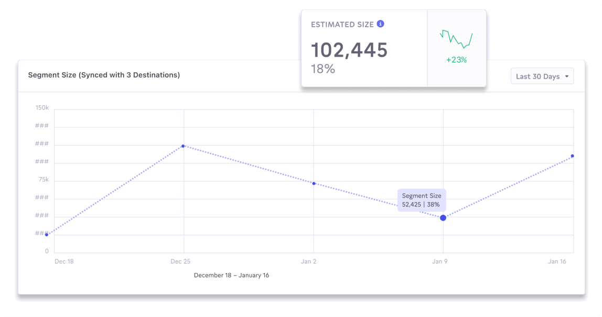
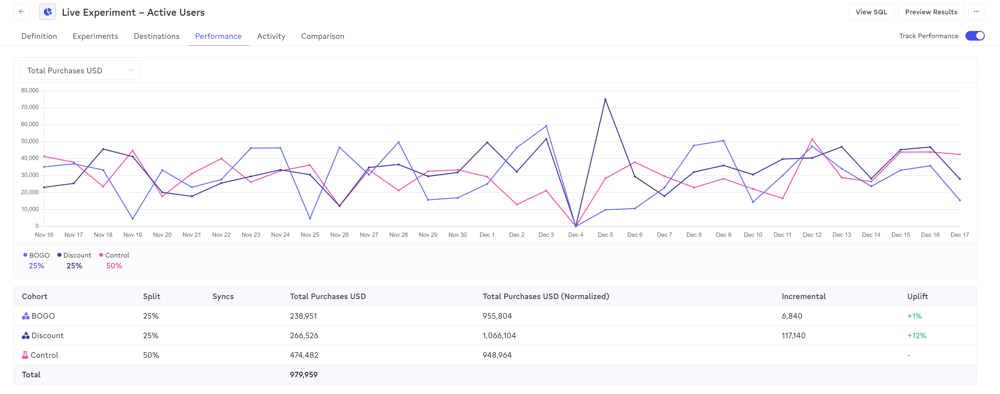

# Experiments and Analysis

Census makes it easy to understand the shape of the segments you're creating and how they're performing once you've synced them to your destinations.&#x20;

## Setting up Split Tests

Once you've created a segment, you can take advantage of split test experiments to test how your new segment performs. A split test divides the people in your segment randomly into one or more **treatments** as well as a **control** cohort, which should be used as a baseline to compare the impact of your campaign. Each cohort has a percentage size you control, letting you set the relative sizes of each size.

<figure><figcaption></figcaption></figure>

Split testing enables a number of marketing efforts:

* Create a simple treatment with control group and measure the increased conversion rate over users that received the treatment.&#x20;
* Divide a segment into multiple treatments for different channels and compare relative conversion rates of the same segment across each.
* Use a treatment and control group to "ramp up" a very large campaign over time. Start with 10% of segment and grow the treatment once you're confident it's performing as expected.

Each cohort can be [synced to their own set of destinations](../syncing-segments.md), including back to warehouse, and users appearing in each cohort are available in Warehouse Writeback (see [below](./#detailed-segment-performance)).

## Tracking Segment Size

One of the most important signals when creating segments is its size. Too big and your segment is too vague to enable effective targeting. Too small and the size may not be worth your time to target at all.

<figure><figcaption></figcaption></figure>

When creating segments, Census will show you the estimated segment size based the conditions you've defined. Depending on your warehouse type, Census will automatically refresh the size as more conditions are added or you can refresh it manually as well.

Once your segment has been created, you can visit the **Activity** tab at any point to understand how your segment size has changes over time, including after making changes to the segment definition.&#x20;

## Audience Comparisons

When it's easy to create new segments, you can end up in a world of too many segments and it's hard to tell if a new segment is unique, even if you can see what members look like. In this case, you can compare your segment against any other existing segment by visiting the **Overlap** tab on your segment.&#x20;

<figure><figcaption></figcaption></figure>

## Measuring Segment Match Rates

Census will capture and report the audience match rates for segments synced to various ad destinations. For more information on how to view match rates and which services are supported, see [Audience Match Rates](audience-match-rates.md).

## Detailed Segment Performance with Metrics

Create customized metrics and track segment and cohort performance over time. Our Performance reporting makes it easy to understand the impact of your experiments. Understand the lift from different offers, or learn how your segments perform across your destinations. After running your experiment for an appropriate amount of time, implement the winning variant and start another experiment.

<figure><figcaption></figcaption></figure>


**Metrics are defined on Event type datasets** that are related to other datasets. If you don't see an expected option when creating a metric, make sure your datasets' types and relationship are configured correctly. See [Dataset Core Concepts](../../datasets/core-concepts/) for more details.


In order to measure segment performance, you first need to define the metrics that Census should measure. The metrics are provided by data in your datasets and then aggregated and tracked over time by Census.&#x20;

Each metric is made up of a few elements:

* The name of the metric, which will appear in reporting UI.&#x20;
* The dataset it should be applied to. This should be the exact same dataset that you plan on segmenting.&#x20;
* The aggregation to apply, either a count of the number of filtered events, or a sum of a particular attribute on those events.
* The related events dataset that should be aggregated over to calculate useful performance metrics. These are typically conversion-type events such as purchases or views of a particular bottom-of-funnel web page.&#x20;
* Optionally a filter can be applied to as well, such that the count/sum only applies to a subset of the events dataset.&#x20;

Note that these metrics should be created before starting campaigns as they will only be measured for campaigns once they've been created, they will not be generated historically.

## Warehouse Writeback

For the deepest level of analysis, you can take advantage of [Warehouse Writeback](../../syncs/sync-monitoring/warehouse-writeback.md), which logs all sync activity back to your data source. You can use this data to determine when users were added and removed from segments in each of the destinations your segment is synced to or the relative conversion performance of users across cohorts.&#x20;

To take advantage of Warehouse Writeback for your analysis, ensure it is enabled on your warehouse connection.
