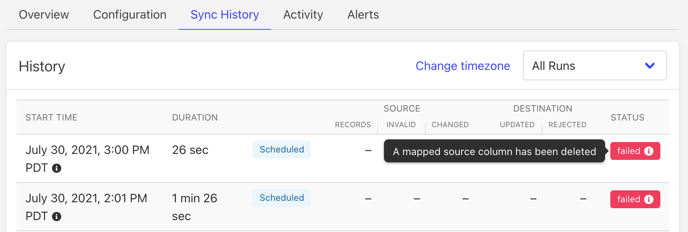
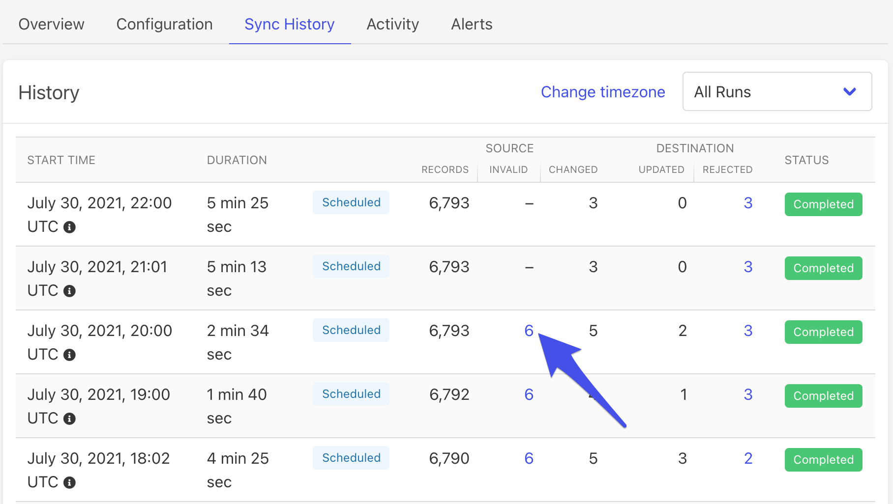
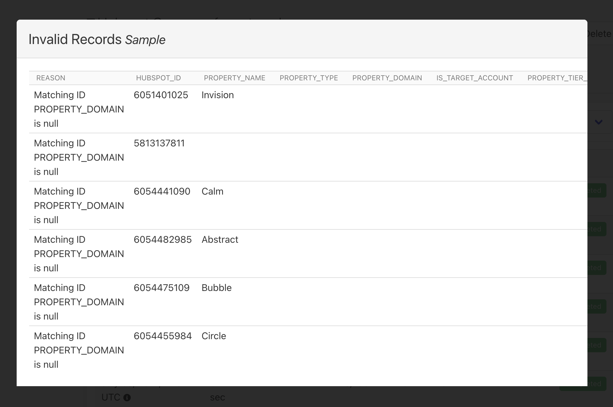
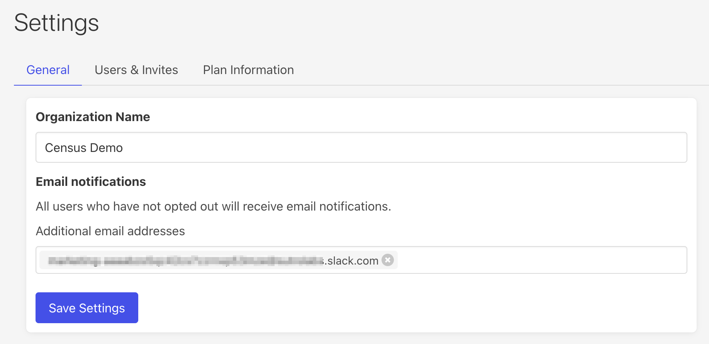

# Alerts

Census offers both email and Slack alerts so you're always the first to know what's going on with your syncs. Read on to learn how to configure them.

### **Setup email alerts**

Census sends two types of email notifications: sync alerts \(per sync\), and a weekly sync summary \(across all syncs\).

By default sync failure alerts will always be turned on for every sync. 

Go to the **Alerts** tab in your Sync to configure which alerts are enabled per sync. You can choose to receive:

1. Alerts when a sync totally fails, usually because the source or destination connection is broken.
2. Alerts when a sync ran successfully but some of the records were invalid or rejected. 

### Understanding invalid or rejected records

You can dive deeper into why syncs failed, or what records were invalid from the source, or rejected by the destination, under the **Sync History** tab.

**Failed Syncs**  
Hover over the status label to see a detailed error.

**Invalid or rejected records**  
Click the number of invalid or rejected records to see a sample \(up to 100\), and the reason why they were invalid or rejected.

### Configure your personal email notifications

By default, all members of your team will receive all email notifications. You can choose to personally opt out of certain notifications, under **Settings** &gt; **User Settings**.

### Slack notifications

You can send Slack alerts to your selected channels via Slack's channel email feature. Every Slack channel has its own email address, and any emails sent to that address automatically appear as messages in that channel. This is a super easy way to configure notifications without having to give Census a lot of permissions to your organization's Slack. 

1. In Slack, find the email address for the channel you want to send notifications to. To do this click the **channel name &gt; Integrations**

2. Once you have the email address, go to **Census** &gt; **Settings** and paste that channel's email address under **Email notifications** &gt; **Additional email addresses**

🎉That's it! Now your slack channel\(s\) will automatically post any alerts configured on all your syncs, as well as the weekly sync summary. 

### Send notifications to additional emails

You can use the same mechanism above to send emails to any email address. For example, you can use this to send notifications to mailing list. 

Go to **Census** &gt; **Settings** and type the additional email addresses that you want to receive Census alerts.

###  

###  

