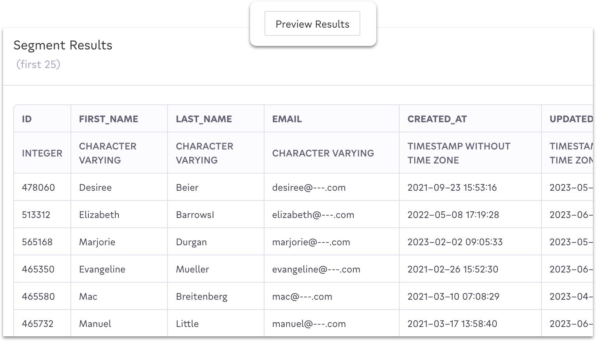

# Experiments and Analysis

Census makes it easy to understand the shape of the segments you're creating and how they're performing once you've synced them to your destinations.&#x20;

## Setting up Split Tests

Once you've created a segment, you can take advantage of split test experiments to test how your new segment performs. A split test divides the people in your segment randomly into one or more **treatments** as well as a **control** cohort, which should be used as a baseline to compare the impact of your campaign. Each cohort has a percentage size you control, letting you set the relative sizes of each size.

<figure><figcaption></figcaption></figure>

Split testing enables a number of marketing efforts:

* Create a simple treatment with control group and measure the increased conversion rate over users that received the treatment.&#x20;
* Divide a segment into multiple treatments for different channels and compare relative conversion rates of the same segment across each.
* Use a treatment and control group to "ramp up" a very large campaign over time. Start with 10% of segment and grow the treatment once you're confident it's performing as expected.

Each cohort can be [synced to their own set of destinations](syncing-segments.md), including back to warehouse, and users appearing in each cohort are available in Warehouse Writeback (see [#analyzing-segment-performance](analyzing-segments.md#analyzing-segment-performance "mention") below).

## Tracking Segment Size

One of the most important signals when creating segments is its size. Too big and your segment is too vague to enable effective targeting. Too small and the size may not be worth your time to target at all.

<figure><figcaption></figcaption></figure>

When creating segments, Census will show you the estimated segment size based the conditions you've defined. Depending on your warehouse type, Census will automatically refresh the size as more conditions are added or you can refresh it manually as well.

Once your segment has been created, you can visit the **Activity** tab at any point to understand how your segment size has changes over time, including after making changes to the segment definition.&#x20;

## Previewing Members

At any point, you can also view a sample of the members of a particular segment by pressing the **Preview Results** button in the top right of the segment view. This will show the first 25 members of your segment as currently defined.

<figure><figcaption></figcaption></figure>

## Audience Comparisons

When it's easy to create new segments, you can end up in a world of too many segments and it's hard to tell if a new segment is unique, even if you can see what members look like. In this case, you can compare your segment against any other existing segment by visiting the **Overlap** tab on your segment.&#x20;

<figure><figcaption></figcaption></figure>

## Analyzing Segment Performance

For more detailed analysis including understanding how your segments are performing across your destinations, you can take advantage of [Warehouse Writeback](../sync-monitoring/warehouse-writeback.md) which logs all sync activity back to your data source. You can use this data to determine when users were added and removed from segments in each of the destinations your segment is synced to or the relative conversion performance of users across cohorts.&#x20;

To take advantage of Warehouse Writeback for your analysis, make sure it is enabled on your warehouse connection.
