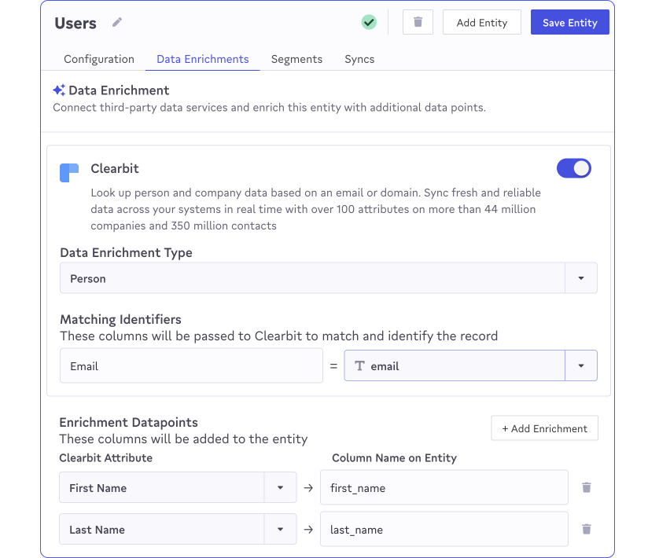
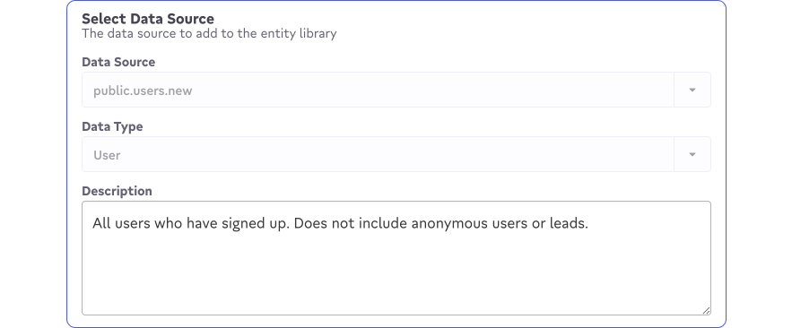

# Data Preparation

Audience Hub is built from the ground up to let marketing teams target effectively without having to know any SQL. But unlike other segmentation tools, Census Segments runs directly on top of a data warehouse or other data source. Marketing teams love this because it gives them access to the full world of a company's up-to-date and approved data.&#x20;

Working with a warehouse directly can be overwhelming. Census provides a number of tools for the data teams to make preparing their data for use with segments and easy and straightforward.

## Highlighting Datasets For Segmentation

Segments are built on top of your company's [Entities](../data-models-and-entities/entities.md). You can think of entities as the approved or favorite data sets coming from your data warehouse so the first step to enabling Audience Hub is to set up the entities that segments will be built on. Your entities should include the actual datasets that will be segmented, for example full lists of Users or Companies that will be filtered into segments. They can also include any related entities that may be provide useful conditions for filtering. Entities enable a number of powerful features within Segments.&#x20;


Census previously allowed segments to be built on models directly. Segments created in the past this way will appear in Census with a **Legacy** tag and cannot make use of any of the following entity features.


###

### Working Across Relationships

Entities give data teams the ability to [define the relationships](https://docs.getcensus.com/basics/data-models-and-entities/entities#relationships) that exist between your entities. When creating segments, you can also create conditions by adding any related entities and filtering based on its attributes as well.

<figure><figcaption></figcaption></figure>

Relationships defined in entities are one-to-many, but segments can also take advantage of implicit many-to-many relationships and multi-step relationships automatically. Users simply need to select the related entity they care about and Census will take care of building the series of joins to associate them.

Entities give data teams the ability to [define the relationships](https://docs.getcensus.com/basics/data-models-and-entities/entities#relationships) that exist between your entities. When creating segments, you can also create conditions by adding any related entities and filtering based on its attributes as well.

### Segmenting on Event Streams

Entities also define the "type" of data stored in each individual dataset. For segmentation, one of the most powerful types is the Event type. By highlighting the entities that contain event data, marketers can create segments that filter on depth of engagement, engagement in certain time periods, specific interactions, as well as filtering on any other data point.

<figure><figcaption></figcaption></figure>

### Calculated Fields

Calculated fields allow marketers to create aggregations from other entities.  For instance, being able to sum a transaction table and calculate the total spend of a customer.  These generated fields can be used in segmentation building or as attributes in syncs.&#x20;

<figure><figcaption></figcaption></figure>

There are 2 ways to create calculated fields within the audience hub.&#x20;

* In the Audience Hub segments page
* Directly when creating a segment

We currently support the following aggregations, more will be released soon.

* Sum
* Count
* Most Frequent
* Average&#x20;
* % Change
* Difference
* Custom Filtering

### Enumerated Value Columns

In entities you can select the columns that have a finite list of values such as country, product type. &#x20;

<figure><figcaption></figcaption></figure>

When these columns are used in segmentation they will now display a dropdown of options to choose from.  This helps to avoid issues of using the wrong casing. &#x20;

### Enriching Entities

<figure><figcaption></figcaption></figure>

The data warehouse is a vast repository of data generated by your customer interactions: the products the buy, the actions they take and the invoices, orders, documents, and anything else they create in working with your business. This is first-party data, the things only your business knows about your customers.&#x20;

Effective segmentation often also requires third-party data as well, which is data provided by external services such as demographic and firmographic data. To build a segment with the condition "Give me all of my users that signed up in the last 90 days who work at companies with more than 1,000 employees", you'll need both first and third party data.

[Enrichments](../data-models-and-entities/enrichment.md) make it easy to add third party data points to your entities, so they're available both for segmentation, as well as in your warehouse.&#x20;

### Adding Documentation

<figure><figcaption></figcaption></figure>

SQL table names are often not enough to fully explain what data should actually be used for. Take advantage of Census's ability to add or automatically import descriptions for models, entities (and also segments) to give marketing users more details on how data should be used. \
\
If you have DBT connected,  field descriptions are automatically pulled in and displayed in the segment builder when hovering over a particular field.&#x20;

### Hiding data

If you have sensitive information this can be marked as Personally Identifiable Information (PII) within models.  If a column has been marked as PII on a model, all entities or segments built off of the model will inherit the configuration and correctly mask its content.&#x20;

<figure><figcaption></figcaption></figure>

If a model has PII marked data it will no longer be viewable within the API inspector in syncs.&#x20;
