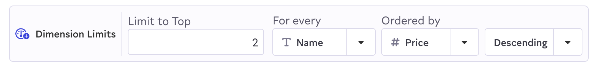

# Creating Segments

## Before you start

Segments are built on top of entities, the core models set up for a data warehouse connection. Typically a member of the data team will need to first set up the entities for your warehouse connection before getting started. Take a look at [Defining Your Data Model](data-preparation.md) for details.

## Using the visual builder

To create your first segment, click on **Segments** in the left-hand navigation of Census and then click **Add a New Segment** in the top right.

To start, you'll need to select the data set you're segmenting in the top left. This will determine the type of records your segment contains, the conditions you'll be able to filter on, and what data will eventually be available to sync to your destination tools.

.png>)

At any point, you can press **Preview Results** to get a look at a sample of the data that will be available in your segment. When you're happy with your segment conditions, give you segment a name and press **Save**.

### Conditions and Groups

The basis of any segment is adding new conditions. Clicking **Add Condition** to select an attribute or related data from the **Details List** on the right hand side. It contains all the available attributes for the selected entity, as well as any related entities or segments which can be used for additional conditions as well.

On the left side, you'll see the And / Or condition combination control. You can use this to change how conditions are combined. **And** meaning all the conditions must be met; **Or** meaning any of the conditions can be met. You can also make combinations of ands and ors by adding **Condition Groups** which can have their own conditions and combination control.

### Related Entities and Related Segments

In addition to creating conditions about attributes on the entity you're segmenting, you can also filter based on other data related to this entity.

* **Related Entities** is the list of other entities connected to the entity you're segmenting. You can also create conditions on any related entities and your segment will only include records that are related to entities that meet those conditions. Census will take care of building the association between those data sets.
* **Inclusions and Exclusions** - Allows _including_ or _excluding_ members from a segment if they appear in some other segment of the same entity data. This enables creating sub segments of common shared definitions like Paid Customers, excluding segments that should never be targeted, as well as creation unions and intersections of of multiple other segments.

<figure><figcaption></figcaption></figure>

### Operators

Census supports a wide variety of operations that can be used to filter segments. The types of operators available are dictated by the types of the data warehouse columns being filtered. Selecting a column with a different type will change the types of operators available.

| Operator                   | Column Type        | Description                                                                                  |
| -------------------------- | ------------------ | -------------------------------------------------------------------------------------------- |
| is null / is blank         | All                | Column is NULL (or the empty string if given a text column)                                  |
| is not null / is not blank | All                | Column contains any value other than NULL (and not the empty string, if given a text column) |
| is                         | All except boolean | Exactly matches the given value (case sensitive)                                             |
| is not                     | All except boolean | Does not match the given value                                                               |
| starts with                | Text               | Starts with the given value                                                                  |
| ends with                  | Text               | Ends with the given value                                                                    |
| contains                   | Text               | Column contains the given value                                                              |
| doesn't contain            | Text               | Column doesn't contain the given value                                                       |
| more than                  | Number             | Column is larger than the given value                                                        |
| less than                  | Number             | Column is smaller than the given value                                                       |
| is true                    | Boolean            | Column is true                                                                               |
| is false                   | Boolean            | Column is false                                                                              |
| more than                  | Datetime           | Column's value is more than \_\_\_ days ago                                                  |
| less than                  | Datetime           | Column's value is less than \_\_\_ days ago                                                  |
| exactly                    | Datetime           | Column is exactly \_\_\_ days ago                                                            |
| after                      | Datetime           | Column is after the given date                                                               |
| on                         | Datetime           | Column is exactly the given date                                                             |
| before                     | Datetime           | Column is before the given date                                                              |
| between                    | Datetime           | Column's value is between \_\_\_ days and \_\_\_\_ days ago                                  |
| contains any of            | Array              | Array column contains any of the provided values                                             |

### Event Filters

When the Entity you're segmenting has a related events entity, those events have even more conditions available, powered by the schema columns defined on the event entity.

<figure><figcaption></figcaption></figure>

| Type        | Operator              | Description                                        |
| ----------- | --------------------- | -------------------------------------------------- |
| Event Name  | Any Event             | Entity has any event matching the other conditions |
|             | No Event              | Entity has no event matching the other conditions  |
|             | Event Name is         | Entity has an event with the given name            |
|             | Event Name is one of  | Entity has an event with any of the given names    |
|             | No Event Named        | Entity has no event with the given name            |
|             | No Event Named any of | Entity has none of the given events                |
| Engagement  | At least              | Entity has at least x matching events              |
|             | At most               | Entity has at most x matching events               |
|             | Exactly               | Entity has exactly x matching events               |
|             | Any number            | Entity has any number (> 0) of events              |
| Time Period | Between               | Events occurred between \_\_\_ and \_\_\_ days ago |
|             | Prior To              | Events occurred before a date \_\_\_ days ago      |
|             | Within Last           | Events occurred within the last \_\_\_ days        |
|             | Between dates         | Events occurred between two fixed dates            |
|             | After date            | Events occurred after a fixed date in time         |
|             | Before date           | Events occurred before a fixed date in time        |
|             | Any time              | Entity has match dates regardless of time          |

### SQL Conditions

Though Census's visual segment creator is designed to be used without knowing any SQL, it works by generating SQL underneath the covers and running that against your data. You can actually view this SQL at any point by pressing the **View SQL** button.

Additionally, if you're trying to create a condition that Census doesn't support, you can still add conditions to your segment by selecting the **SQL Condition** in the Attribute menu. The SQL you provide will be added as an additional condition alongside any other conditions you've added to your segment. Think of it like formulas in Excel: it's a powerful tool in your toolbelt that can let you express very complex concepts, but it can break the segment so use with care!

### Segment Limits

A limit can be placed on a segment to confine to a certain number of records. This is accessed when building a segment by clicking the ... menu item in the upper right. The process to add a limit is as follows.

* Enter the number of records to limit by
* Select the field that will be used to order by
* Select whether you want to order by ascending or descending. The top values will be selected so if choosing descending this will be the highest or latest records.

<figure><figcaption></figcaption></figure>

If you want to limit randomly, consider using an ID as the field to order by.

### Dimension Limits

Dimension limits can be placed on a segment to confine the max number of records that share the same value for a specific column. One example is when we want the segment to target no more than 100 people per U.S. state. This can be achieved by setting the dimension limit grouped by the **state** column.

Setting a dimension limit follows a similar set of steps as segment limits. Enabling the dimension limit is done by clicking the ... menu item in the upper right corner of the segment builder page.

* Enter the number of records to limit by
* Select the field whose value will be used to limit matching records by. Columns holding enum or non-unique values work best
* Select the field that will be used to order by
* Select whether you want to order by ascending or descending. This value will dictate the ordering of records within each dimension group

_Note: Dimension limits are currently only available for **Snowflake** and **Databricks** warehouses._

<figure><figcaption></figcaption></figure>

## FAQs

**Which string comparison operators are case sensitive and insensitive?**

_Case sensitive:_ Census will consider the "is" and "is not" operators to be case sensitive.

_Case insensitive:_ Census will consider the "contains", "does not contain", "starts with", and "ends with" operators to be case insensitive.
