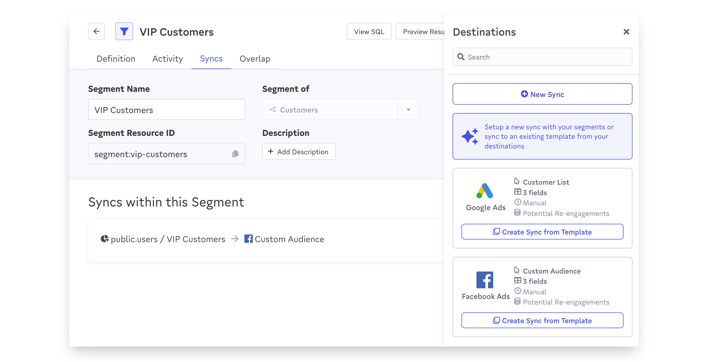

# Syncing Segments

Creating segments is valuable on its own (for more information, take a look at how Census lets you [analyze your segments](analyzing-segments.md) regardless of their destination). But the real value of Census is publishing them to your marketing, advertising, and sales destinations, and automatically keep them up-to-date as your data changes.&#x20;

To publish a segment, you'll need to set up a new sync that defines how the segment should be sent to a specific destination, including which data points should be synced, and how frequently. You can sync a segment in two ways:

#### 1. Quick Sync

For any segment, you can view all of its destinations in the **Syncs** tab. You can also use **Quick Sync** to instantly setup a new sync. Quick Sync uses the most recently created sync from the segment's input data set and each destination as a template. Quick Sync will instantly copy the configuration from the last including schedules and field mappings. If it's an audience sync, Quick Sync will automatically pass along your segment's name to the destination as well.&#x20;

<figure><figcaption></figcaption></figure>


Only active syncs can be used as quick sync templates. Paused and draft syncs will not appear as an option in the quick sync list.


#### 2. New Sync

Segments are available as a sync source option through the normal [sync creation workflow](../core-concept/). In this case, you'll first select the entity your segment is based off of, and then select the specific segment you'd like to sync.

<figure><figcaption></figcaption></figure>

Segments and entities have the same capabilities as model based syncs but also enable the syncing of fields from any related source that is joined on a many:1 basis.  For example if syncing contacts you can also sync the company name of the contact. &#x20;

## Automatically Managing Destination Audiences

Where available, Census also supports automatically creating new audiences in destinations to match your segments. For more information on this special sync type, see [Audience Syncs](../core-concept/audience-syncs.md).

## Syncing All Segment Membership Lists

It's common to have many segments created from the same entity, and many of the users or other records may appear in multiple segments. In some cases, it's helpful to be able to access a list of all of the segments the record appears in so that they can be worked with in combination (for example, combining potential offers in a single email) or just-in-time decisions can be made about most important segment.

In this case, the entity has a dynamic value called **Segment Membership** that will return a list of all of the segments each record is a member of. This value is available when syncing the entity rather than any individual segment, so it will include all records of the entity, even if the list of segments they are currently a member of is empty.&#x20;

You can also sync this field to make segment memberships available via the [Entity API](../developers/entity-api.md).

<figure><figcaption></figcaption></figure>

Syncing Segment Memberships will recalculate segment membership across all syncs for that entity at sync time so depending on the number of segments created, this can slow down your sync.&#x20;
