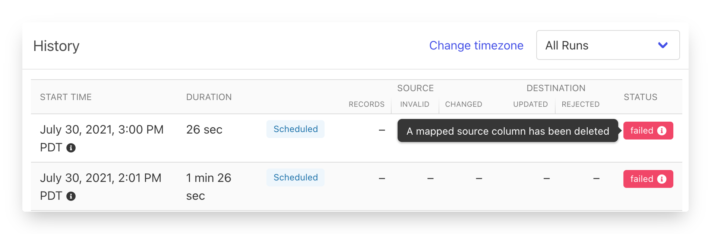
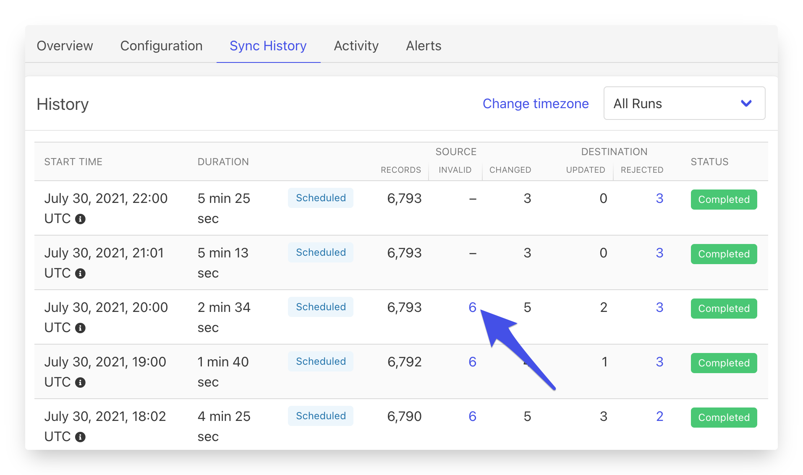
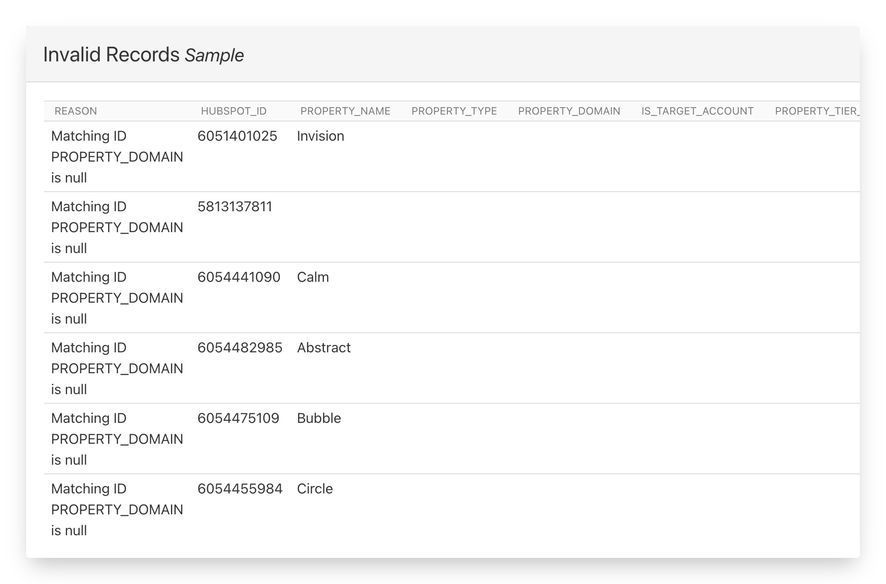
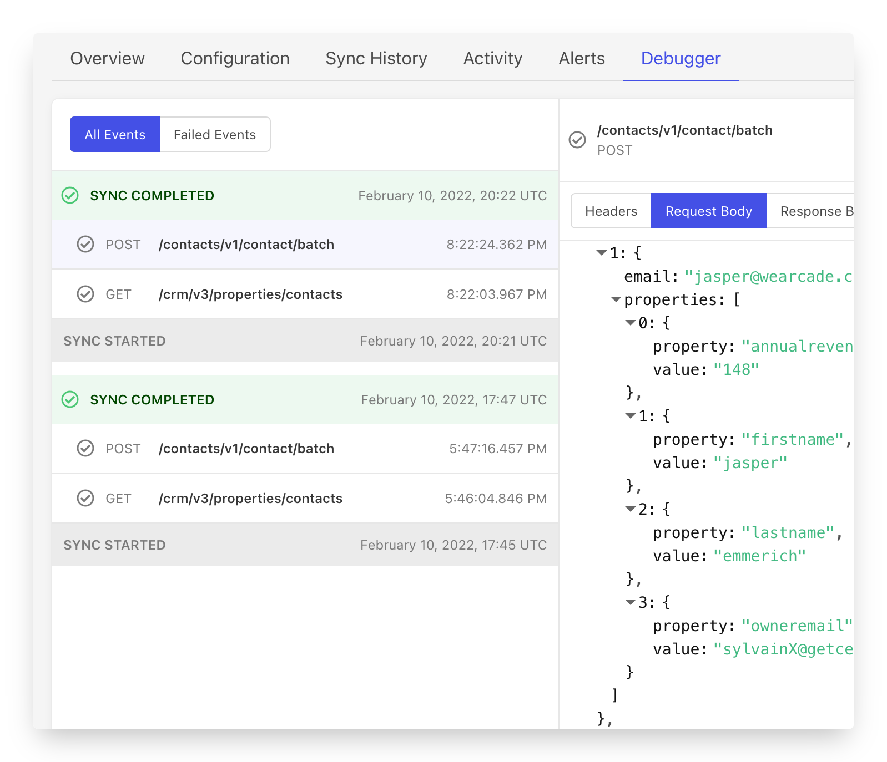

# Monitoring

Each sync you set up has several different views into its status, recent activity and overall health. This includes:

* The Overview status - A high level summary of the most recent status of the sync
* [Sync History](sync-monitoring.md#sync-history) - A detailed log of all of the sync's activity history
* API Inspector - A view of recent API calls made to the destination service

Additionally, you don't have to hang out looking at syncs all day to be sure they're healthy. Census also provide [Sync Alerts](alerts.md) for when things need your attention.

## Sync History

You can dive deeper into why syncs failed, or what records were invalid from the source, or rejected by the destination, under the **Sync History** tab.

**Failed Syncs**\
****Hover over the status label to see a detailed error.

**Invalid or rejected records**\
****Click the number of invalid or rejected records to see a sample (up to 100), and the reason why they were invalid or rejected.

## API Inspector

Sometimes it helps to be able to look under the hood and see how the engine is running. That's exactly what the API Inspector is for! You can use the API Inspector to understand the API calls Census is making to the destination service to sync your data, and also get low level details when things go wrong.&#x20;

Keep in mind, while Census works hard to make them all look the same, every destination has different API capabilities. Census will use a variety of endpoints to make sure your data syncs safely and as fast as possible.

The API Inspector will connect and show you the API calls made by Census related to a specific sync configuration. All API calls, including errors will appear here. Census will cache the most recent 200 API calls for up to seven days at which point the cache will be cleared. If you need the details of a specific API call, we recommend you copy the request and save it separately outside Census.&#x20;

### Supported Destinations

The vast majority of Census destinations support the API Inspector. This includes services that use JSON, XML, and CSV payloads to send your data.&#x20;

As of Early 2022, the following services are not yet supported: CustomerIO, Facebook Audiences, Google Ads, Google Cloud Storage, Google Sheets, Iterable, Microsoft Ads, NetSuite, Salesforce Marketing Cloud S3, SFTP

