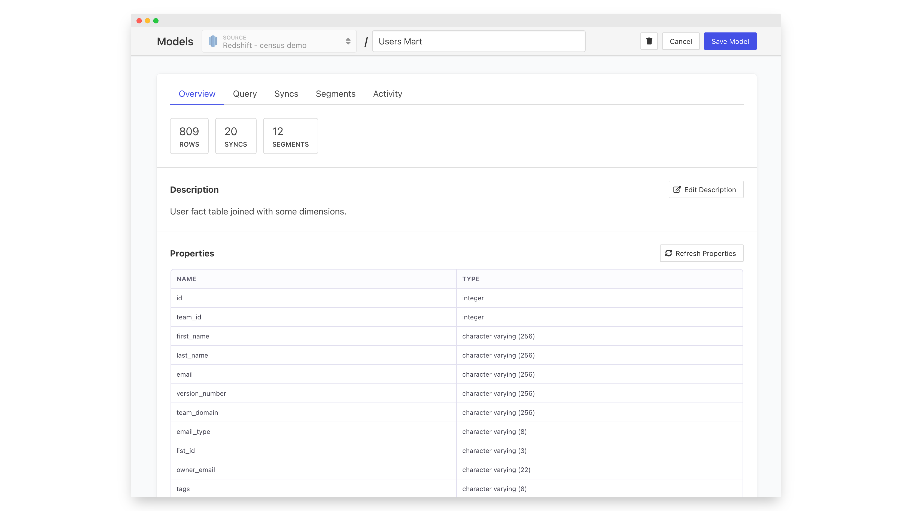

# Models

Models will be retired shortly, for the new, simpler approach to defining data please see [datasets.md](../datasets.md "mention")

\
At Census, we refer to each individual data set as a **Model**. A model is just a set rows-and-columns that Census can access in your data warehouse so they can take a lot of different forms:

* Tables or Views already in your data warehouse – This is the most common place to start. Chances are your data warehouse contains many tables and views already that can be reused in Census.
* [census-models.md](census-models.md "mention") – You can also just use SQL to model your data too. It's a fast way to get started syncing the exact set of data you need for a particular destination.
* External model repositories – Census also supports directly connecting to existing model repositories such as [native-dbt-integration.md](native-dbt-integration.md "mention"), [sigma.md](sigma.md "mention"), and [looker.md](looker.md "mention"). These tools make it easy to build and maintain sophisticated data transforms that keep your models up to date. Census connects with these tools to enable singular business logic to be sent to downstream business applications.

The actual set of properties/columns in your model have can be anything. The only important thing is that they are the properties needed for your syncs. The benefit of building models is that you can define them one time then reuse them as the authoritative source for all of your syncs.

<figure><figcaption>
The model overview helps you quickly understand what your model looks like and where it's used
</figcaption></figure>

The following pages cover the various ways you can add or create models in Census.
