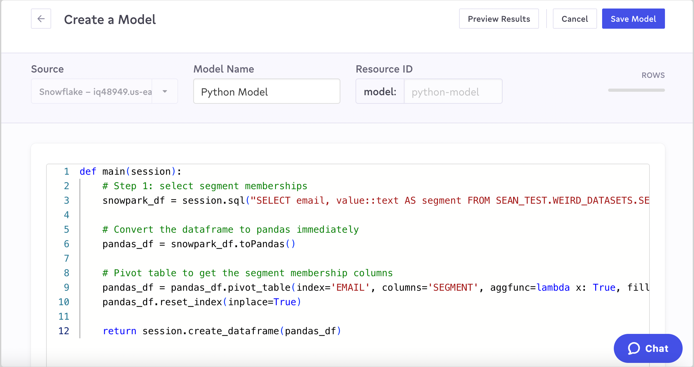

# Python Models (Snowflake-Only)

Python Models require nothing other than a Snowflake data source connection in [Advanced Sync Engine](../../../sources/overview.md#sync-engines). Once you have Snowflake connected, you can immediately start creating Python models. Using Snowflake's Snowpark developer framework, your python will be executed in your Snowflake data warehouse. The only requirement is that your results are returned as a Snowpark dataframe.

Python Models are a fast way to write and save data transformations that are difficult to perform in SQL. If you have the [necessary permissions](../../security-and-privacy/workspaces-and-access-controls.md), you can write brand new code or copy-and-paste from an existing system. Give it a name and save it, and you can immediately start using your model as a source for any of your syncs.

<figure><figcaption>
Pivoting data using the Python package pandas in Census
</figcaption></figure>

## Version History and Rollback

The version history of each Python model is also tracked in Census. Under the Activity tab, you have observability into the different changes to your Python Models. You can track:

* Which user made a change
* When the change was made
* What the model change was:
  * Name change
  * Description change
  * Python model change

<figure><figcaption>
View of Model Activity Tracking
</figcaption></figure>

Clicking the **Restore** button will restore the state of your Python model immediately prior to the selected change. This enables you to update your models with confidence, knowing you can always revert your changes if they accidentally break something downstream.


Note that restores will only affect the Python of the model. The model's name and its description will remain as they were before restoring.

