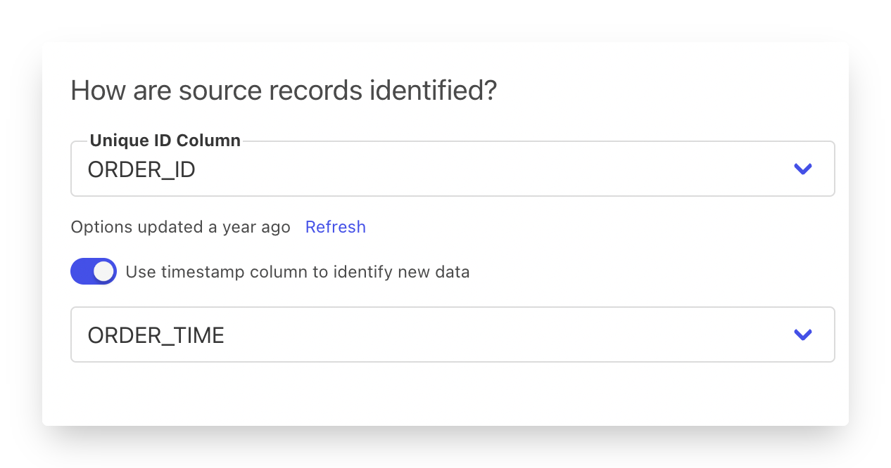
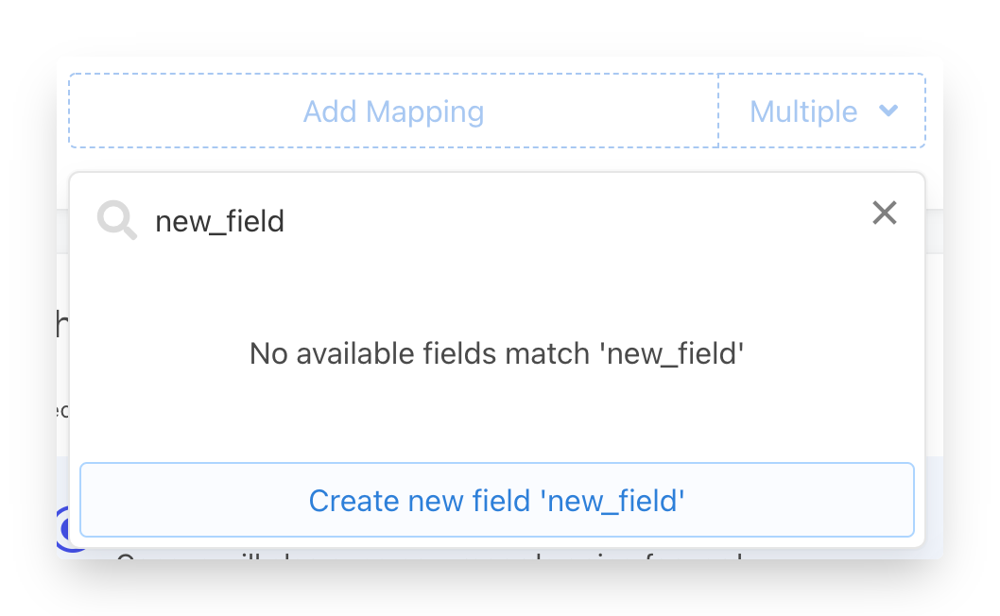

# Events

## What Are Events?

Unlike user profile records, event data is tied to specific actions, almost always associated with a user and/or company. Events typically have a specific set of fields

* **Unique ID** - Often used by services to make sure events are not submitted multiple times
* **Timestamp** - The time the event occurred
* **Event Name / Type** - Indication of the type of event that happened at that time
* **User and/or Company ID** - The thing that caused the event to happen or that the event happened to.
* And then optionally some properties about the event, often different properties for each type

In your data model, each event should be represented as a single row/record in the data source. When Census detects a new row in the data source, it will pass it to the destination service as an event/action using the parameters you've configured.

## Defining Event Syncs

Census supports an ever-growing set of destinations that accept event-style data. Often times these are simply labeled as "Events" but some destination services, such as [delighted.md](../../../destinations/delighted.md "mention") or [webhook.md](../../../destinations/webhook.md "mention") work like events in order to send NPS Surveys and Webhook API messages respectively.&#x20;

To send event data, you'll create a new sync that uses the **Append Only**. Census will treat your event data as an ever-growing append log of data and whenever new rows appear in your data source, will send them over.

The Append Only event sync gives you a few special behaviors to optimize your sync

#### Backfill or just look forward

When setting up an Append Only sync, Census will ask if you'd like to backfill the events already in the data source or simply sync going forward. This option lets you skip any existing data in the data source and only sync new event rows as they appear.&#x20;

#### Using timestamp to identify new records


This feature is meant to pick up fast-changing data, to enable syncing many events as fast as possible. If syncing to Slack, or with low volumes of data, we recommend not using this


By default, Census uses the Event ID to detect which rows are new and should be synced. This is fine for most use cases but when data sources expand beyond tens of millions or rows, it may be faster to use a timestamp if available.&#x20;


Identify new records by timestamp is available on Google BigQuery, Snowflake, and Redshift data warehouses.


#### Tracking data history

Census will keep track of events that have been synced by ID (or timestamp) for the life of the sync configuration to avoid syncing them more than once. As a result, the typical Force Full Sync option is not available on event syncs, and event syncs require data warehouses that support writing state. As such, [read-only data sources](https://docs.getcensus.com/basics/core-concept#data-source-permissions-and-read-only-access) are not supported at this time.&#x20;

## Mapping Event Properties

With your event sync ready to go, the next step is to let Census know how to handle the rest of the event properties. In this case, you have three options depending on the shape your data.&#x20;

1. Mapping all remaining columns to the destination automatically - Best for models that represent only that event type.
2. Mapping each column to a destination property individually - Best for models with lots of columns where only a subset are needed for the actual event.
3. (Where available) Using the properties bundle shortcut - Best for models that contain multiple different event types in the same data set.

#### Mapping all columns automatically

Nearly all event destinations support custom or dynamic properties, meaning the service will let Census send whichever properties you'd like, not just the default ones. In this case, you can let Census automatically sync all the remaining columns in your data model and as new columns are added, the fields will be automatically added to your sync/passed along as well.&#x20;

**Mapping specific columns**

This is the standard method of defining syncs in Census. You'll add mapping entries for each column you'd like to send to the destination. Take advantage of the **Create New Field** option when setting up mappings as well.

Note: Most event services do not let Census know which properties are already used in the destination so you'll need to provide the list of destination properties yourself if you want to reuse existing fields or events. Keep in mind capitalization!

## Using the Properties Bundle

Some event destinations such as Amplitude and Mixpanel support a Properties Bundle shortcut which accepts a [structured-data.md](structured-data.md "mention") object column containing the keys you'd like to send to the destination. The benefit of this approach is that your data model can include dynamic sets of properties for different event types in a single sync.&#x20;

