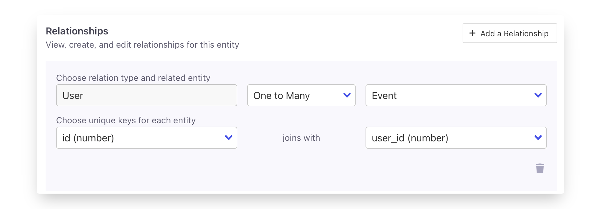

# Entities

Entities are a core concept in Census. Entities are the most important [models](models/ "mention") in your data warehouse and typically represent a single "thing" like a person (or a lead or a contact) or a company (or an account or organization) though they can also be other things like invoices, campaigns, events, or devices.

Your entity is a list or a set of those things, ideally the full set so that others can easily use [audience-hub](../audience-hub/ "mention") to create interesting subsets of that thing. That means your entity should include as many columns (also called properties or fields) as possible so others can easily reuse those entities in segments or [core-concept](../core-concept/ "mention").

Setting up entities in Census gives you the opportunity to define where the data is stored, what it is, how it's related and more, all of which will make Census much more powerful and easier to use.

<figure><figcaption>
example Person entity
</figcaption></figure>

## Concepts

Entities add a number of additional pieces of information on top of a regular [model](models/) that makes them much more powerful, but also requires a bit of thought during setup.

### Data Source

An entity is just a pointer to an existing model in your warehouse. You can think of an entity as bookmarking, favoriting, or otherwise promoting a model that already exists so that anyone can quickly jump to the data that matters for them.

### Data Type

Letting Census know what "type" of data your entity is will let Census be smarter when segmenting or syncing your entities later on. Census currently supports three specific data types in addition to a Generic type.

| Type       | Description                                                                                                                               |
| ---------- | ----------------------------------------------------------------------------------------------------------------------------------------- |
| Generic    | Any unspecified type of data. **If in doubt**, you can always use Generic for any of your entities.                                       |
| Event      | Analytical events that capture a specific type of action with a moment in time (rather than calendar events)                              |
| Person     | Humans that engage with your business in some form. They may be subscribers or free users or email recipients depending on your business. |
| Join Table | This can be used to specify a many-to-many relationship.                                                                                  |

### Schema Columns

Depending on the type of your entity, you can also highlight certain key columns on the entity that should have a special behavior.

* All Entity types require a single column to act as a unique identifier for each record. If your data set doesn't already have one, you can create a column by combining values from other columns into a unique identifier.
* Event type entities require a few additional additional fields to support event segmentation.
  * Event Name - The human readable label for the action the event record refers to.
  * Timestamp - The timestamp the event occurred (ideally in UTC).

**Don't worry**, all of your entity's existing columns will be available for syncing and segmenting. Schema Columns just indicate the columns on your entity that have special value for Census.

### Relationships

Though entities can exist without any relationships, almost all entities are related to another. Defining those relationships in Census unlocks the power of relationship-based Segmentation so define the relationships that exist in your data whenever possible.

Each entity can have many relationships defined and the relationship will appear on both related entities once defined.

<figure><figcaption></figcaption></figure>

The relationship definition includes two pieces of information:

* The type of relationship - Specify Many-to-One or One-to-Many relationship types here. These can be used to indicate when an entity is "owned" or "belongs to" one thing, or when an entity has many "children". The configured relationship should make sense if read out loud. For example, a `Person` entity almost always has a one-to-many relationship with Events because a "One Person Has Many Events".
* The matching identifiers - The columns that contain identifiers that should match (be equivalent) on both sides of the relationship. In database terms, this is the primary key and foreign key that would sit on either side of a JOIN condition.

To specify a Many-to-Many relationship type, use a `Join Table` type:

* Any entity can be used as a join table, not just ones that are typed `Join Table`. All the `Join Table` type does is drop the requirement of specifying a `Unique Id` for that entity since often join tables do not have unique Ids for rows.
* Aside from the specific many-to-many filtering use case, this change lets you filter on related entities inside filters on related entities. So you can now segment for things like “Pets who belong to users who have 5 purchase events in the last month”


Note that Census does not check or enforce the validity of the data on either side of your relationship. Duplicate values on either side of the relationship can cause issues using the relationships used in segmentation so please make sure the relationship's data remains valid via tools like dbt testing.


### Categories / Picklists

Often times, your data source contains columns that store categorical data, where the options in that column are limited to a small set of potential values. For example a `persona_type` attribute may have a limited set of 12 options, a `plan` attribute may only have two or three.&#x20;

You can indicate which columns of your data source should be treated as categorical by adding them to the **Enumerated Value Columns** list. Census will then show picklists for these when defining segments. The Event Name attribute of Event data is always treated as a category field.

<figure><figcaption></figcaption></figure>

## How to use entities at your company

The entities that matter for any given business are always unique so don't worry if your entities feel like they may be unique.

When setting up entities for the first time, it's easier to focus on just one or two entities and build from there. A great starting point:

* Person entity
* Events triggered by those people (if that applies to your business)
* Companies those people work at (if that applies to your business)

Setting up two of these entities with a relationship that joins them will let you get a sense of how the process works and how the resulting entities appear in segments and syncs.

## Next steps

Once your entities are configured, you can open up Census to anyone that could benefit from direct access to your data.

* Business Users can create meaningful subsets of data with Census's [audience-hub](../audience-hub/ "mention")functionality.
* Entities are easy to use directly in [core-concept](../core-concept/ "mention").

Have more questions about how entities fit with your data strategy? [Contact us](mailto:support@getcensus.com) via support@getcensus.com or start a conversation with us via the [in-app](https://app.getcensus.com) chat to let us know what questions we can help with!
