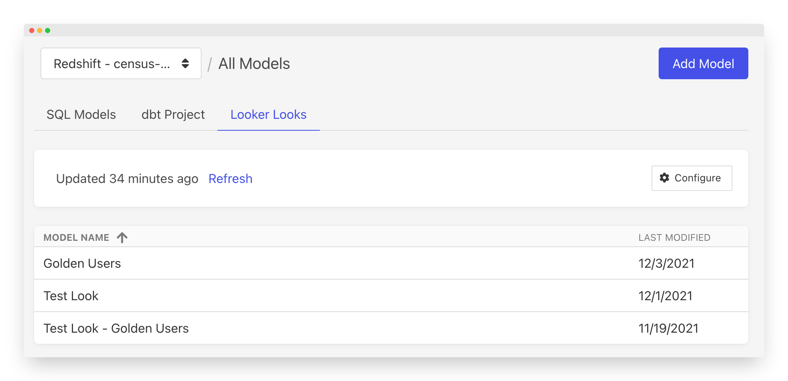

# Looker

Census supports connecting to an existing Looker environment, which allows you to build Looker Looks with Looker's powerful visual builder and then sync the data to any of your business apps.&#x20;

Census compiles your models on the fly whenever a sync is scheduled so your data and your models are always up to date. Here's a quick video of the instructions that we've covered in the write-up below.&#x20;



## Set up

To connect Looker to your Census instance, you'll need two things:

* An existing Census data source connection that matches the data source used by Looker. See the below section on about permissions.
* Looker API3 credentials for the user that has access to the Looks you plan to use in Census.

To create new API3 credentials, you'll need to visit the **Admin** > **Users** page, select the desired user and click the **Edit** button and then the **Edit Keys** button on the user's profile page. You'll need to note both the **Client ID** and **Client Secret** values to provide to Census. The [Looker documentation](https://docs.looker.com/admin-options/settings/users#edit\_api3\_keys) provides more details on how to find and create keys.\
\
Finally, you'll also need the subdomain of your Looker instance. You should be able to simply pull that directly from your browser URL bar. For example, if the URL is `https://censususer.looker.com/` then the subdomain is `censususer`.

#### Connecting Census to Looker

Now back in Census, select **Models** from the left navigation bar and, if you have multiple warehouse connections, make sure the one that matches your Looker instance is currently selected in the top right. Once it is, pick the **Looker** tab just below it. You'll see a **Connect Looker** button to start the process. From here, simply provide your subdomain, the client id and client secret.&#x20;

.png>)

Once saved, you should see all of your Looker Looks!


Note: Looks that are in development mode are not shared in the Looker API so only Looks that have been published will appear in Census.&#x20;


## Required data warehouse permissions

Census and Looker both maintain their own data warehouse credentials and connections which means each can have different permissions. However, Census requires the same permissions your Looker Looks use within Looker. If Census is missing some permissions that Looker has, you may see a permissions error in Census when attempting to preview the model or use it in a sync.&#x20;
