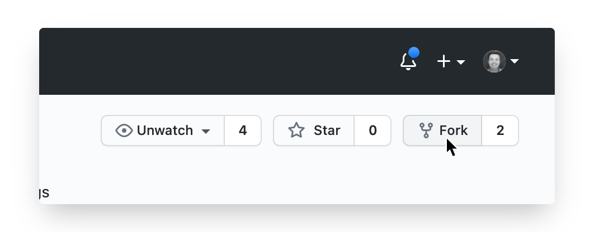
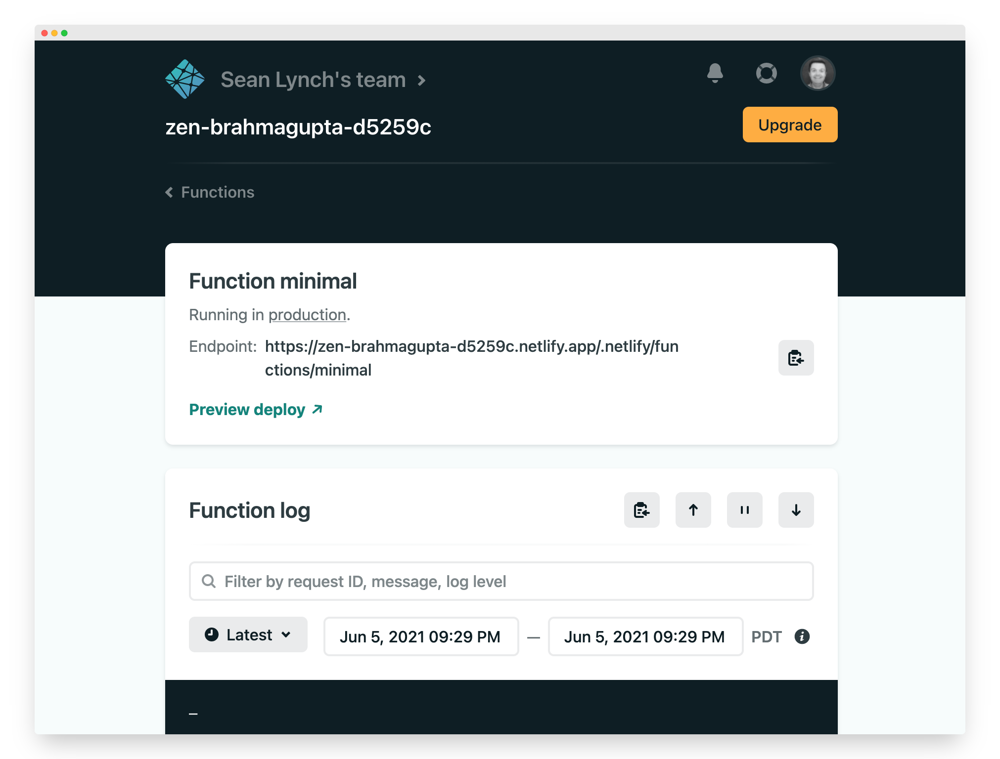
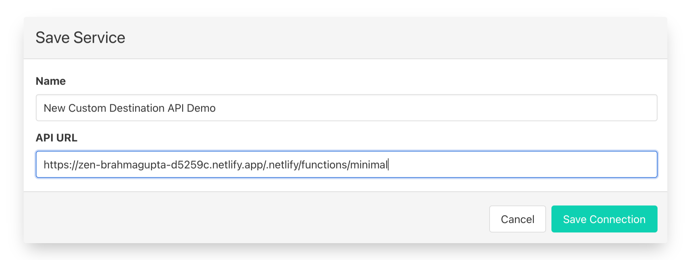
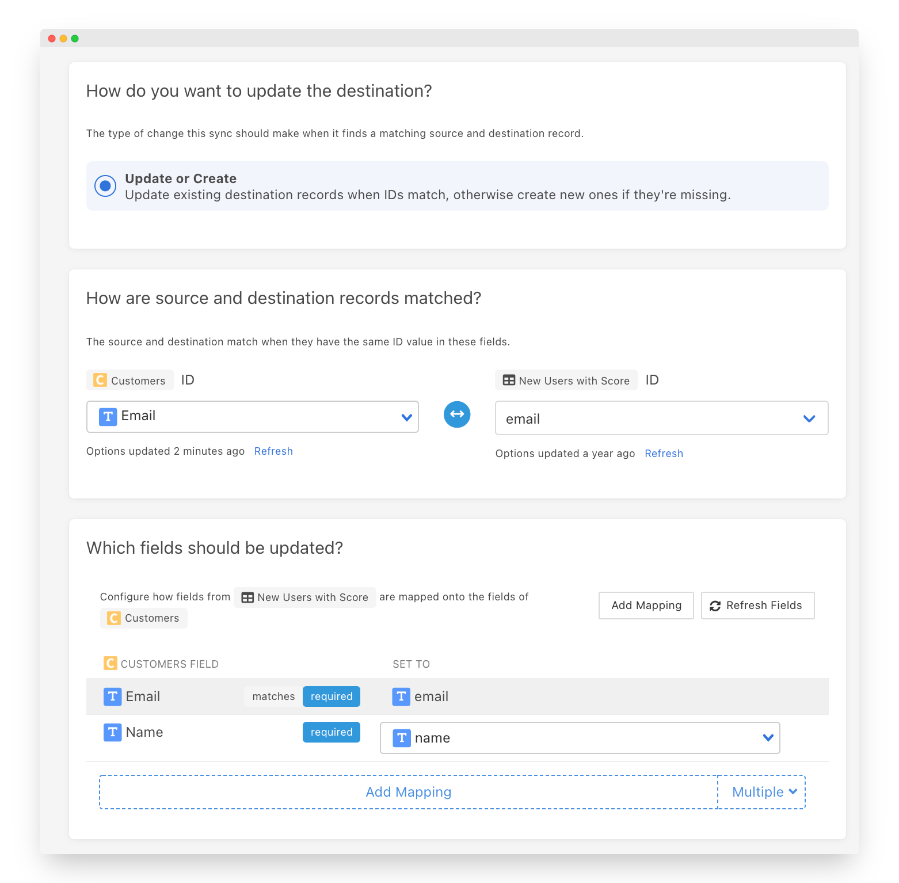
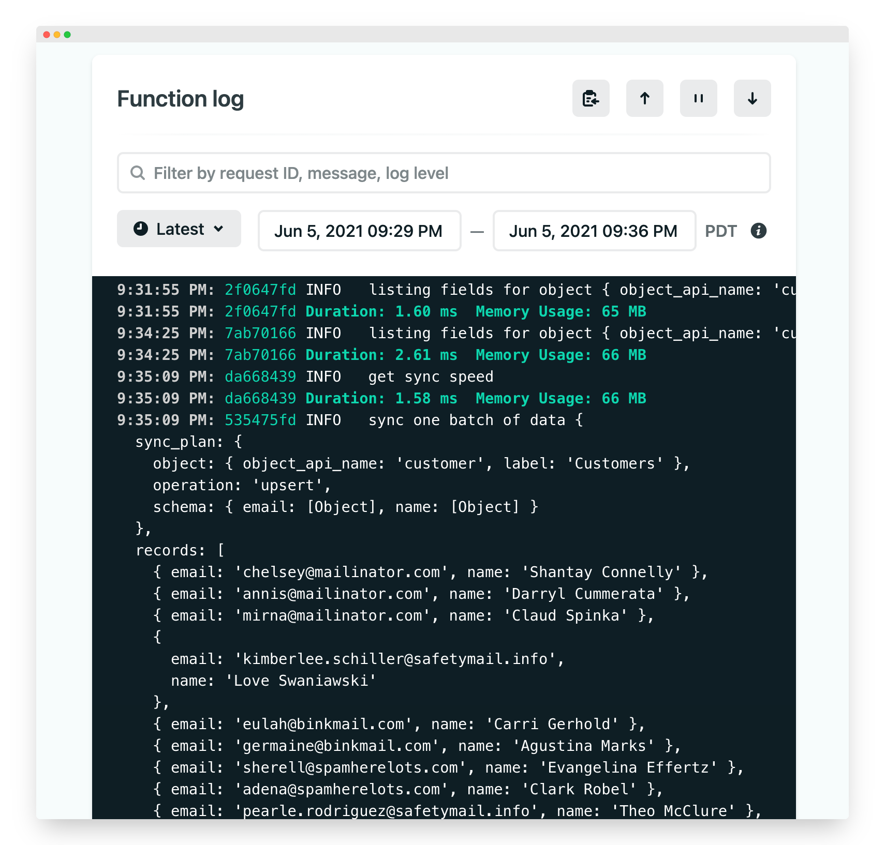
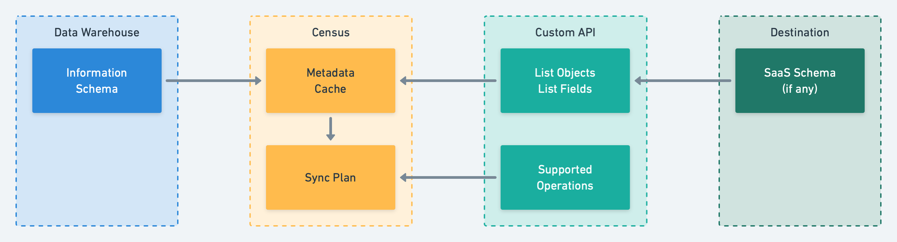
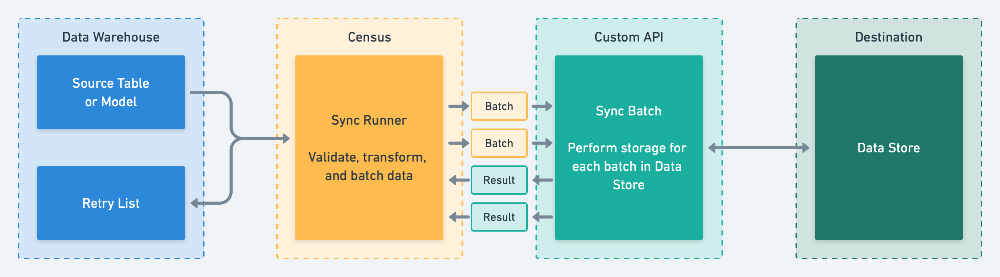

# Custom Destination API

Custom Destination API allow you to "bring your own" SaaS connector to Census. A custom destination is a few simple API endpoints that teach Census about the type of data your connector can process, the operations allowed on that data, and how to actually load that data. You can deploy your implementation to any service you like, as long as Census can reach the URL over the internet.

This guide walks you through setting up an example implementation, how to build your own from scratch, and covers all the technical details of how it operates.

## 🏃‍♀️ Demo Destination

To start, let's walk through the steps to deploy the[ sample implementation](https://github.com/sutrolabs/census-custom-api-docs/tree/main/samples/minimal). This will give you a good overview of everything involved in building a custom destination implementation.

#### Prerequisites

* A Census account. If you don't have one, you can sign up for a free trial [here](https://app.getcensus.com/).
* A place to run your Custom API code. Custom APIs have to be accessible via a public endpoint over HTTPS. For this demo, we'll use [Netlify Functions](https://www.netlify.com/products/functions/) (you can sign up for a free account) . If you'd prefer to test locally, you can also use [ngrok](https://ngrok.com) or a similar tool to expose your local endpoint to a temporary public URL.
* Your own copy of this [sample implementation](https://github.com/sutrolabs/census-custom-api-docs/tree/main/samples/minimal). It takes care of the JSON-RPC protocol and provides stub implementations of some methods for simple Custom APIs.

Generally speaking, your Custom API will act as a proxy that passes data from Census to some destination service. For now, we're just going to log the data once it reaches our code.

Once you've got your Census, Netlify, and GitHub accounts ready, let's get started!

#### Fork the Sample

To deploy to Netlify, you'll need a git repo with a copy of the sample implementation that Netlify can connect to directly. The easiest way to do this is by [forking the GitHub repository](https://github.com/sutrolabs/census-custom-api-docs/fork). Otherwise, you can clone the repo and then push it to a new repo on GitHub, Gitlab, or Bitbucket.



#### Deploy the Function

Now head over to Netlify. Create a new "Site" and point Netlify at your newly forked or cloned repo.


The example code is set up to work exactly to Netlify's default site specifications. You should be able to click past the Site Settings page as is. Once you've completed the three steps, you'll press the final Deploy Site button. You'll see your new site building and then eventually deployed.

Once deployed, select Functions from the top menu. You'll see a list that contains the new **minimal** function we created. Click on it to see the URL of this new end point. That's the public URL for our newly created function. Click the handy copy button to the right and keep that handy, we'll give it to Census next. BUT! Leave this page open in a tab. It has a handy live log view that we'll return to at the very end.



#### Set up the Connection

Now head to Census, specifically the [Connections page](https://app.getcensus.com/connections). From the **Add Services** menu, select **Custom Destination API**. You can give your new connection any name you'll remember, and the URL will be the value you copied from Netlify a moment ago. Save your new connection and you should see Census testing your new connection is responding correctly. You should see ✅in just a minute.



#### Create a Sync

The last step is to create a test sync. The sample implementation expects records with Email and Name properties, but you can sync whatever table, view, or model you have handy in your data warehouse for now, though you only need a few rows to test.

In Census on the [Syncs page](https://app.getcensus.com/syncs), click the **Add Sync** button. Select your test model and your new Custom Destination. You can provide matching email and name fields, or use any other available fields, the data won't be sent anywhere other than Netlify's logs.

Your sync should look like this at the end. Save it and run it!



#### The Results

After your sync is complete, head back to your Netlify tab. You should see the logs for the calls Census made to your connector, including the final sync data.



Congratulations! You've got your first Custom Destination running! There's a lot of details we've skipped over to get here so read on to learn more about how Custom Destination API works and how you can extend it to work for your specific destinations.

## Concepts

Your Custom API is a bridge between Census and your destination SaaS or other system. Census syncs are divided into two phases, each of which will call different methods on your API: planning and execution.

#### Sync Planning



In the planning phase, Census will ask your API what kinds of data it manages and what operations are available on that data. This phase is broken into three API methods:

* `list_objects` - Get a list of the objects your API can write to.
* `list_fields` - Get a list of the fields, along with data types and validation rules, for a given object.
* `supported_operations` - Find out what kinds of "writes" can be performed on an object - can new instances be created? Can existing instances be modified?

#### Sync Execution



Once the sync has been planned by the user (utilizing metadata from your API and your data warehouse) it can be executed. At execution time, Census will call two methods on your API:

* `get_sync_speed` - How quickly should Census send data to your API?
* `sync_batch` - Sync one batch of records to your destination, reporting success and failure for each record.

### Objects and Fields

Every Census connector has a schema, which is made up of _Objects_ and _Fields_. Objects are roughly analogous to tables in a database, whereas fields are like columns. Your Custom API connector will tell Census what its schema is as part of the planning process (via the `list_objects` and `list_fields` methods). Census will use this information to populate its mapping API, and guide the users of your Custom API to map tables and columns in their data warehouse to your destination.

Every SaaS application has a different data surface it exposes to the world, and there is some art in deciding how to model SaaS data APIs as objects and fields. This also depends on the operations the SaaS application gives you (see below).

Many SaaS applications / destinations do not provide APIs to discover objects and fields. In this case, your Custom API should return a hard-coded list of objects and fields and return those to Census.

### Operations

Destination systems may also have rules about what can be done with new and existing data. Census will send an `operation` field in the [sync\_batch](custom-api.md#sync\_batch) call to indicate how the records should be processed. Census currently allows Custom APIs to choose from four operations for each object:

* `upsert` (most common) - records in the destination can be created or modified
* `insert` - records can only be created in the destination, they cannot be modified
* `update` - records can only be modified in the destination, they cannot be created
* `mirror` - records will be created and deleted in the destination as they are added and deleted from the dataset

Census does not know whether a record already exists in your destination when using a Custom API, so it is up to you to enforce the semantics of the operation(s) you have chosen to support. For example, if Census has been configured to `update` records in the destination but not `insert` them, your Custom API must first check the destination to see if a matching record exists, and tell Census to skip it if it does not exist. Some destination systems may provide APIs like this for you (create this record only if it does not exist) if they have strong enforcement of uniqueness on identifiers.

When it comes to `mirror` syncs Census will send separate batches of records. For records that should be created and updated the batch will indicate an operation of `upsert` and for records that should be deleted from the destination the operation will be `delete` .

### Matching Source and Destination Data

Every sync plan created by Census for an `insert`, `update`, or `upsert` sync will include a field that should be used as the identifier for matching source and destination records. This field must be unique and required in both systems (the source data warehouse and the destination SaaS), and it will be provided for every record. Your Custom API will tell Census (via the `list_fields` method) which fields can be legally used as identifiers.

### Security Considerations

The requests that Census makes to your Custom API may include sensitive data about your business or customers, and your API must protect that data. In addition, your API must protect any secrets or credentials that it will use to authenticate to the ultimate destination system.

All connections from Census to a Custom API must use HTTPS with a certificate signed by a well-known CA - self-signed certificates are prohibited.

Your Custom API URL can include a cryptographically unguessable segment that you can use to verify calls are coming from Census and not an imposter. For example, if your Custom API is hosted at `https://census-custom-api.yourcompany.example`, you could configure Census to invoke it as `https://census-custom-api.yourcompany.example?census_authentication=XoBcsUoFT82wgAcA` and verify all calls include the correct `census_authentication` value.

Secrets needed by your Custom API can be stored in several places:

* In environment variables accessible to your Custom API - this is a common pattern supported by many API hosting platforms.
* In your application's source code - this is usually a bad practice because source code may not be stored as securely as environmental variables, but this depends on your organization's practices
* As query string or path segment parameters in your Custom API's URL. To continue the example above, if your Custom API needs an API key to access the destination system, you could include it as a second parameter, i.e. `https://census-custom-api.yourcompany.example?census_authentication=XoBcsUoFT82wgAcA&api_key=Ur2NtbfiPuFSkdQp`

Because your Custom API URL can contain secrets, it is considered to be sensitive data by Census and encrypted within our logs and databases.

#### Auth Token

You can specify a special authentication token for a Custom API connection and this token will be attached as an `Authorization` header to every request. In the connection setup screen you will see an optional field:

<figure><figcaption><p>Custom API Connection setup card with Auth Token field</p></figcaption></figure>

Whatever you place in the _Auth Token_ field will be sent along with every request as a header in the form of `Authorization: Bearer <your string>`. This avoids the need to add a token to the url. NOTE: Once a token credential has been set it can be changed but not removed.

### Versioning

Our Custom Destination API is versioned with the current version being v1. You can adjust the version you are targeting by editing the connection credentials in the Census app for that specific connection. The versioning scheme is simple: whenever we make a breaking change to the Custom Destination API interface we will increment the version and your existing connections should remain functional.&#x20;

<figure><figcaption></figcaption></figure>

## Writing Your Custom API

### Basic Request-Reply Message Format

Your Custom API will use an [RPC-style protocol](https://www.jsonrpc.org/specification) to communicate with Census. Every message from Census will be an HTTP POST whose body is a JSON object that includes these elements:

* `method`: The name of the method Census is calling on your API. Methods are included in request bodies (instead of as a RESTful-style URL component) so that you can give Census a single URL as the integration point.
* `params`: A JSON object (possibly empty) containing parameters for the method
* `id`: A unique ID for the request. You must return this same ID in the response
* `jsonrpc`: This will always be the string `"2.0"`

Your response to every call must be a JSON object with these elements:

* `result`: A JSON object that is the value you are returning from the method call. Can be empty, depending on the method
* `error` : Optional - allows you to return [error information](https://www.jsonrpc.org/specification#error\_object) to Census in the event of a problem invoking your API. The `error` property must not be present if there is a `result`
* `id`: The same `id` that was passed in to the request
* `jsonrpc`: This will always be the string `"2.0"`

Here's an example of what a request and reply look like in Census, assuming your Custom API is located at `https://example.com/census`

#### HTTP Request

```http
POST /census HTTP/1.1
User-Agent: Census https://www.getcensus.com
Content-Type: application/json
Accept-Encoding: gzip;q=1.0,deflate;q=0.6,identity;q=0.3
Accept: */*
Connection: keep-alive
Keep-Alive: 30
Host: example.com
Content-Length: 96

{"jsonrpc":"2.0","method":"test_connection","params":{},"id":"d33ded2672b7877ff833c317892d748c"}
```

#### HTTP Response

```http
HTTP/1.1 200 OK
X-Powered-By: Express
content-length: 83
content-type: application/json; charset=utf-8
Date: Fri, 19 Mar 2021 00:25:21 GMT
Connection: keep-alive

{"jsonrpc":"2.0","id":"d33ded2672b7877ff833c317892d748c","result":{"success":true}}
```

Every request currently requires a synchronous response. Census will time out requests that take a long time to complete; if your connector is unable to complete its work (particularly the `sync_data` method) within this time, you can use the `get_sync_speed` method to tell Census to send data more slowly until you are able to complete within this timeout.

### Caching, State, and Parallel Invocations

The Custom API protocol is designed to allow you to implement your API in a completely stateless manner. Specifically:

* Don't cache data or metadata. Census will perform caching of your objects, fields, supported operations, etc. automatically, with policies to refresh stale data and controls for users to force invalidation. Adding additional caching may make your Custom API behave unusually in the Census UI.
* Don't store any other durable state, especially service data, unless your Custom API is "part of" the destination system. Try to ensure that calls to `sync_batch` result in the data being actually persisted to the destination system - once you tell Census a record has been synced, Census may never send that record again (if it doesn't change in the source) and Census has no way to know that it was "lost" from the destination system
* Expect Census to send multiple requests to your Custom API in parallel. For performance, Census will retrieve / update schemas in parallel, and will sync data in parallel. You can control the degree of parallelism for syncs via the `get_sync_speed` method.

### Error Handling

Census will take care of most error handling on your behalf. Census uses a hierarchical retry strategy - single records or batches may be retried on failure, and full syncs may be retried if Census detects that a sync was incomplete. In addition, Census can automatically perform "full syncs" of the source data set if it detects certain conditions that can lead to loss of durability.

Do not be surprised if Census tries to sync the same record to your destination multiple times - this is a normal part of our recovery-oriented sync runner.

Census provides three "channels" for your Custom API to return errors:

* If your Custom API fails to return an object with the correct keys, Census will fail with an "unknown error". If you have enabled the Custom API debugger (see below), the error will be captured for later troubleshooting
* Your Custom API may return a structured error message and code in the error property of the JSON-RPC response object. This error code and message will be displayed in the Census UI.
* Two methods, `test_connection` and `sync_batch`, provide the ability to return application-level error messages. For `test_connection`, you can return a high-level error messsage helping the user debug why your Custom API may not be working. `sync_batch` requires your Custom API to indicate a success or failure status for each record in the batch - error messages associated with record-level failures will be displayed in the Census Sync History UI

And finally, do not hesitate to fail any method calls if your Custom API encounters an unexpected error - the sync engine is designed to be safe even in the presence of transient or permanent failures. It's always safer and simpler to fail and propagate errors back to Census than to attempt your own retry logic.

### Rate Limiting

By default a Custom API connection has a _connection-wide_ rate limit of 5000 requests per second. This means that if two syncs are running simultaneously against the same custom connection they will both count against that rate limit.

This limit can be overridden by returning a `X-RateLimit-Limit` header in the responses to our calls against your custom API. For example: if you want to cap requests to your custom service at 100 reqs/second then return `X-RateLimit-Limit: 100` as a header in the responses from your service. Whatever value you set here is the limit _per second._

**NOTE**_:_ This is different than our operation to fetch the [sync speed](custom-api.md#get\_sync\_speed). In essence these are two rate limiting mechanisms working in tandem. `get_sync_speed` is designed to indicate how fast and parallel an individual sync can be while this `X-RateLimit_Limit` header is a connection wide limit that acts as a cap to ensure that multiple syncs running simultaneously do not overwhelm the same custom API destination.

## RPC Details

Your connector must implement all of these methods to work with Census:

### test\_connection

#### Verify that the custom connection is working

Census calls this method when a user presses the “Test Connection” button on your custom connection. When this is invoked, you should do something to test that the connection to your upstream SaaS application is working correctly - specifically, it’s useful to verify API keys.

**Request**

This method has no parameters - the request parameters will always be an empty JSON object

```javascript
{
  "jsonrpc": "2.0",
  "method": "test_connection",
  "id": "d33ded2672b7877ff833c317892d748c",
  "params": {}
}
```

**Response**

This method has two possible responses. On success, you should respond with:

```javascript
{
  "jsonrpc": "2.0",
  "id": "d33ded2672b7877ff833c317892d748c",
  "result": {
    "success": true
  }
}
```

If an error occurs performing the connection test, respond with:

```javascript
{
  "jsonrpc": "2.0",
  "id": "d33ded2672b7877ff833c317892d748c",
  "result": {
    "success": false,
    "error_message": "The API Key is invalid"
  }
}
```

### list\_objects

#### List all the objects supported by the custom connection

Census calls this method periodically (in response to UI interaction as well as proactively in the background to warm its caches) to get the list of objects your connector supports as sync destinations. Your connector will be useless unless you respond with at least one object.

Objects have both labels (for humans) and API names. These may be the same value, but they do not have to be. The API name is an identifier chosen by you that acts as the primary key for an object; an object’s label may change over time, but its API name must not. You should choose API names that correspond with long-lived identifiers in your destination SaaS.

Objects can support creating new fields if the `can_create_fields` property is set to `on_write`. This is useful for objects which can have arbitrary properties, like events. Census allows you to map new fields in the Sync creation UI but it's on your API implementation to support ingesting and creating these new fields when they are received. Being able to create new fields is a requisite for an object supporting [Sync All Properties](https://docs.getcensus.com/basics/core-concept#creating-new-fields-on-your-destination-object).

**Request**

This method has no parameters - the request will always be an empty JSON object

```javascript
{
  "jsonrpc": "2.0",
  "method": "list_objects",
  "id": "6d2bd06835a565bee3e2250177f1d738",
  "params": {}
}
```

**Response**

```javascript
{
  "jsonrpc": "2.0",
  "method": "list_objects",
  "id": "6d2bd06835a565bee3e2250177f1d738",
  "result": {
    "objects": [
      {
        "object_api_name": "restaurant",
        "label": "Restaurants"
      },
      {
        "object_api_name": "venue", 
        "label": "Concert Venues"
      },
      {
        "object_api_name": "reservation", 
        "label": "Reservation",
        "can_create_fields": "on_write"
      },
    ]
  }
}
```

### list\_fields

#### List all the fields for a given object

Census calls this method periodically to get the list of fields for a supported object. An object must have at least one field with `identifer` set to `true`, or it cannot be the destination of a Census sync.

A field’s description consists of these required properties:

* `field_api_name` (string): A unique, unchanging identifier for this field
* `label` (string): A human-friendly name for the field
* `identifer` (boolean): If true, this field can act as a shared identifier in a Census sync. In order to be used an an identifier, a field must fulfill a few constraints:
  * It must be unique
  * It must be required
  * It should be easy to create or update records in the destination SaaS by this value
* `required` (boolean): If true, a record cannot be created unless a values is specified for this field. Census will enforce this by requiring a mapping from a data warehouse column to this field before a sync can be performed.
* `createable` (boolean): If true, this field can be populated on record creation in the destination SaaS. This will be true for most fields. An example of a non-creatable field would be something like an auto-populated “Created At” timestamp that you’re not able to write to using the SaaS API.
* `updateable` (boolean): Similar to `createable` - if true, this field can be populated when updating an existing record. Generally speaking, if a field is neither `createable` nor `updateable`, you might consider omitting it entirely from the `list_fields` response, as it won’t be usable by Census for any syncs.
* `type` (string): The data type for this field. Census uses this to plan any “type casts” required to translate data from your data warehouse to your SaaS, to warn of invalid or lossy type casts, and will format the data on the wire to your custom connector using this type information. If `identifier` is `true`, the type must be `string` or `integer`. See the table below for the full list of types.
* `array` (boolean): If true, this field accepts an array of values instead of a single value. Any type can be used as an `array` type, but `array` types cannot be `identifier`s. Census will require array fields to have a matching array field in the mapped data warehouse column.

| Census Type | Can Be Identifier | JSON Wire Type | JSON Wire Example        | Notes                                                                                                                          |
| ----------- | ----------------- | -------------- | ------------------------ | ------------------------------------------------------------------------------------------------------------------------------ |
| `boolean`   | No                | `boolean`      | `true`                   |                                                                                                                                |
| `decimal`   | No                | `string`       | `"1234.1234"`            | Fixed-point decimal numbers are sent as strings to avoid loss of precision                                                     |
| `float`     | No                | `number`       | `42.42`                  | Consider the decimal type instead for `numeric` data warehouse columns                                                         |
| `integer`   | Yes               | `number`       | `4242`                   |                                                                                                                                |
| `date`      | No                | `string`       | `"2021-03-29"`           | JSON does not have a date type, so dates are ISO 8601 strings                                                                  |
| `date_time` | No                | `string`       | `"2021-03-29T16:32:23Z"` | JSON does not have a datetime or time type, so date times are ISO 8601 strings. All date\_time values will be expressed in UTC |
| `string`    | Yes               | `string`       | `"pepperoni"`            | String encoding follows the JSON standard                                                                                      |

**Request**

```javascript
{
  "jsonrpc": "2.0",
  "method": "list_fields",
  "id": "172ac10da8e6e29296612223e428bafd",
  "params": {
    "object": {
      "object_api_name": "restaurant",
      "label": "Restaurants"
    },
  }
}
```

**Response**

```javascript
{
  "jsonrpc": "2.0",
  "method": "list_fields",
  "id": "172ac10da8e6e29296612223e428bafd",
  "result": {
    "fields": [
      {
        "field_api_name": "name",
        "label": "Name",
        "identifier": true,
        "required": true,
        "createable": true,
        "updateable": true,
        "type": "string",
        "array": false,
      },
      {
        "field_api_name": "outdoor_dining",
        "label": "Outdoor Dining?",
        "identifier": false,
        "required": false,
        "createable": true,
        "updateable": true,
        "type": "boolean",
        "array": false,
      },
      {
        "field_api_name": "zip",
        "label": "ZIP Code",
        "identifier": false,
        "required": false,
        "createable": true,
        "updateable": true,
        "type": "decimal",
        "array": false,
      },
      {
        "field_api_name": "tag_list",
        "label": "Tags",
        "identifier": false,
        "required": true,
        "createable": true,
        "updateable": true,
        "type": "string",
        "array": true,
      }
    ]
  }
}
```

### supported\_operations

#### List the operations that can be performed on an object

Census calls this method when a user is setting up a sync to your custom connector to determine how data should be copied to your object. You should advertise all the operations you are capable of supporting - the Census user will pick one of them from your supported list when they are configuring their sync. Currently, custom connectors support these operations:

* `upsert`: Look for a matching record in the SaaS - if it is present, update its fields with the new values, if not, create it. This is the most commonly used operation.
* `insert`: If a matching record is not present in the SaaS, create it. If it is present, skip syncing this record.
* `update`: If a matching record is present in the SaaS, update it with new field values. If it is not present, do not create it and skip syncing it.

**Request**

```javascript
{
  "jsonrpc": "2.0",
  "method": "supported_operations",
  "id": "f6a21a592299ee8ff705354b12f30b4d",
  "params": {
    "object": {
      "object_api_name": "restaurant",
      "label": "Restaurants"
    },
  }
}
```

**Response**

```javascript
{
  "jsonrpc": "2.0",
  "method": "supported_operations",
  "id": "f6a21a592299ee8ff705354b12f30b4d",
  "result": {
    "operations": ["upsert", "update"],
  }
}
```

### get\_sync\_speed

#### Tell Census what batch sizes and sync speeds should be used

Census will call this method just before a sync is starting to determine how quickly it should send data to your custom connector. In order to make your connector as easy to implement as possible, Census allows you to configure the batch sizes, maximum throughput, and maximum parallelism it should use when sending you data.

Your response should include these three values:

* `maximum_batch_size`: How many records Census should include in each call to `sync_batch` (see below). Census may send smaller batches than this, but it will never send larger batches. If your SaaS API has a batch API, you should strongly consider setting this value to match you SaaS’s maximum batch size. If your SaaS does not have a batch import API, we recommend setting this to a relatively low value (under 100) then testing the performance of your custom connector with different batch sizes and increasing the value if needed for increased throughput.
* `maximum_parallel_batches`: How many simultaneous invocations of `sync_batch` Census will perform. It’s generally safe to set this to a large number and control your sync speed using the other two variables, but if your underlying infrastructure (web server or function-as-a-service provider) limits the number of parallel calls to your function, you should use this parameter to stay under that limit and avoid queueing at the network layer. **NOTE: The maximum allowed value here is 50. If you set a higher number it will be set down to 50.**
* `maximum_records_per_second`: How many records (not batches) Census will send to your custom connector per second, across all invocations. This should be matched to your SaaS API’s maximum records per second, possibly with some buffer to allow for measurement error. The actual records per second may be less than this value, depending on `maximum_batch_size`, `maximum_parallel_batches`, and the average time it takes for your connector to complete one batch.

_Known Issue_: Currently these “speed limits” are enforced at the sync level, not across the entire connector, so two simultaneous syncs to different objects on the same connector can cause these limits to be exceeded.

**Request**

```javascript
{
  "jsonrpc": "2.0",
  "method": "get_sync_speed",
  "id": "fca4af985ea367a22bec9cb6fc31676f",
  "params": {}
}
```

**Response**

```javascript
{
  "jsonrpc": "2.0",
  "id": "fca4af985ea367a22bec9cb6fc31676f",
  "result": {
    "maximum_batch_size": 5,
    "maximum_parallel_batches": 8,
    "maximum_records_per_second": 100,
  }
}
```

### sync\_batch

#### Load one batch of data from Census to your destination application

This is the actual “data transfer” method in the API - once configuration is performed and a sync plan is made, Census will call this method repeatedly with batches of data from your warehouse that are ready to load.

This API should attempt to load all of the records in the batch, and must return a success or failure message to Census for each attempted record. It is extremely important that you only tell Census that a record succeeded if you are certain of it - once Census records that a record has been successfully synced, that record may never be copied again (if it never changes). Census assumes that all records that are not explicitly reported as successes have failed, and should be retried, but providing an explicit failure message can be helpful to the users of your custom connector so they can fix any data issues.

Census employs a hierarchical retry strategy - syncs are retried at the record level, at the batch level, and at the sync level, so if you are unsure if a record or batch has succeeded, we encourage you to fail fast and rely on Census to retry as the best way to avoid data integrity issues.

**Request**

```javascript
{
  "jsonrpc": "2.0",
  "method": "sync_batch",
  "id": "5da3749ace39c7d47791dcf3b10f9842",
  "params": {
    "sync_plan": {
      "object": {
        "object_api_name": "restaurant",
        "label": "Restaurants"
      },
      "operation": "upsert",
      "sync_run_id": 602,
      "sync_id": 309,
      "schema": {
        "name": {
          "active_identifier": true,
          "field": {
            "field_api_name": "name",
            "label": "Name",
            "identifier": true,
            "required": true,
            "createable": true,
            "updateable": true,
            "type": "string",
            "array": false,
          }
        },
        "zip": {
          "active_identifier": false,
          "field": {
            "field_api_name": "zip",
            "label": "ZIP Code",
            "identifier": false,
            "required": false,
            "createable": true,
            "updateable": true,
            "type": "decimal",
            "array": false,
          },
        },
        "tag_list": {
          "active_identifier": false,
          "field": {
            "field_api_name": "tag_list",
            "label": "Tags",
            "identifier": false,
            "required": true,
            "createable": true,
            "updateable": true,
            "type": "string",
            "array": true,
          }
        }
      }
    },
    "records": [
      {
        "name": "Ashley's",
        "zip": "48104",
        "tag_list": ["Bar", "Brewpub"]
      },
      {
        "name": "Seva",
        "zip": "48103",
        "tag_list": ["Vegan", "Casual"]
      },
      {
        "name": "Pizza House",
        "zip": "48104",
        "tag_list": ["Pizzeria", "Sports Bar"]
      },
      {
        "name": "Zingerman's Delicatessen",
        "zip": "48104",
        "tag_list": ["Deli", "Specialty"]
      },
      {
        "name": "Gandy Dancer",
        "zip": "48104",
        "tag_list": ["American", "Seafood", "Historic", "Cocktails"]
      }
    ]
  }
}
```

**Response**

```javascript
{
  "jsonrpc": "2.0",
  "id": "5da3749ace39c7d47791dcf3b10f9842",
  "result": {
    "record_results": [
      {
        "identifier": "Ashley's",
        "success": true
      },
      {
        "identifier": "Seva",
        "success": true
      },
      {
        "identifier": "Pizza House",
        "success": false,
        "error_message": "API Error, please retry"
      },
      {
        "identifier": "Zingerman's Delicatessen",
        "success": true
      },
      {
        "identifier": "Gandy Dancer",
        "success": false,
        "error_message": "Exceeded tag limit of 3"
      }
    ]
  }
}
```

## Debugging Your Custom API

Census provides a "debugger" for all Custom API connections that shows a full log of all requests and responses to the connection and any errors encountered during processing. The debugger is disabled by default. To enable it, click the "Debug" button on your Custom API in the Connections view and then click the record button.

Census will record as many as 100 requests to your API. You can replay specific requests repeatedly in order to test fixes. Recorded requests are encrypted by Census, but we still advise you to use the debugger to clear out any potentially sensitive requests once your troubleshooting has completed.

You can also use a Census model to "hard code" a small data set in your warehouse as a source for testing. You should initially point your API to a non-production destination while you test syncs to ensure you don't alter or overwrite any critical data. Once you have verified the correctness of your Custom API, you can start using it to sync production data.

## Other Details

Custom APIs cannot be shared across Census accounts, and there is currently no plan for community-owned connectors or a connector marketplace. There are a number of core Census features that are not currently available to Custom APIs, and the Census product team is committed to building high-quality first-party connectors for as many SaaS applications as we can. Please contact us if Census is missing a SaaS connector that you believe would be useful to our customer community!

## 🚑 Need help connecting to a Custom Destination?

[Contact us](mailto:support@getcensus.com) via support@getcensus.com or start a conversation with us via the [in-app](https://app.getcensus.com) chat.
