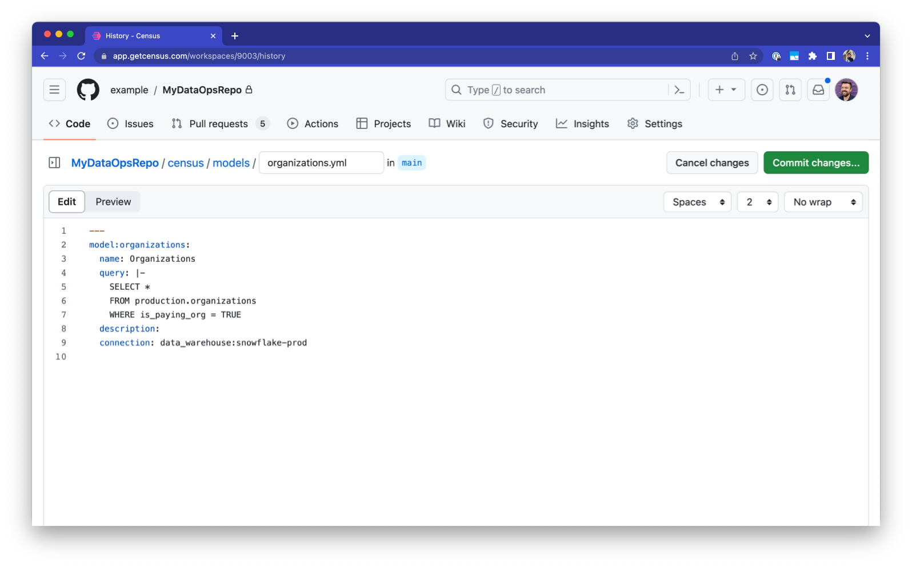

# GitLink

## Overview

GitLink enables you to leverage best practices of production software development – like peer review and version control – when making changes to your Census workspace. This gives you:

- **Resources as Code**: Specify your Census SQL models and syncs in YAML configuration files.
- **Bi-directional Updates**: Make changes to Census via the Census UI, or by updating the YAML configuration files in your Git repository.
- **Git-Backed Change History:** View and rollback changes to Census resources not just within the Census UI, but also within Git.

Creating, editing, and deleting resources in the Census UI will all be represented as changes to your YAML configuration files stored in Git. All changes will be represented as commits to those files. When you create and edit the configuration files via commits and pull requests in a Git repository, Census will materialize your changes into your Census workspace.

<figure><figcaption><p>A sample YAML configuration file within Git that describes a Census SQL model.</p></figcaption></figure>

This will also enable a global History view of all resource changes across your entire Census workspace. You can isolate exactly when those changes went into effect, and the latest Git commit associated with that change.

<figure><figcaption><p>A sample set of changes within the new History view.</p></figcaption></figure>


GitLink is only accessible to Platform Plan accounts. If you would like to enable GitLink and are not on the Platform Plan, please contact us at [support@getcensus.com](mailto:support@getcensus.com).


## Setup

To set up GitLink:

1.  Go to **Settings -> Integrations.**

    <figure><figcaption></figcaption></figure>

2.  Click **Setup.**

    <figure><figcaption></figcaption></figure>

3.  You're now on the GitLink configuration page. Let's get set up by connecting to Git:

    <figure><figcaption></figcaption></figure>

4.  Select the repositories you would like to use for version control:

    <figure><figcaption></figcaption></figure>

5.  Once you select what repositories you want to be connected, it will redirect you back to the GitLink configuration page. Select the specific repository and branch name that you'd like to use for version control.

    <figure><figcaption></figcaption></figure>

    Optionally, in addition to the repository and branch, you can select a directory where Census will read and write configuration files. Census will never edit any files outside of this path.

6.  Once the repository, branch, and directory are saved, click **Enable Git Sync**. You'll see a modal pop up. Here, you can specify whether to use Census as the basis for the first sync (thus overriding all Census configuration files within Git), or to import Git configurations into Census (thus overriding all models within Census). Click **Setup Git Sync** to continue.

    <figure><figcaption></figcaption></figure>

7.  Click **Setup Git Sync** to continue. At this point, Census will be hard at work setting up GitLink, synchronizing the state of Census and Git. This should take a few minutes.

    <figure><figcaption></figcaption></figure>

8.  Once the initial sync is done, GitLink will be set up!

    <figure><figcaption></figcaption></figure>

## After Setup

Once GitLink is enabled, you can continue to use the Census UI as usual, with no changes to any workflows. Census will automatically commit all edits made within the UI to Git. Likewise, all changes within Git will automatically be synced to Census.

In addition, several new features will be available to users after the feature is enabled.


Please ensure that the directory structure within your repository matches the directory structure expected within Census at all times, for both models and syncs. For example, if models are configured to be written to `census/models/` in your Census settings, moving models to a different directory or subdirectory will delete the model from Census.


### YAML in your Git Repository

YAML files for each Census resource will be available in your Git repository. Below are sample model and sync configuration YAML files, with explanations of each parameter.

#### SQL Models

```yaml
model:users: ## Unchanging resource identifier for your SQL model
  name: Users ## Changeable UI label for your SQL model
  query: |- ## SQL to run against your data source
    select *
    from schema.users
  description: Accounts! ## Description of your SQL model
  connection: data_warehouse:snowflake-prod ## Resource identifier for your data source
```

#### Syncs

There are many more sync configuration parameters than model parameters, but there are reliable components that we'll discuss below.

To discover the exact YAML that might be necessary for your use case, we recommend creating a sample sync in the UI to your desired destination, or reaching out to [support@getcensus.com](mailto:support@getcensus.com).


Available parameters for each sync are dependent on the destination. For example, in your sync to an [S3 bucket destination](../../destinations/s3.md), you might want to specify the file format (like CSV or Parquet), but this parameter is irrelevant to a sync to [Salesforce](../../destinations/salesforce.md).


```yaml
sync:hubspot-contact-sync: ## Unchanging resource identifier for your sync
  paused: false ## Option to pause the sync from its regular schedule, usually "false"
  label: Hubspot Contact Sync ## Changeable UI label for your sync

  # Sync operation behaviors, e.g. upsert, update, mirror
  behavior:
    operation: upsert

  # Scheduling options for your sync
  triggers:
    schedule:
      frequency: quarter_hourly
      minute: 0

  # Destination connection and object
  destination:
    connection_identifier: destination:hubspot-prod ## Resource identifier for your destination
    object_identifier: contact

  # Source connection and object (e.g. model, segment, table)
  source:
    type: model
    connection_identifier: data_warehouse:snowflake-prod ## Resource identifier for your data source
    object_identifier: model:users ## Resource identifier for your model / segment / entity

  # Mappings from your dataset's columns to the destination's fields
  mappings:
    - from:
        type: column
        data:
          column_name: ID
      to:
        field_name: USER_ID
      is_primary_identifier: true ## Census uses the identifier to look for matched records between source and destination
    - from:
        type: column
        data:
          column_name: LAST_LOGIN_DATE
      to:
        field_name: LAST_LOGIN

  # Alerting options and thresholds for your syncs
  operational_settings:
    alerts:
      failed_run_notifications:
        enabled: true
      failed_record_notifications:
        enabled: true
        threshold_percent: 75
```

### Automatic YAML Spec Versions

The YAML spec for GitLink-backed resources is versioned. Currently, the spec version is `0.x`. Version updates will automatically upgrade your repository with new feature support, until `1.x`. We do not anticipate changes to any core model and sync components (like the `mappings` or `operational_settings` sync configuration blocks).

YAML specs will be upgraded to enable support for new resources, and match support for model and sync configuration options. After `1.x`, you will have migration windows announced at least 2 weeks in advance, with the ability to choose exactly when upgrades occur.

### History View

Census provides a History View of all changes applied from Census to Git, and from Git to Census. To find the History View:

1.  Navigate to the **Integrations** page and click **View History**.

    <figure><figcaption></figcaption></figure>

2.  You can see a full list of all changes, including the latest commit from the changes that were applied, the number of changes (and failures), and when the changes were applied.

    <figure><figcaption></figcaption></figure>

3.  You can always ask Census to perform a reconciliation between the Census UI and your git repository by clicking the **Force Reconciliation** button. Use this in the rare cases where the git repository's APIs and webhook functionality are not performing as expected.

### Linked Git Configuration

Every resource within Census that is backed by version control will have a link to the YAML configuration file for that specific resource, and for the latest commit that introduced a change. You can find the link within the Census UI, for example within the Models page:

<figure><figcaption></figcaption></figure>

## GitHub&#x20;

GitLink offers some additional functionality when connected to GitHub repositories by automatically adding YAML configuration checks. If you are using GitHub's branch protection features, you may also need to make some changes to allow GItLink to operate smoothly.

### Automated Continuous Integration Tests

When using GitHub as your GitLink repository, Census will run Continuous Integration (CI) tests on every pull request. These tests will specify exactly which changes will occur, as well as whether there are any errors in any YAML configuration.

<figure><figcaption></figcaption></figure>

### Working with Branch Protection

Because GitLink keeps the state of Census and Git synchronized, Census must write to Git on each resource save. This may conflict with certain branches that have branch protection (i.e. `main`). To fix this, you can add the **Census Git** app to the list of actors that bypass required pull request approvals once you install the app during the [#setup](gitlink.md#setup "mention") flow.

<figure><figcaption></figcaption></figure>

## Troubleshooting

There are a few strict requirements in order to use GitLink:

- The governed GitLink directory (by default, `census/models/*.yml`) must be entirely empty, or populated only by configuration files that Census can read. As such, if you have `.txt` files, `README.md` files, or other files that are not YAML-deserializable and correspond to a known resource configuration by Census, GitLink will not work.
- Each SQL model and sync configuration should be in its own file.

## Sync Attributes Guide

Please refer to this section on the different parameters and their values a sync configuration could take up

<!-- <details>
  <summary><b>
    Sync Attributes
  </b></summary>
&nbsp; -->

<!-- PAUSED -->
<details>
  <summary>
    <b>
      Paused
    </b>
  </summary>
&nbsp;

- **Description**: Indicate whether the current sync is in a paused state. Setting this to false will prevent the sync from running in its cadence.

- **Required**: `true`

- **Type**: `Boolean`

- **Key**: `paused`

- **Possible values**: `true` or `false`
</details>
&nbsp;

<!-- LABEL -->
<details><summary><b>
Label
</b></summary>
&nbsp;

- **Description**: Name of the sync

- **Required**: `false`

- **Type**: `String`

- **Key**: `label`

- **Possible values**: Any
</details>
&nbsp;

<!-- Template Sync -->
<details>
  <summary><b>
    Template sync
  </b></summary>
  &nbsp;
  
- **Description**: Resource Identifier of the sync from which the current sync was created from

- **Required**: `false`

- **Type**: String

- **Key**: `template_sync_identifier`

- **Possible values**:

</details>
&nbsp;

<!-- SYNC BEHAVIOR -->
<details><summary><b>
Behavior
</b></summary>
&nbsp;

- **Description**: Describe the sync behavior to Census

- **Required**: `true`

- **Type**: `Object`

- **Key**: `behavior`

- **Fields**:

  <!-- SYNC BEHAVIOR - Operation -->
  <details>
  <summary><b>
    Operation
  </b></summary>
  &nbsp;

  - **Description**: Indicate to Census how to deal with records that match (don't match) between the sync's source and destination

  - **Required**: `true`

  - **Type**: `String`

  - **Key**: `operation`

  - **Possible values**: `upsert`, `update`, `create`, `mirror`, `append`, `delete`

  </details>

  <!-- SYNC BEHAVIOR - Append Properties -->
  <details>
  <summary><b>
    Append Properties
  </b></summary>
  &nbsp;

  - **Description**: Describe the sync behavior for append only syncs (only applies if the `append` option was selected for sync operation)

  - **Required**: `false`

  - **Type**: JSON

  - **Fields**:
    <!-- SYNC BEHAVIOR - Append Properties - Backfill Records -->
    <details>
    <summary><b>
      Backfill Records
    </b></summary>
    &nbsp;

    - **Description**: Indicate during append sync setup whether records in the source should be backfilled in the destination or just new records moving forward.

    - **Required**: `false`

    - **Type**: `Boolean`

    - **Key**: `backfill_records`

    - **Possible values**: `true` or `false`

    </details>

    <!-- SYNC BEHAVIOR - Append Properties - Highwater mark -->
    <details>
    <summary><b>
      Highwater Mark
    </b></summary>
    &nbsp;

    - **Description**: Choose the column from the source to use as the primary key between source and destination records

    - **Required**: `false`

    - **Type**: `Object`

    - **Key**: `high_water_mark`

    - **Fields**:

      <!-- Sync Behavior - Append Properties - Highwater mark - column name -->
      <details>
      <summary><b>
        Column Name
      </b></summary>
      &nbsp;

      - **Description**: The name of the column in the data source

      - **Required**: `true`

      - **Type**: `String`

      - **Key**: `column_name`

      - **Possible values**: Any

      </details>
      &nbsp;

    </details>

  </details>

  <!-- Sync Behavior - Mirror Properties -->
  <details>
  <summary><b>
    Mirror Properties
  </b></summary>
  &nbsp;

  - **Description**:

  - **Type**: `Object`

  - **Key**: `mirror_properties`

  - **Fields**:
    <!-- Sync Behavior - Mirror Properties - strategy -->
    <details>
    <summary><b>
      Strategy
    </b></summary>
    &nbsp;

    - **Description**: Describe to Census how the sync should maintain the mirror between the source and destination

    - **Required**: `true`

    - **Type**: `String`

    - **Key**: `strategy`

    - **Possible values**: `sync_updates_and_deletes` or `sync_updates_and_nulls`

    </details>
    &nbsp;

  </details>
  &nbsp;

</details>
&nbsp;

<!-- Mapping Configuration -->
<details>
<summary><b>
  Mapping Configuration
</b></summary>
&nbsp;

- **Description**: Describe common properties on how Census should handle the mappings

- **Required**: `false`

- **Type**: `Object`

- **Key**: `mapping_configuration`

- **Fields**:
  <!-- Mapping Configuration - Sync All Source Columns -->
  <details>
  <summary><b>
    Sync All Source Columns
  </b></summary>
  &nbsp;

  - **Description**: Indicate whether all source columns should be sent to the destination

  - **Required**: `false`

  - **Type**: `Object`

  - **Key**: `sync_all_source_columns`

  - **Possible values**:

  </details>
  &nbsp;

  <!-- Mapping Configuration - Name Normalization -->
  <details>
  <summary><b>
    Name Normalization
  </b></summary>
  &nbsp;

  - **Description**: Indicate how the sync would map the source column names to their corresponding destination field names

  - **Required**: `false`

  - **Type**: `String`

  - **Key**: `name_normalization`

  - **Possible values**: `match_source_names`, `start_case`, `lower_case`, `upper_case`, `camel_case`, `snake_case`, `ensure_uniqueness`

  </details>
  &nbsp;

  <!-- Mapping Configuration - Order By -->
  <details>
  <summary><b>
    Order By
  </b></summary>
  &nbsp;

  - **Description**: Indicate how the mappings between source and destination are ordered

  - **Required**: `false`

  - **Type**: `String`

  - **Key**: `order_by`

  - **Possible values**: `alphabetical_column_name`, `mapping_order`

  </details>
  &nbsp;

</details>
&nbsp;

<!-- Sync Triggers -->
<details>
<summary><b>
  Sync Triggers
</b></summary>
&nbsp;

- **Description**: Describe upstream triggers that would trigger the current sync

- **Required**: `true`

- **Type**: `Object`

- **Key**: `triggers`

- **Fields**:
  <!-- Sync Triggers - Schedule -->
  <details>
  <summary><b>
    Schedule
  </b></summary>
  &nbsp;

  - **Description**: Describe the schedule of the trigger

  - **Required**: `true`

  - **Type**: `Object`

  - **Key**: `schedule`

  - **Fields**:

    <!-- Sync Triggers - Schedule - Frequency -->
    <details>
    <summary><b>
      Frequency
    </b></summary>
    &nbsp;

    - **Description**: Describe the frequency of the sync trigger

    - **Required**: `true`

    - **Type**: `String`

    - **Key**: `frequency`

    - **Possible values**: `never`, `expression`, `continuous`, `hourly`, `daily`, `weekly`, `quarter_hourly`

    </details>
    &nbsp;

    <!-- Sync Triggers - Schedule - Day -->
    <details>
    <summary><b>
      Day
    </b></summary>
    &nbsp;

    - **Description**: Week of the day description of the sync schedule

    - **Required**: `false`

    - **Type**: `String`

    - **Key**: `day`

    - **Possible values**: `Monday`, `Tuesday`, `Wednesday`, `Thursday`, `Friday`, `Saturday`, `Sunday`

    </details>
    &nbsp;

    <!-- Sync Triggers - Schedule - Hour -->
    <details>
    <summary><b>
      Hour
    </b></summary>
    &nbsp;

    - **Description**: Hour description of the sync schedule

    - **Required**: `false`

    - **Type**: `Integer`

    - **Key**: `hour`

    - **Possible values**: `0 - 23`

    </details>
    &nbsp;

    <!-- Sync Triggers - Schedule - Minute -->
    <details>
    <summary><b>
      Minute
    </b></summary>
    &nbsp;

    - **Description**: Minute description of the sync schedule

    - **Required**: `false`

    - **Type**: `Integer`

    - **Key**: `minute`

    - **Possible values**: `0 - 59`

    </details>
    &nbsp;

    <!-- Sync Triggers - Schedule - Cron Expression -->
    <details>
    <summary><b>
      Cron Expression
    </b></summary>
    &nbsp;

    - **Description**: Cron expression to describe the sync's frequency. Ensure that for `frequency` above, the `expression` option is specified.

    - **Required**: `false`

    - **Type**: `String`

    - **Key**: `cron_expression`

    - **Possible values**: Any valid CRON expression conforming to the Census CRON [docs](/basics/core-concept/triggering-syncs.md#cron-custom-schedules).

    </details>
    &nbsp;

  </details>
  &nbsp;

  <!-- Sync Triggers - on other sync success -->
  <details>
  <summary><b>
    On other sync success
  </b></summary>
  &nbsp;

  - **Description**: Resource identifier of the sync that would trigger the current sync. The trigger would only be fired if the former sync succeeds.

  - **Required**: `false`

  - **Type**: `String`

  - **Key**: `on_other_sync_success`

  - **Possible values**: Any

  </details>
  &nbsp;

  <!-- Sync Triggers - dbt cloud -->
  <details>
  <summary><b>
    dbt Cloud
  </b></summary>
  &nbsp;

  - **Description**: Describe the dbt cloud job that would trigger the current sync. A dbt cloud API key needs to be installed in your Census organization for this to operate correctly.

  - **Required**: `false`

  - **Type**: `Object`

  - **Key**: `dbt_cloud`

  - **Fields**:
    <!-- Sync Triggers - dbt cloud - project_id -->
    <details>
    <summary><b>
      Project ID
    </b></summary>
    &nbsp;

    - **Description**: Project ID for the dbt cloud project

    - **Required**: `true`

    - **Type**: `String`

    - **Key**: `project_id`

    - **Possible values**: Any

    </details>
    &nbsp;

    <!-- Sync Triggers - dbt cloud - job_id -->
    <details>
    <summary><b>
      Job ID
    </b></summary>
    &nbsp;

    - **Description**: dbt job ID triggering current sync

    - **Required**: `true`

    - **Type**: `String`

    - **Key**: `job_id`

    - **Possible values**: Any

    </details>
    &nbsp;

  </details>
  &nbsp;

</details>
&nbsp;

<!-- Sync Logs -->
<details>
<summary><b>
  Sync Logs
</b></summary>
&nbsp;

<!-- Add hyperlink to the section in the docs -->

- **Description**: Indicate whether the warehouse writeback feature is enabled for this sync

- **Required**: `false`

- **Type**: `Boolean`

- **Key**: `enable_sync_logs`

- **Possible values**: `true` or `false`

</details>
&nbsp;

<!-- Service Slice size -->
<details>
<summary><b>
  Service Slice Size
</b></summary>
&nbsp;

- **Description**: Denote the size of the data chunks in which data will be uploaded to the destination

- **Required**: `false`

- **Type**: `Integer`

- **Key**: `service_slice_size`

- **Possible values**: `1 - 100,000`

</details>
&nbsp;

<!-- Destination -->
<details>
<summary><b>
  Destination
</b></summary>
&nbsp;

- **Description**: The destination to which the sync will upload the data

- **Required**: `true`

- **Type**: `Object`

- **Key**: `destination`

- **Fields**:

  <!-- Destination - Connection Identifier -->
  <details>
  <summary><b>
    Connection Identifier
  </b></summary>
  &nbsp;

  - **Description**: Resource identifier of the sync destination

  - **Required**: `true`

  - **Type**: `String`

  - **Key**: `connection_identifier`

  - **Possible values**:

  </details>
  &nbsp;

  <!-- Destination - Object Identifier -->
  <details>
  <summary><b>
    Object Identifier
  </b></summary>
  &nbsp;

  - **Description**: Object identifier of the sync destination object to which the records are uploaded

  - **Required**: `true`

  - **Type**: `String`

  - **Key**: `object_identifier`

  - **Possible values**: Please refer to the Management API documentation on [Destination Objects](api/destination-objects.md) to find object identifiers for a given destination.

  </details>
  &nbsp;

  <!-- Destination - Lead Union Default Object -->
  <details>
  <summary><b>
    Lead Union Default Object
  </b></summary>
  &nbsp;

  - **Description**: Indicate if records are uploaded to Salesforce as a 'Lead or Contact' or 'Lead or Account' object. (This field is only applicable if the current sync has a Salesforce destination)

  - **Required**: `false`

  - **Type**: `String`

  - **Key**: `lead_union_default_object`

  - **Possible values**: `converted`, `lead`

  </details>
  &nbsp;

  <!-- Destination - File Settings -->
  <details>
  <summary><b>
    File Settings
  </b></summary>
  &nbsp;

  - **Description**: Describe the file settings of the sync destination

  - **Required**: `false`

  - **Type**: `Object`

  - **Key**: `file_settings`

  - **Fields**:

    <!-- Destination - File Settings - File format -->
    <details>
    <summary><b>
      File Format
    </b></summary>
    &nbsp;

    - **Description**: File format of the sync destination

    - **Required**: `true`

    - **Type**: `String`

    - **Key**: `file_format`

    - **Possible values**: `CSV`, `TSV`, `JSON`, `NDJSON`, `Parquet`

    </details>
    &nbsp;

    <!-- Destination - File Settings - Delimiter -->
    <details>
    <summary><b>
      Delimiter
    </b></summary>
    &nbsp;

    - **Description**: String character that delineates the records in the sync destination

    - **Required**: `false`

    - **Type**: `String`

    - **Key**: `delimiter`

    - **Possible values**:

    </details>
    &nbsp;

    <!-- Destination - File Settings - Include Header -->
    <details>
    <summary><b>
      Include Header
    </b></summary>
    &nbsp;

    - **Description**: Indicate if the header row of the destination file should be uploaded

    - **Required**: `false`

    - **Type**: `Boolean`

    - **Key**: `include_header`

    - **Possible values**: `true` or `false`

    </details>
    &nbsp;

  </details>
  &nbsp;

</details>
&nbsp;

<!-- Source -->
<details>
<summary><b>
  Source
</b></summary>
&nbsp;

- **Description**: The data source from which the sync will extract records

- **Required**: `true`

- **Type**: `Object`

- **Key**: `source`

- **Fields**:

  <!-- Source - Type -->
  <details>
  <summary><b>
    Type
  </b></summary>
  &nbsp;

  - **Description**: Type of the sync data source

  - **Required**: `true`

  - **Type**: `String`

  - **Key**: `type`

  - **Possible values**: `table`, `segment`, `entity`, `model`, `cohort`

  </details>
  &nbsp;

  <!-- Source - Connection Identifier -->
  <details>
  <summary><b>
    Connection Identifier
  </b></summary>
  &nbsp;

  - **Description**: Resource identifier of the sync source connection

  - **Required**: `true`

  - **Type**: `String`

  - **Key**: `connection_identifier`

  - **Possible values**:

  </details>
  &nbsp;

  <!-- Source - Object Identifier -->
  <details>
  <summary><b>
    Object Identifier
  </b></summary>
  &nbsp;

  - **Description**: Resource identifier of the sync source object. This only pertains if the source type is a `entity`, `model` or `segment`.

  - **Required**: `false`

  - **Type**: `String`

  - **Key**: `object_identifier`

  - **Possible values**:

  </details>
  &nbsp;

  <!-- Source - Table Catalog -->
  <details>
  <summary><b>
    Table Catalog
  </b></summary>
  &nbsp;

  - **Description**: Sync source table catalog name. Only applicable, if the source type is a `table`.

  - **Required**: `false`

  - **Type**: `String`

  - **Key**: `table_catalog`

  - **Possible values**:

  </details>
  &nbsp;

  <!-- Source - Table Schema -->
  <details>
  <summary><b>
    Table Schema
  </b></summary>
  &nbsp;

  - **Description**: Sync source schema name. Only applicable, if the source type is a `table`.

  - **Required**: `false`

  - **Type**: `String`

  - **Key**: `table_schema`

  - **Possible values**:

  </details>
  &nbsp;

  <!-- Source - Table Name -->
  <details>
  <summary><b>
    Table Name
  </b></summary>
  &nbsp;

  - **Description**: Sync source table name. Only applicable, if the source type is a `table`.

  - **Required**: `false`

  - **Type**: `String`

  - **Key**: `table_name`

  - **Possible values**:

  </details>
  &nbsp;

</details>
&nbsp;

<!-- Mappings -->
<details>
<summary><b>
  Mappings
</b></summary>
&nbsp;

- **Description**: Describe the mappings between source and destination of this sync.

- **Required**: `true`

- **Type**: `Array`

- **Key**: `mappings`

- **Element**:

  <!-- Mappings - From Mapping -->
  <details>
  <summary><b>
    From Mapping
  </b></summary>
  &nbsp;

  - **Description**: Describe the mapping properties in the source

  - **Required**: `true`

  - **Type**: `Object`

  - **Key**: `from`

  - **Fields**:

    <!-- Mapping - From Mapping - Type -->
    <details>
    <summary><b>
      Type
    </b></summary>
    &nbsp;

    - **Description**: Type of the source object in the data source

    - **Required**: `true`

    - **Type**: `String`

    - **Key**: `type`

    - **Possible values**: `column`, `constant`, `reference`, `compound`, `segment-membership`

    </details>
    &nbsp;

    <!-- Mapping - From Mapping - Data -->
    <details>
    <summary><b>
      Data
    </b></summary>
    &nbsp;

    - **Description**: Describe the data type of the record in the source

    - **Required**: `false`

    - **Type**: `Object`

    - **Key**: `data`

    - **Possible values**: Fields of any **one** of the objects below

      <!-- Mapping - From Mapping - Data - Static Expression Data -->
      <details>
      <summary><b>
        Static Expression Data
      </b></summary>
      &nbsp;

      - **Description**: Mapping for a constant value to a destination

      - **Required**: `false`

      - **Fields**:

        <!-- Mapping - From Mapping - Data - Static Expression Data - Basic Type -->
        <details>
        <summary><b>
          Basic Type
        </b></summary>
        &nbsp;

        - **Description**: Data type of the constant

        - **Required**: `true`

        - **Type**: `String`

        - **Key**: `basic_type`

        - **Possible values**: `Integer`, `String`

        </details>
        &nbsp;

        <!-- Mapping - From Mapping - Data - Static Expression Data - Value -->
        <details>
        <summary><b>
          Value
        </b></summary>
        &nbsp;

        - **Description**: Value of the constant

        - **Required**: `true`

        - **Type**: `String`

        - **Key**: `value`

        - **Possible values**:

        </details>
        &nbsp;

      </details>
      &nbsp;

      <!-- Mapping - From Mapping - Data - Column Expression Data -->
      <details>
      <summary><b>
        Column Expression Data
      </b></summary>
      &nbsp;

      - **Description**: Mapping for a column expression from the data source

      - **Required**: `false`

      - **Fields**:
        <!-- Mapping - From Mapping - Data - Column Expression Data - Column Name -->
        <details>
        <summary><b>
          Column Name
        </b></summary>
        &nbsp;

        - **Description**: Name of the column in data source

        - **Required**: `true`

        - **Type**: `String`

        - **Key**: `column_name`

        - **Possible values**:

        </details>
        &nbsp;

      </details>
      &nbsp;

      <!-- Mapping - From Mapping - Data - Compound Upsert Key Expression Data -->
      <details>
      <summary><b>
        Compound Upsert Key Expression Data
      </b></summary>
      &nbsp;

      - **Description**: Properties of mappings that are composed by sub mappings

      - **Required**: `false`

      - **Fields**:
        <!-- Mapping - From Mapping - Data - Compound Upsert Key Expression Data - Sub-Expressions -->
        <details>
        <summary><b>
          Sub-Expressions
        </b></summary>
        &nbsp;

        - **Description**: Sub-expressions that will be composed together

        - **Required**: `true`

        - **Type**: `Array`

        - **Key**: `subexpressions`

        - **Element**:
          <!-- Mapping - From Mapping - Data - Compound Upsert Key Expression Data - Sub-expressions - Type -->
          <details>
          <summary><b>
            Type
          </b></summary>
          &nbsp;

          - **Description**: Data type of the sub-expression

          - **Required**: `true`

          - **Type**: `String`

          - **Key**: `type`

          - **Possible values**: `String`, `Integer`

          </details>
          &nbsp;

          <!-- Mapping - From Mapping - Data - Compound Upsert Key Expression Data - Sub-expressions - Data -->
          <details>
          <summary><b>
            Data
          </b></summary>
          &nbsp;

          - **Description**: Data expression of the mapping

          - **Required**: `true`

          - **Type**: `Object`

          - **Key**: `data`

          - **Fields**: Fields of one of the following objects
            <!-- Mapping - From Mapping - Data - Compound Upsert Key Expression Data - Sub-expressions - Data - Static Expression Data -->
            <details>
            <summary><b>
              Static Expression Data
            </b></summary>
            &nbsp;

            - **Description**: Mapping for a constant value to a destination

            - **Required**: `false`

            - **Fields**:

              <!-- Mapping - From Mapping - Data - Compound Upsert Key Expression Data - Sub-expressions - Data - Static Expression Data - Basic Type -->
              <details>
              <summary><b>
                Basic Type
              </b></summary>
              &nbsp;

              - **Description**: Data type of the constant

              - **Required**: `true`

              - **Type**: `String`

              - **Key**: `basic_type`

              - **Possible values**: `Integer`, `String`

              </details>
              &nbsp;

              <!-- Mapping - From Mapping - Data - Compound Upsert Key Expression Data - Sub-expressions - Data - Static Expression Data - Value -->
              <details>
              <summary><b>
                Value
              </b></summary>
              &nbsp;

              - **Description**: Value of the constant

              - **Required**: `true`

              - **Type**: `String`

              - **Key**: `value`

              - **Possible values**:

              </details>
              &nbsp;

            </details>
            &nbsp;

            <!-- Mapping - From Mapping - Data - Compound Upsert Key Expression Data - Sub-expressions - Data - Column Expression Data -->
            <details>
            <summary><b>
              Column Expression Data
            </b></summary>
            &nbsp;

            - **Description**: Mapping for a column expression from the data source

            - **Required**: `false`

            - **Fields**:
              <!-- Mapping - From Mapping - Data - Compound Upsert Key Expression Data - Sub-expressions - Data - Column Expression Data - Column Name -->
              <details>
              <summary><b>
                Column Name
              </b></summary>
              &nbsp;

              - **Description**: Name of the column in data source

              - **Required**: `true`

              - **Type**: `String`

              - **Key**: `column_name`

              - **Possible values**:

              </details>
              &nbsp;

            </details>
            &nbsp;

          </details>
          &nbsp;

        </details>
        &nbsp;

      </details>
      &nbsp;

      <!-- Mapping - From Mapping - Data - Related Entity Expression Data -->
      <details>
      <summary><b>
        Related Entity Expression Data
      </b></summary>
      &nbsp;

      - **Description**:

      - **Required**: `false`

      - **Fields**:
        <!-- Mapping - From Mapping - Data - Related Entity Expression Data - Object Identifier -->
        <details>
        <summary><b>
          Object Identifier
        </b></summary>
        &nbsp;

        - **Description**:

        - **Required**: `true`

        - **Type**: `String`

        - **Key**: `object_identifier`

        - **Possible values**:

        </details>
        &nbsp;

        <!-- Mapping - From Mapping - Data - Related Entity Expression Data - Referenced Column Name -->
        <details>
        <summary><b>
          Referenced Column Name
        </b></summary>
        &nbsp;

        - **Description**:

        - **Required**: `true`

        - **Type**: `String`

        - **Key**: `referenced_column_name`

        - **Possible values**:

        </details>
        &nbsp;

        <!-- Mapping - From Mapping - Data - Related Entity Expression Data - Referenced Object Identifier -->
        <details>
        <summary><b>
          Referenced Object Identifier
        </b></summary>
        &nbsp;

        - **Description**:

        - **Required**: `true`

        - **Type**: `String`

        - **Key**: `referenced_object_identifier`

        - **Possible values**:

        </details>
        &nbsp;

      </details>
      &nbsp;

    </details>
    &nbsp;

  </details>
  &nbsp;

  <!-- Mappings - To -->
  <details>
  <summary><b>
    To Mapping
  </b></summary>
  &nbsp;

  - **Description**: Describe the mapping properties in the destination

  - **Required**: `true`

  - **Type**: `Object`

  - **Key**: `to`

  - **Fields**:

    <!-- Mapping - To Mapping - Field Name -->
    <details>
    <summary><b>
      Field Name
    </b></summary>
    &nbsp;

    - **Description**: Name of the mapping in the destination

    - **Required**: `true`

    - **Type**: `String`

    - **Key**: `field_name`

    - **Possible values**:

    </details>
    &nbsp;

    <!-- Mapping - To Mapping - Lookup Object -->
    <details>
    <summary><b>
      Lookup Object
    </b></summary>
    &nbsp;

    - **Description**: Object properties of the destination

    - **Required**: `false`

    - **Type**: `Object`

    - **Key**: `lookup_object`

    - **Fields**:

      <!-- Mapping - To Mapping - Lookup Object - Object Identifier -->
      <details>
      <summary><b>
        Object Identifier
      </b></summary>
      &nbsp;

      - **Description**: Identifier for the destination object

      - **Required**: `true`

      - **Type**: `String`

      - **Key**: `object_identifier`

      - **Possible values**:

      </details>
      &nbsp;

      <!-- Mapping - To Mapping - Lookup Object - Field to Match by -->
      <details>
      <summary><b>
        Field to Match By
      </b></summary>
      &nbsp;

      - **Description**: Field on the object to match a record with

      - **Required**: `true`

      - **Type**: `String`

      - **Key**: `field_to_match_by`

      - **Possible values**:

      </details>
      &nbsp;

    </details>
    &nbsp;

  </details>
  &nbsp;

  <!-- Mappings - Field Type -->
  <details>
  <summary><b>
    Field Type
  </b></summary>
  &nbsp;

  - **Description**: Indicate the type of the current mapping

  - **Required**: `false`

  - **Type**: `String`

  - **Key**: `field_type`

  - **Possible values**:

  </details>
  &nbsp;

  <!-- Mappings - Follow Source Type -->
  <details>
  <summary><b>
    Follow Source Type
  </b></summary>
  &nbsp;

  - **Description**: Indicate if destination should conform the mapping to the same type as the source

  - **Required**: `false`

  - **Type**: `Boolean`

  - **Key**: `follow_source_type`

  - **Possible values**: `true` or `false`

  </details>
  &nbsp;

  <!-- Mappings - Array Field -->
  <details>
  <summary><b>
    Array Field
  </b></summary>
  &nbsp;

  - **Description**: Indicate if the current field is of type `array`

  - **Required**: `false`

  - **Type**: `Boolean`

  - **Key**: `array_field`

  - **Possible values**: `true` or `false`

  </details>
  &nbsp;

  <!-- Mappings - Is Primary Identifier -->
  <details>
  <summary><b>
    Is Primary Identifier
  </b></summary>
  &nbsp;

  - **Description**: Indicate if the mapping is the primary identifier for the records between the source & destination

  - **Required**: `false`

  - **Type**: `Boolean`

  - **Key**: `is_primary_identifier`

  - **Possible values**: `true` or `false`

  </details>
  &nbsp;

  <!-- Mappings - Generate Field -->
  <details>
  <summary><b>
    Generate Field
  </b></summary>
  &nbsp;

  - **Description**: Indicate to Census if the mapping is a user-generated field

  - **Required**: `false`

  - **Type**: `Boolean`

  - **Key**: `generate_field`

  - **Possible values**: `true` or `false`

  </details>
  &nbsp;

  <!-- Mappings - Preserve Values -->
  <details>
  <summary><b>
    Preserve Values
  </b></summary>
  &nbsp;

  - **Description**: Indicate if mapping should be overwritten in the destination

  - **Required**: `false`

  - **Type**: `Boolean`

  - **Key**: `preserve_values`

  - **Possible values**: `true` or `false`

  </details>
  &nbsp;

  <!-- Mappings - Operation -->
  <details>
  <summary><b>
    Operation
  </b></summary>
  &nbsp;

  - **Description**: Array operation indicating how array fields should be updated in the destination. Only applies if `array_field` is set to `true`.

  - **Required**: `false`

  - **Type**: `String`

  - **Key**: `operation`

  - **Possible values**: `overwrite`, `merge`

  </details>
  &nbsp;

</details>
&nbsp;

<!-- Advanced Configuration -->
<details>
<summary><b>
  Advanced Configuration
</b></summary>
&nbsp;

- **Description**: Any advanced configuration that a sync requires, particularly for notification syncs.

- **Required**: `false`

- **Type**: `Object`

- **Key**: `advanced_configuration`

- **Possible values**:

</details>
&nbsp;

<!-- Operational Settings -->
<details>
<summary><b>
  Operational Settings
</b></summary>
&nbsp;

- **Description**: Describe the alerting and monitoring configuration for the sync

- **Required**: `true`

- **Type**: `Object`

- **Key**: `operational_settings`

- **Fields**:

  <!-- Operational Settings - Alerts -->
  <details>
  <summary><b>
    Alerts
  </b></summary>
  &nbsp;

  - **Description**: Describe the alerting configuration for the sync

  - **Required**: `false`

  - **Type**: `Object`

  - **Key**: `alerts`

  - **Fields**:

    <!-- Operational Settings - Alerts - Failed run notifications -->
    <details>
    <summary><b>
      Failed run notifications
    </b></summary>
    &nbsp;

    - **Description**: Notification settings for when a sync fails

    - **Required**: `false`

    - **Type**: `Object`

    - **Key**: `failed_run_notifications`

    - **Fields**:
      <!-- Operational Settings - Alerts - Failed run notifications - enabled -->
      <details>
      <summary><b>
        Enabled
      </b></summary>
      &nbsp;

      - **Description**: Indicate whether the sync should raise a notification when the run fails

      - **Required**: `false`

      - **Type**: `Boolean`

      - **Key**: `enabled`

      - **Possible values**: `true` or `false`

      </details>
      &nbsp;

    </details>
    &nbsp;

    <!-- Operational Settings - Alerts - Failed record notifications -->
    <details>
    <summary><b>
      Failed record notifications
    </b></summary>
    &nbsp;

    - **Description**: Notification settings for when records fail to be transferred to the destination in a sync run

    - **Required**: `false`

    - **Type**: `Object`

    - **Key**: `failed_record_notifications`

    - **Fields**:

      <!-- Operational Settings - Alerts - Failed record notifications - Enabled -->
      <details>
      <summary><b>
        Enabled
      </b></summary>
      &nbsp;

      - **Description**: Indicate whether the sync should raise a notification when the records fail to be uploaded to the destination

      - **Required**: `false`

      - **Type**: `Boolean`

      - **Key**: `enabled`

      - **Possible values**: `true` or `false`

      </details>
      &nbsp;

      <!-- Operational Settings - Alerts - Failed record notifications - threshold percent -->
      <details>
      <summary><b>
        Threshold percent
      </b></summary>
      &nbsp;

      - **Description**: The percentage of records that need to fail to send a records failing notification

      - **Required**: `false`

      - **Type**: `Integer`

      - **Key**: `threshold_percent`

      - **Possible values**: `0 - 100`

      </details>
      &nbsp;

    </details>
    &nbsp;

  </details>
  &nbsp;

</details>
&nbsp;

<!-- </details> -->

&nbsp;&nbsp;
