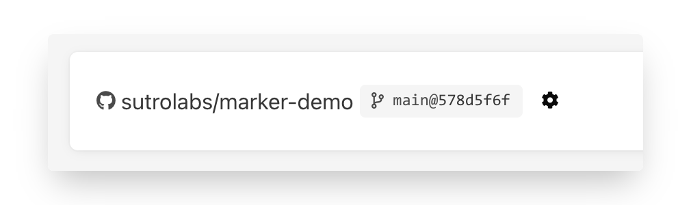
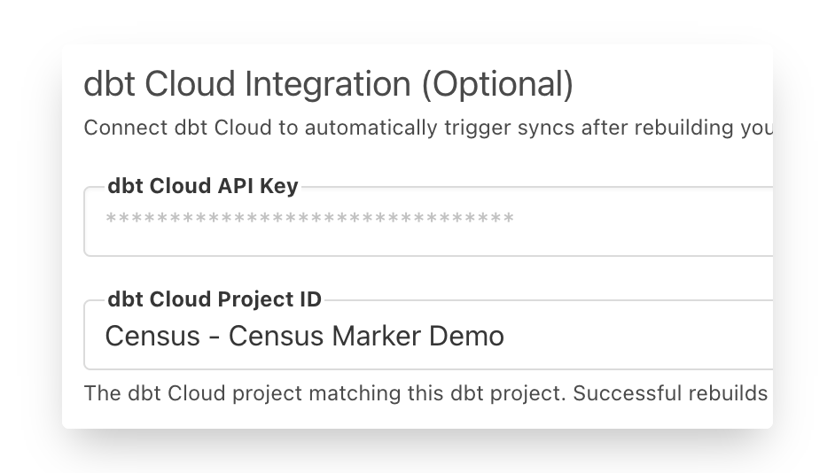
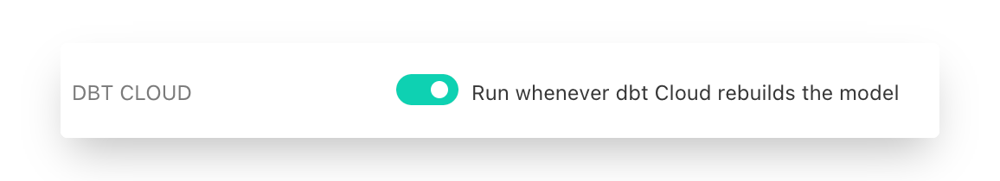

# dbt and dbt Cloud Integration

Census supports connecting to an existing dbt project, which allows you to select models you want to make available to sync into all your business tools. This means you can keep all your source code & transforms in a single repository.&#x20;

Census compiles your models on the fly whenever a sync is scheduled so your data and your models are always up to date. And Census is designed to work hand-in-hand with dbtCloud or any other dbt runner.

## Setting it up

Before you can create models on a new data warehouse connection, you’ll be asked to decide whether you’d like to store your models with Census or use an existing dbt project as a source of models. Here are the instructions for connecting a dbt project.

1. Connect to your GitHub repository. We currently only support dbt projects stored in GitHub. If you’d prefer to use a different service, please let us know!
2. Select the branch (if any) you’d like Census to use. Census will refresh the project on a regular basis and detect any changes to your models. You can force a refresh at any point from the models' page.
3. Customize the Census model selector. Any model exposed to Census becomes available as a source for syncing your data to external tools. By default, Census looks for models with the `census` tag but you can customize the filter.

**Example Selectors**

* All models with a tag: `tag:census`
* All models in a directory: `path/to/models`
* All models: `*`

For more information on selector syntax, see [dbt’s Model Selector Syntax](https://docs.getdbt.com/reference/model-selection-syntax/).

Finally, specify where intermediate models are materialized. If the models you expose in Census have dependencies, we will attempt to use these materialized tables. You may need to ensure that our database connection has read access to these tables.

Once you’ve configured your project repository, Census will analyze your project and display the models you’ve made available. You’re now ready to start using these models as part of Census syncs!

## Integrating with dbt Cloud

If you're using dbt Cloud to run your dbt project, our integration goes even further. You can configure Census to automatically run syncs whenever your models have been rebuilt.&#x20;



To connect Census to your dbt Cloud, you'll first need a [dbt Cloud API](https://docs.getdbt.com/docs/dbt-cloud/dbt-cloud-api/service-tokens) key.&#x20;

* You may use both User API keys and Service Account tokens. We strongly recommend you use Service Account tokens.
* As of May 2021, according to dbt Cloud, tokens may only be created or modified by users with Account Admin (Enterprise plan) or Owner (Team plan) permissions on an account, so that this token has these privileges.

With your token in hand, you can now connect dbt Cloud to your dbt project.&#x20;

1. Configure your existing dbt project by clicking the ⚙️icon next to the git repo description.\
   &#x20;&#x20;
2. Then copy your dbt Cloud API key. This will load your dbt Cloud Projects. \
   &#x20;&#x20;
3. Select the dbt Cloud Project that matches you code repo / project. Yes, "project" annoyingly means two different things here, the trick here is to get them to match. The dbt Cloud Project should point to the exact same git repo and branch that you've configured for Census.&#x20;
4. Finally hit save!

Now, when you create syncs using dbt models as sources, you'll see this brand new way of triggering syncs.&#x20;

With this enabled, the sync will run automatically as soon as dbt Cloud has finished rebuilding each model used in a sync. Nothing more to do!

## Required data warehouse permissions

Census doesn't necessarily require the same permissions your dbt project needs because Census only runs the models you've exposed to Census during set up. Census only requires read access to your selected models and any of their materialized dependencies. That means you can use dbt's materialize configuration flag to create permissions boundaries. Once materialized dependencies are generated by dbt runner, Census will reference the materialized results when accessing your models.

## Supported dbt features and versions

Our dbt integration is designed to pair nicely with your existing dbt runner, whether dbt Cloud or self-hosted. We do this by using the `dbt compile` command rather than the typical `dbt run` and then make use of the compiled output only.&#x20;

As a result, there's several dbt features that Census does not make use of. These include:

* Materialization directives. Census doesn’t currently materialize your tables back to your data warehouse. Census will however use materialized tables by your dbt runner to speed up the execution
* Pre and post hooks
* Non-public packages

Our dbt integration currently supports version [0.20.2](https://github.com/dbt-labs/dbt-core/releases/tag/v0.20.2). We also post version support in our [changelog](https://whatsnew.getcensus.com).
