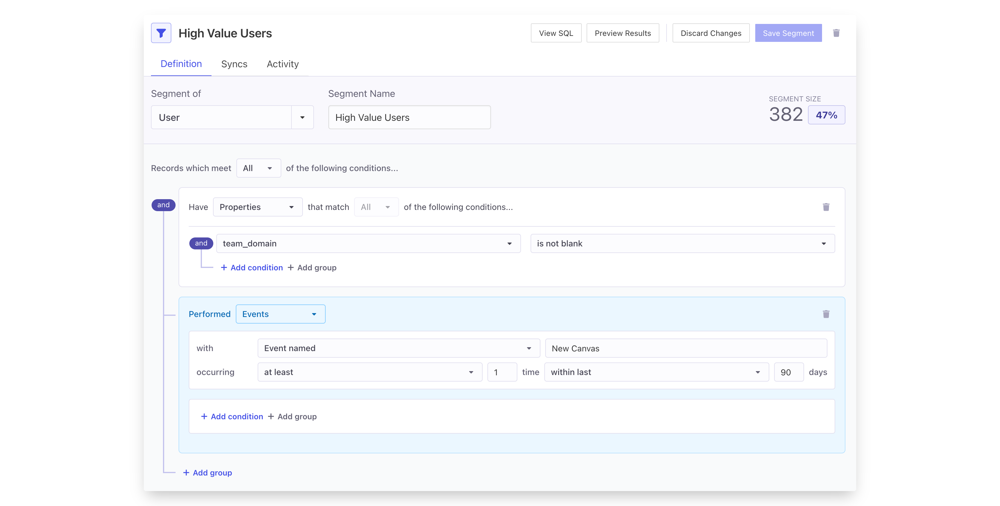
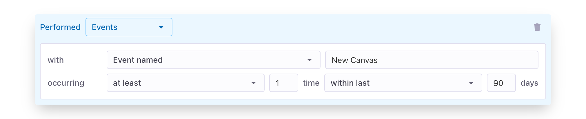

# Defining Segments

## Set up your Entities

Segments are built on top of [entities.md](../data-models-and-entities/entities.md "mention"), the core models set up for a data warehouse connection. Typically a member of the data team will need to first set up the entities for your warehouse connection before getting started.&#x20;

## Using the visual builder

Click on **Segments** tab in the left-hand menu to go to the segments page. Click **Add a New Segment** and use the visual builder to define your segment.&#x20;

To start, you'll need to select the Entity you're segmenting in the top left. This will determine the records returned by your segment.&#x20;

Then start adding **conditions**. For more details on the various operations available, see below. If you are segmenting an entity that has relationships to other entities, you can also filter on those related entities by adding a new **group.**

At any point, you can press **Preview Results** to get a look at a sample of the data that will be available in your segment or **View SQL** to see the SQL generated to power your segment. When you're happy with your segment conditions, give you segment a name and press **Save**.

### Segment Operations

Census supports a wide variety of operations that can be used to filter segments. The types of operators available are dictated by the types of the data warehouse columns being filtered. Selecting a column with a different type will change the types of operators available.

| Operator                   | Column Type        | Description                                                                                  |
| -------------------------- | ------------------ | -------------------------------------------------------------------------------------------- |
| is null / is blank         | All                | Column is NULL (or the empty string if given a text column)                                  |
| is not null / is not blank | All                | Column contains any value other than NULL (and not the empty string, if given a text column) |
| is                         | All except boolean | Exactly matches the given value (case sensitive)                                             |
| is not                     | All except boolean | Does not match the given value                                                               |
| starts with                | Text               | Starts with the given value                                                                  |
| ends with                  | Text               | Ends with the given value                                                                    |
| contains                   | Text               | Column contains the given value                                                              |
| doesn't contain            | Text               | Column doesn't contain the given value                                                       |
| more than                  | Number             | Column is larger than the given value                                                        |
| less than                  | Number             | Column is smaller than the given value                                                       |
| is true                    | Boolean            | Column is true                                                                               |
| is false                   | Boolean            | Column is false                                                                              |
| more than                  | Datetime           | Column's value is more than \_\_\_ days ago                                                  |
| less than                  | Datetime           | Column's value is less than \_\_\_ days ago                                                  |
| exactly                    | Datetime           | Column is exactly \_\_\_ days ago                                                            |
| after                      | Datetime           | Column is after the given date                                                               |
| on                         | Datetime           | Column is exactly the given date                                                             |
| before                     | Datetime           | Column is before the given date                                                              |
| between                    | Datetime           | Column's value is between \_\_\_ days and \_\_\_\_ days ago                                  |
| contains any of            | Array              | Array column contains any of the provided values                                             |

### Event Segmentation

When the Entity you're segmenting has a related events entity, those events have even more conditions available, powered by the schema columns defined on the event entity.

<figure><figcaption></figcaption></figure>

| Type        | Operator              | Description                                        |
| ----------- | --------------------- | -------------------------------------------------- |
| Event Name  | Any Event             | Entity has any event matching the other conditions |
|             | No Event              | Entity has no event matching the other conditions  |
|             | Event Name is         | Entity has an event with the given name            |
|             | Event Name is one of  | Entity has an event with any of the given names    |
|             | No Event Named        | Entity has no event with the given name            |
|             | No Event Named any of | Entity has none of the given events                |
| Engagement  | At least              | Entity has at least x matching events              |
|             | At most               | Entity has at most x matching events               |
|             | Exactly               | Entity has exactly x matching events               |
|             | Any number            | Entity has any number (> 0) of events              |
| Time Period | Between               | Events occurred between \_\_\_ and \_\_\_ days ago |
|             | Prior To              | Events occurred before a date \_\_\_ days ago      |
|             | Within Last           | Events occurred within the last \_\_\_ days        |
|             | Between dates         | Events occurred between two fixed dates            |
|             | After date            | Events occurred after a fixed date in time         |
|             | Before date           | Events occurred before a fixed date in time        |
|             | Any time              | Entity has match dates regardless of time          |

## Syncing your segment

Your newly created segment will now be available to sync in the standard Census sync workflow. You can sync segments to all over our supported destinations such as [Facebook Ads](../../destinations/facebook-ads.md), [Google Ads](../../destinations/google-ads/) and [Marketo](../../destinations/marketo.md). \
\
At this point, you're good to go with Segments, but there's more to read if you need:

* Want to learn about Syncs? Check out the [Core Concepts](../core-concept/) section
* Need to get your favorite app connected to Census? Take a look at Destinations in the menu on the left.

## FAQs

****

**Which string comparison operators are case sensitive and insensitive?**

_Case sensitive:_ Census will consider the "is" and "is not" operators to be case sensitive.

_Case insensitive:_ Census will consider the "contains", "does not contain", "starts with", and "ends with" operators to be case insensitive.

