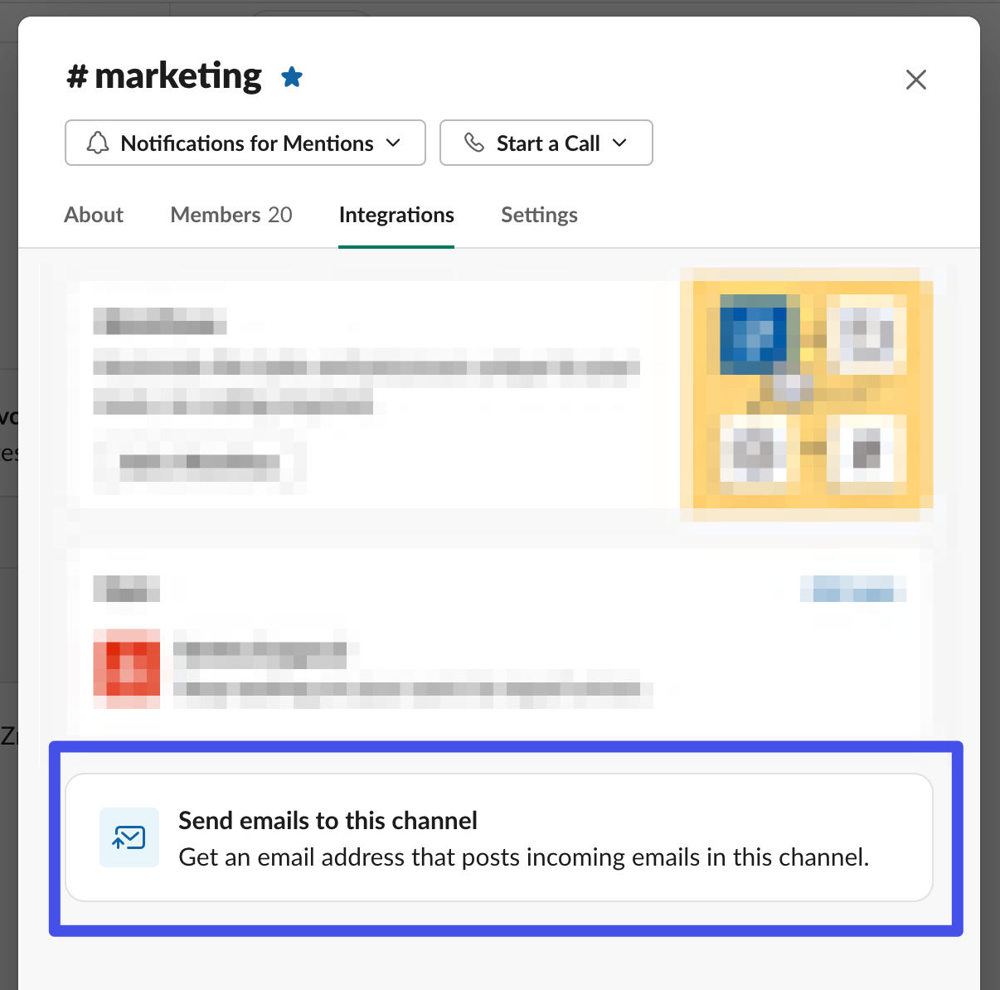

# Sync Alerts

Our goal is to keep all the data flowing smoothly, but sometimes things don't go as planned. When that happens, Census offers multiple ways to get alerted so you're always the first to know what's going on with your syncs. Read on to learn how to configure them.

## Alert Types

Each Census sync has its own set of potential alerts and you can configure each of them to match your needs. There are six types of alerts available, two of which are turned on by default for each new sync:

1. **Failed Sync** (default) - Alerts when a sync completely fails, usually because the source or destination connection is broken.
2. **Failed Records** (default) - Alerts when a sync ran successfully but some of the records were invalid in the source or rejected by the destination. In this case, you can configure the threshold that should generate alerts. By default, it's 75% of records, but that can be lowered all the way down to alert you if any record is invalid or rejected. [Learn more about invalid and rejected records](../core-concept/#sync-history).
3. **Sync Status** - Alerts when a sync starts or successfully completes.
4. **Full Sync Triggered** - Alerts when a full sync is triggered on your sync. Your alert will contain the reason(s) why a full sync was run.
5. **Sync Runtime** - Alerts when a sync has not completed within a configurable length of time since either the scheduled or actual sync start time.
6. **Record Count Deviation** - Alerts when a variety of record count options have deviated from the "norm", which is determined by the average of a configurable number of previous sync runs.

To configure, visit the **Alerts** tab in your Sync to configure which alerts are enabled per sync. By default, you will have 2 alert types enabled.

The "New Alert" drop-down will open up the list of alert types that you may add to your sync. You can add as many, even multiple of the same type, as you need.

Most of the alert types come with a configurable option for the frequency of the alerts.

1. **First Violation** (default) - You will be alerted the first time an alert condition is violated, but not on each consecutive failure. If your alert resolves and then re-opens, you will still get alerted for the new violation.
2. **Every Violation** - You will be alerted on every single violation of the alert condition. This is off by default to prevent email spam.

Lastly, you can configure whether or not you would like recovery emails. By default, Census will notify you when an alert that was in violation of its condition becomes resolved. If you are not interested in these recovery emails, you can disable them from this configuration screen.

## Personal Alert Settings

You can choose to opt out of certain emails under **Organization Home** > **User Settings**. By default, you will receive sync alert and weekly summary emails for every workspace to which you belong.

The 2 primary alert types are **Sync Alerts** and **Weekly Summary Email**. For the **Sync Alert** type, you can subscribe/unsubscribe to individual syncs. By default, you will be subscribed to every new sync that is created. You can change this behavior via the **Automatically subscribe to alerts for new syncs** setting shown below.

For more details on per-sync subscriptions, see [#sync-subscriptions](alerts.md#sync-subscriptions "mention").

<figure><figcaption></figcaption></figure>

## Sync Subscriptions

Each user can manage their own subscriptions to syncs. By default, you will be automatically subscribed to each sync in your workspaces. This behavior can be changed in your [#personal-alert-settings](alerts.md#personal-alert-settings "mention").

Subscriptions can be managed via the Alerts tab of a sync. Those users with permissions to manage subscriptions can add & remove other members of the workspace/organization. Those users with basic permissions will only be permitted to edit their own.

<figure><figcaption></figcaption></figure>

The subscriptions can also be managed via the Sync List page.

<figure><figcaption></figcaption></figure>

## Aliases & Mailing Lists

You can also send sync alerts and weekly sync summaries to any non-user email address such as an email alias or mailing list. Simply go to **Workspace Settings** > **General** and add the desired email address under **General Settings > Email Alerts and Weekly Summaries**.

### Slack alerts

You can send sync alerts to your selected channels via Slack's channel email feature. Every Slack channel has its own email address, and any emails sent to that address automatically appear as messages in that channel. This is a super easy way to configure alerting without having to give Census a lot of permissions to your organization's Slack.

1. In Slack, find the email address for the channel you want to send alerts to. To do this click the **channel name > Integrations**

2. Once you have the email address, go to **Workspace Settings** > **General** and paste that channel's email address under **General Settings** > **Slack Alerts**

:tada:That's it! Now your slack channel(s) will automatically post any alerts configured on all your syncs. (No weekly summaries will be sent to Slack channels.)
