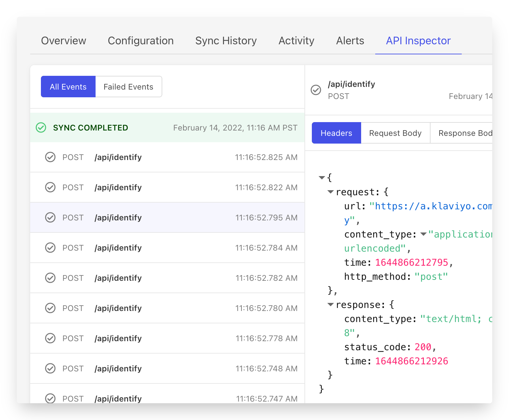

# API Inspector

Sometimes it helps to be able to look under the hood and see how the engine is running. That's exactly what the API Inspector is for! You can use the API Inspector to understand the API calls Census is making to the destination service to sync your data, and also get low level details when things go wrong.

Keep in mind, while Census works hard to make them all look the same, every destination has different API capabilities. Census will use a variety of endpoints to make sure your data syncs safely and as fast as possible.

The API Inspector will connect and show you the API calls made by Census related to a specific sync configuration. All API calls, including errors will appear here and are streamed to the browser as they happen. Census will attempt to cache the most recent 100 API calls for up to seven days at which point the cache will be cleared. Because this is an ephemeral cache, it may be cleared prior to day limit for reasons unrelated to your sync. If you need to retain the details of a specific API call, we recommend you copy the request and save it separately outside Census.

### Supported Destinations

The vast majority of Census destinations support the API Inspector. As of January 2024, all services other than our database destinations (Snowflake, DynamoDB, etc) and file-based destinations (S3, Google Sheets, etc) support the API Inspector.
