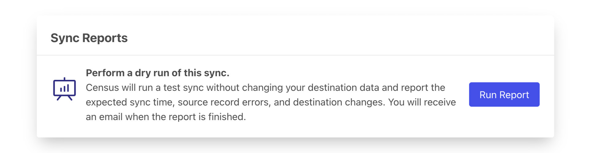
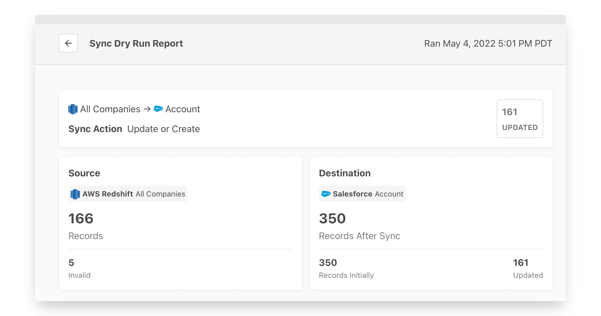

# Sync Dry Runs


This feature is only available when syncing data to Salesforce. [Let us know](mailto:support@getcensus.com) if you need it for another service!


Sometimes you know a lot of data is coming. Maybe it's the very first time you're running a big sync, maybe you've recently made some big changes to your data model. Whatever the reason, that next sync can be nerve racking.

Sync Dry Runs let you simulate a sync before you run it. You can ask Census to provide a Dry Run report of what changes will be made to the destination when the next sync runs.


Please note that this is not available for Multi-Destination objects. Check out Salesforce's supported objects [here](https://docs.getcensus.com/destinations/salesforce#supported-objects).


### How It Works

1. First, you'll need your sync configuration. If thies is a brand new sync, the option to create a Sync Run will be available once the sync has been saved. Don't worry, you don't have to actually run the sync yet; skip that Run Now checkbox. At the bottom of the overview page, you'll see the option to **Run a Sync Run Report**.
2. Click the run button when you're ready. Census will extract the data from your source and compare it against the destination. This can take a while for very large data sets. We need to do all the work we'd normally do, and report back on the results. Note: You won't be able to run or edit the sync configuration until it completes.
3. Once the report completes, you'll see the results of your dry run. This includes a number of data points:
   * The number of currently invalid records in the source data.
   * Number of records that will be created, updated, and–if it's a mirror sync–deleted.
   * The total number of records that will exist in the destination once the sync is completed.
4. This report is accessible in the Sync History, as well as in the Sync Report section.

Keep in mind, the URL to the report is shareable so you can also share the results with others, including the people that own the tool where the data is headed, just to make sure they know what's coming!
