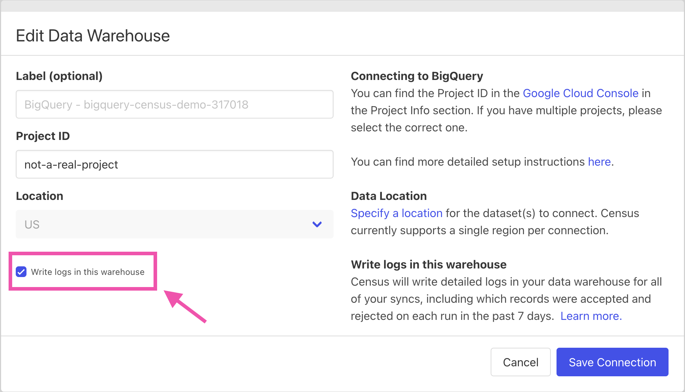

# Warehouse Writeback

Census provides granular details on the data you've sent from your data warehouse to destination SaaS applications like Salesforce or Iterable. With these logs, you can answer common questions like:

1. When was my data updated in the destination?
2. Why did the destination's API reject records that I tried to sync?
3. What is the most common reason that the destination's API rejects my data?
4. Which users were a member of this segment at this time?


Warehouse Writeback is available for Platform Plan accounts. If you would like logging enabled please contact our team at [support@getcensus.com](mailto:support@getcensus.com).


## :ballot\_box: Supported data sources

Census can provide detailed logging for all data warehouse sources:

* Snowflake
* BigQuery
* Redshift
* PostgreSQL (version 13 or later is required)
* Databricks

## 🖥️ Configuring Warehouse Writeback

To enable Warehouse Writeback on any supported source:

1. Visit the [Connections page](https://app.getcensus.com/connections).
2. Click to "Edit" the configuration of the source where you'd like logs.
3. Tick the box next to the option to "Write logs in this warehouse".

Here is an example of this configuration enabled for a sample Bigquery connection:

That's it! Logs will start populating for all syncs in this connection on their subsequent runs.

## 🧮 Log Data

#### Where can I find the logs?

Census exposes detailed logging information in a view called `sync_log` in your data warehouse. By warehouse, this view can be found as follows:

* **Snowflake**: `CENSUS.CENSUS.SYNC_LOG`
* **BigQuery:** `census.sync_log`
* **Redshift:** `census.sync_log`
* **PostgreSQL**: `census.sync_log`
* **Databricks**: `census.sync_log`

#### How much log data is stored?

Census will store the previous 7 days of logs in the `sync_log` view.


Need data stored for longer? Please reach out at support@getcensus.com.


#### What do the columns of the view mean?

| column                  | column description                                                                                                                                                                                |
| ----------------------- | ------------------------------------------------------------------------------------------------------------------------------------------------------------------------------------------------- |
| log\_id                 | Unique identifier for the log                                                                                                                                                                     |
| sync\_id                | 
Unique identifier for the sync configuration. You can find it in the URL of your sync configurations as follows:

https://app.getcensus.com/syncs/<strong>[sync_id]</strong>/overview
 |
| sync\_run\_id           | Unique identifier for the sync run. Use this value to identify a particular occasion when Census sends data as specified for a given sync configuration.                                          |
| record\_identifier      | The value of the identifier specified in your sync configuration, identifying _which_ record in your source you are trying to send to a destination.                                              |
| record\_payload         | The exact data that Census was attempting to send to a given destination. It is formatted as a JSON object.                                                                                       |
| batch\_started\_at      | The time when the batch containing this data was sent to the destination.                                                                                                                         |
| batch\_completed\_at    | The time when the batch containing this data completed.                                                                                                                                           |
| operation               | The operation performed by Census. Either: 'upsert', 'update', 'create', or 'delete'... depending on the sync behavior you specified.                                                             |
| status                  | Either 'succeeded' or 'rejected'                                                                                                                                                                  |
| status\_message         | If the status is 'rejected', this field will contain the reason returned by the destination's API.                                                                                                |
| \_census\_logged\_at    | When Census loaded this log record into your data warehouse.                                                                                                                                      |
| destination\_id         | Unique identifier for the destination (i.e. service) connection that this sync is writing to.                                                                                                     |
| destination\_object\_id | Unique identifier for the destination (i.e. service) object that this sync is writing to.                                                                                                         |
| source\_id              | Unique identifier for the source connection (e.g. your warehouse) that this sync is sending data from.                                                                                            |
| source\_object\_id      | Unique identifier for the specific object in the source connection that this sync is sending data from. This could be a table, model, entity, or segment.                                         |

## Metadata Tables

When you enable Warehouse Writeback for a source, Census will start writing metadata about source objects and destinations involved in syncs. These tables can be joined to the `sync_log` table on their `id` column in order to add additional context.

To illustrate the value here, imagine you have a mirror sync from a segment to an ads destination. The `sync_log` table will log attempts to send new records (i.e. those that entered the segment) to the destination. It will also log attempts to delete records (i.e. those that left the segment) from the destination. If you join those logs with the source objects table (described below) you can get full insight into who is entering and leaving what segments, by name, and when.

### Source Objects Table

Source objects are tables, models, entities, or segments. These are what you send data from during a sync. Continue reading the [schema section](sync-logs.md#schema) below for more information.

#### Where

Metadata tables for source objects can be found in the following tables, by warehouse:

* **Snowflake**: `CENSUS.CENSUS.SOURCE_OBJECTS`
* **BigQuery:** `census.source_objects`
* **Redshift:** `census.source_objects`
* **PostgreSQL**: `census.source_objects`
* **Databricks**: not yet supported

#### `Schema`

| column               | column description                                                                                                                                                                                                                                                                                                                                                                                                                                       |
| -------------------- | -------------------------------------------------------------------------------------------------------------------------------------------------------------------------------------------------------------------------------------------------------------------------------------------------------------------------------------------------------------------------------------------------------------------------------------------------------- |
| id                   | 
Unique identifier for the source object.  This joins to the <code>source_object_id</code> column in the <code>sync_log</code>  table.
                                                                                                                                                                                                                                                                                                       |
| type                 | 
Type of data set. The options with their meaning are:  <code>DataWarehouse::FilterSegmentSource</code> -> A segment  <code>DataWarehouse::Query</code> -> A model  <code>DataWarehouse::BusinessObjectSource</code> -> An entity  <code>DataWarehouse::Table</code> -> A table
                                                                                                                                            |
| name                 | Name of the data set.                                                                                                                                                                                                                                                                                                                                                                                                                                    |
| model\_id            | 
For a source object with type <code>DataWarehouse::Query</code>, this points to the SQL, Looker, or dbt model associated with it.  The model is what you see in the Census UI and is what is responsible for storing a SQL query, dbt reference, etc. The <code>DataWarehouse::Query</code> source object lives between the model and your source and is responsible for translating the model definition into rows and columns.
            |
| business\_object\_id | 
For a source object with type <code>DataWarehouse::BusinessObjectSource</code>, this points to the entity associated with it.  The entity is what you see in the Census UI and is what you configure to fit your business needs. The <code>DataWarehouse::BusinessObjectSource</code> source object lives between the entity and your source and is responsible for translating the entity definition into rows and columns.
                |
| filter\_segment\_id  | 
For a source object with type <code>DataWarehouse::FilterSegmentSource</code>, this points to the segment associated with it.  The segment is what you see in the Census UI and is where you configure conditional logic to segment your data. The <code>DataWarehouse::FilterSegmentSource</code> source object lives between the segment and your source and is responsible for translating the segment definition into rows and columns.
 |

### Destinations Table

Destinations are service connections. These are where you send data during a sync. An example is Salesforce.

#### Where

Metadata tables for destinations can be found in the following tables, by warehouse:

* **Snowflake**: `CENSUS.CENSUS.DESTINATIONS`
* **BigQuery:** `census.destinations`
* **Redshift:** `census.destinations`
* **PostgreSQL**: `census.destinations`
* **Databricks**:  not yet supported

#### `Schema`

| column | column description                                                                                                                            |
| ------ | --------------------------------------------------------------------------------------------------------------------------------------------- |
| id     | 
Unique identifier for the destination.  This joins to the <code>destination_id</code> column in the <code>sync_log</code> table.
 |
| type   | Type of the destination. This can be any of the various destinations we support, in the format `<Destination name>::Connection`               |
| name   | Name of the destination.                                                                                                                      |

### Destination Objects Table

Destination objects are the specific objects within a destination that you send data to during a sync. An example is a Salesforce Contact.

#### Where

Metadata tables for destinations can be found in the following tables, by warehouse:

* **Snowflake**: `CENSUS.CENSUS.DESTINATION_OBJECTS`
* **BigQuery:** `census.destination_objects`
* **Redshift:** `census.destination_objects`
* **PostgreSQL**: `census.destination_objects`
* **Databricks**:  not yet supported

#### `Schema`

| column | column description                                                                                                                                                        |
| ------ | ------------------------------------------------------------------------------------------------------------------------------------------------------------------------- |
| id     | 
Unique identifier for the destination object.  This joins to the<code>destination_object_id</code> column in the <code>sync_log</code> table.
                |
| type   | Type of the destination object. This can be any of the various destination objects we support, in the format `<Destination name>::ObjectTypes::<Destination object name>` |
| name   | Name of the destination object.                                                                                                                                           |

