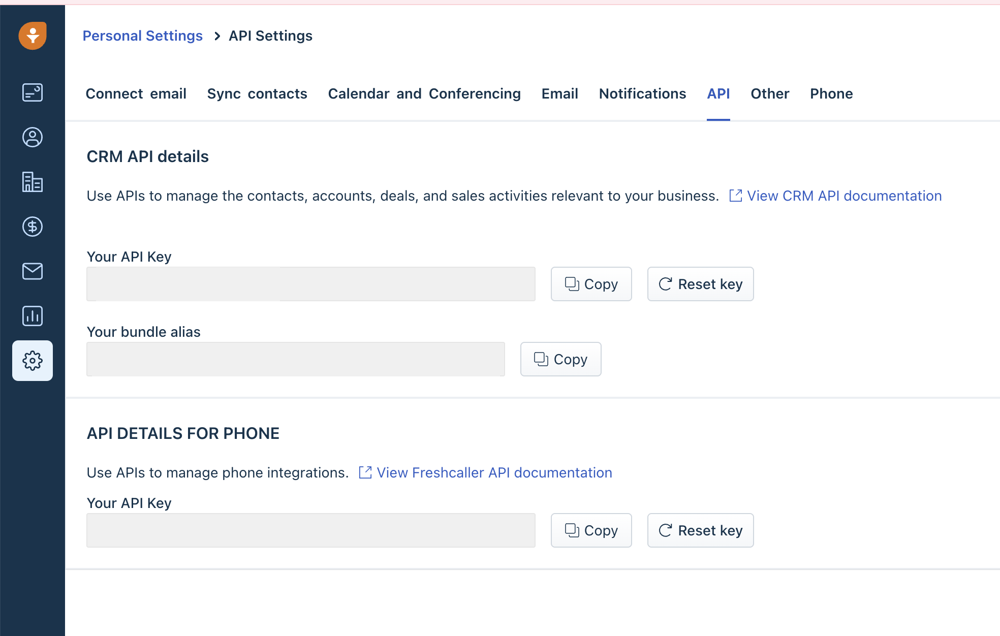

# Core Concepts

## Dataset Source 

Datasets require a source to be defined. The source represent the external infrastructure from which we will be reading the rows and columns for your dataset. You can learn more on how to connect a source through our [Source Documentation](broken-reference). All connected sources will appear at dataset creation time.

Different data sources have different behaviors and functionality. We encode these differences through different Dataset Types. You can learn more of the specific requirements, capabilities and limitations for each within each section.&#x20;

<figure><figcaption></figcaption></figure>

Once a dataset is created you can view the source information through the right sidebar of your Dataset page. Dataset source is not editable after creation, however some sub properties such as Census defined queries are.&#x20;

## Dataset Metadata

Datasets allow you to set icons and descriptions to help you identify and describe your data. For data that is countable (such as materialized data), you can also see the latest row count next to the dataset name.

## FAQ


**What happened with my models and entities?**

All the data you had encoded in your models and entities is still available and now has a new representation through Datasets. If you need help navigating this change [contact us](mailto:support@getcensus.com) via support@getcensus.com or start a conversation with us via the [in-app](https://app.getcensus.com) chat.



**Do these Dataset changes impact my syncs?**

No. All your syncs will continue to work exactly the same way and sync the same data. However, your sync source will now be a Dataset.&#x20;


