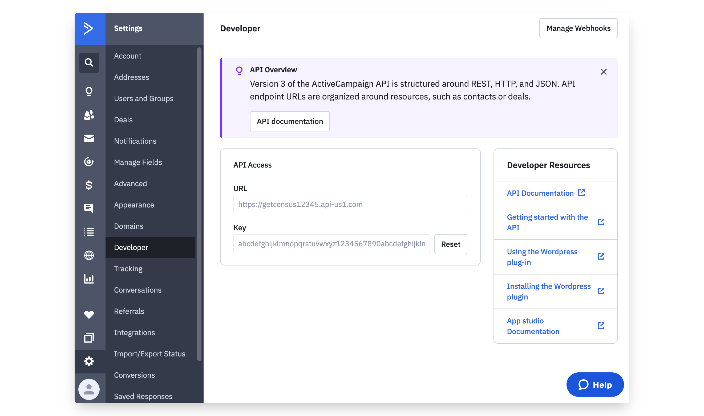
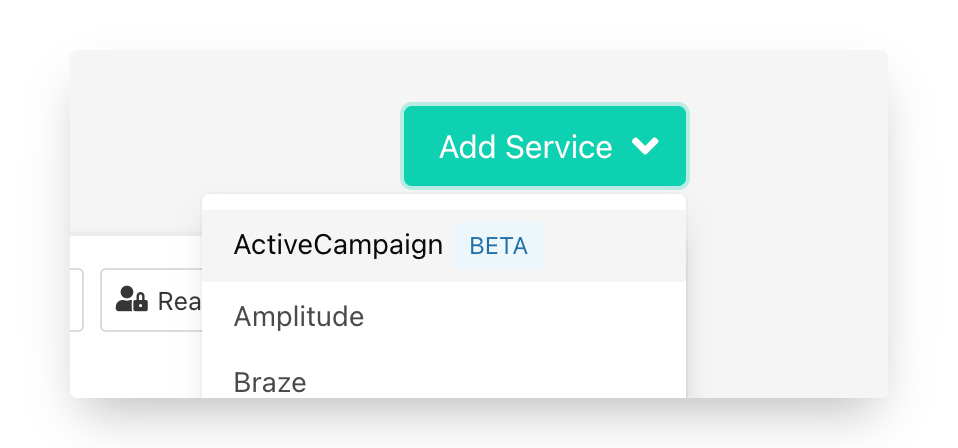
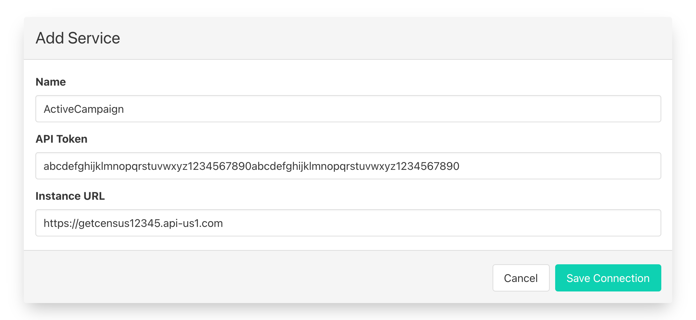
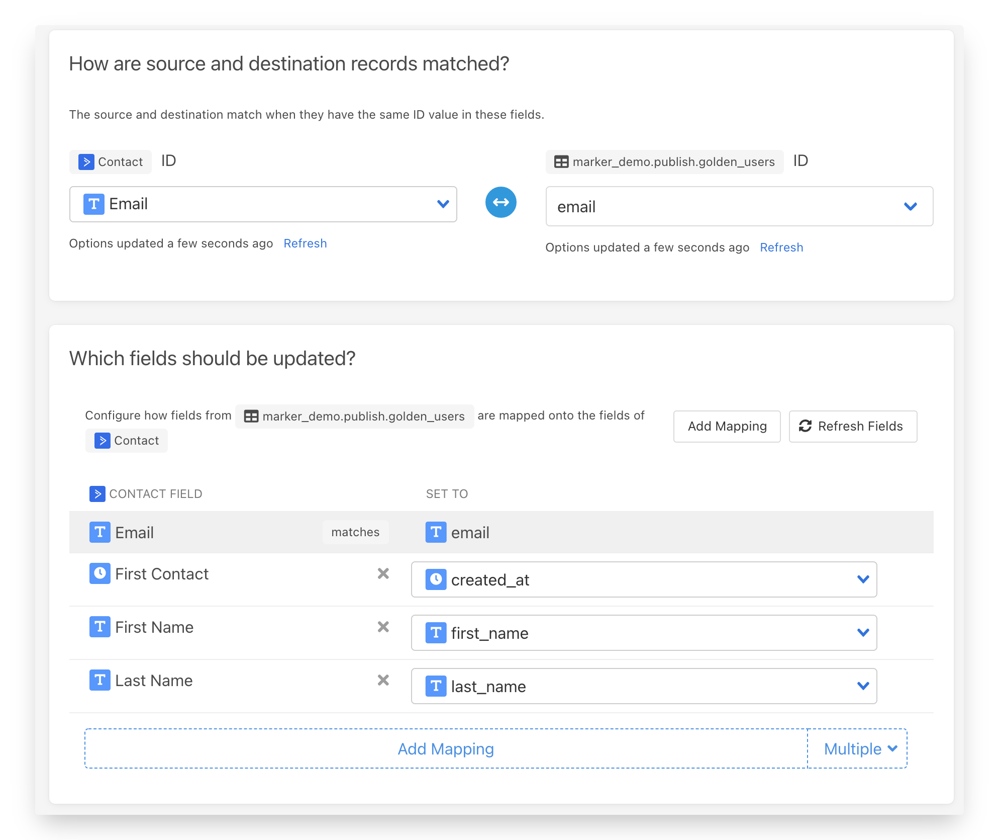
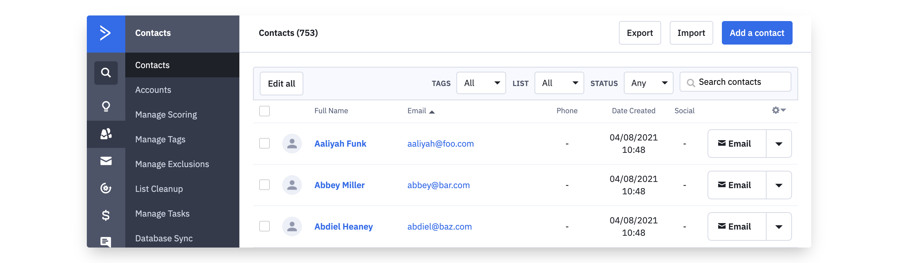
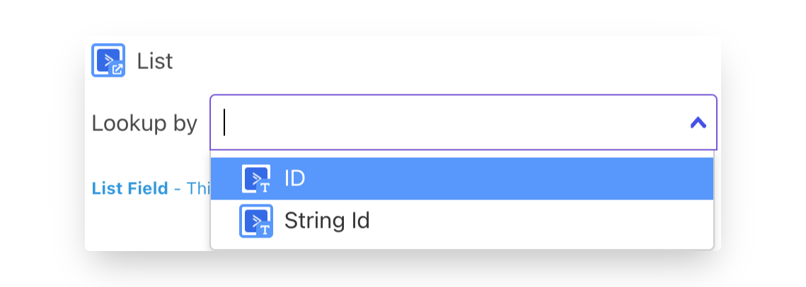

# ActiveCampaign

## 🏃‍♀️ Getting Started

‌In this guide, we will show you how to connect ActiveCampaign to Census and create your first sync.



### Prerequisites

* Have your Census account ready. If you need one, [create a Free Trial Census account](https://app.getcensus.com/) now.
* Have your ActiveCampaign account ready.
* Have the proper credentials to access to your data source. See our docs for each supported data source for further information:
  * [Azure Synapse](../sources/azure-synapse.md)
  * [Databricks](https://docs.getcensus.com/sources/databricks)
  * [Elasticsearch](https://docs.getcensus.com/sources/elasticsearch)
  * [Google BigQuery](https://docs.getcensus.com/sources/google-bigquery)
  * [Google Sheets](https://docs.getcensus.com/sources/google-sheets)
  * [MySQL](https://docs.getcensus.com/sources/mysql)
  * [Postgres](https://docs.getcensus.com/sources/postgres)
  * [Redshift](https://docs.getcensus.com/sources/redshift)
  * [Rockset](https://docs.getcensus.com/sources/rockset)
  * [Snowflake](https://docs.getcensus.com/sources/snowflake)
  * [SQL Server](https://docs.getcensus.com/sources/sql-server)

### 1. Get ActiveCampaign API Key

1. Within ActiveCampaign, visit **Settings** then **Developer** page.
2. Copy the API key and the URL to provide to Census

### 2. Connect ActiveCampaign

* Once you are in Census, navigate to [Destinations](https://app.getcensus.com/destinations)
* Click the **New Destination** button
* Select ActiveCampaign in the dropdown list

* When prompted for your API Credentials, enter your ActiveCampaign API URL and API Key

### 3. Connect to your Data Warehouse

Please follow one of our short guides depending on your data warehouse technology

* [Redshift](https://help.getcensus.com/article/10-configuring-redshift-postgresql-access)
* [Postgres](https://help.getcensus.com/article/10-configuring-redshift-postgresql-access)
* [BigQuery](https://help.getcensus.com/article/21-configuring-bigquery-access)
* [Snowflake](https://help.getcensus.com/article/8-configuring-snowflake-access)

### 4. Create your first Model

Now navigate to the [Model section of our Dashboard](https://app.getcensus.com/models)

Here you will have to write SQL queries to select the data you want to see in ActiveCampaign. Here are some ideas of data you should select

* the Lifetime Value of a customer and add it to a contact or companies
* The end of their trial
* The date they became active in your product
* The number of key activities a user did in your app in the last 7/30 days

Once you have created your model, click save.

### 5. Create your first Sync

Now head to the [Sync page](https://app.getcensus.com/syncs) and click the **Add Sync** button

In the " **What data do you want to sync?"** section

* For the **Connection**, select the data warehouse you connected in step 2
* For the **Source,** select the model you created in step 3

Next up is the **"Where do you want to sync data to?"** section

* Pick ActiveCampaign as **the Connection**
* For Object, pick the one you want to sync data to; Contact or Account.

For the " **How should changes to the source be synced?"** section

* Select **Update or Create** if syncing to the Account object, or select either **Update or Create** or **Update Only** if syncing to the Contact object
* Pick the right mapping key, it could be Email for Contacts, Account Name for Accounts.

Finally, select the fields you want to update in the Mapper in the **"Which Fields should be updated?"** section

* Here simply map the field from your ActiveCampaign instance to the column from your model.
  * When mapping fields to Lists in ActiveCampaign you can associate a List to a Contact by either the List ID or the String ID.

The end result should look something like this

Click the **Next** button to see the final preview which will have a recap of what will happen when you start the sync

### 6. Confirm the data is in ActiveCampaign

Now go back to your ActiveCampaign and go view a record type (Contact or Account) that should have been updated. If everything went well, you should see your data in ActiveCampaign.

That's it! In 6 steps, you connected Census to ActiveCampaign and started syncing customer & account data from your warehouse to ActiveCampaign 🎉

## 🏎 Sync Speed

ActiveCampaign is syncing data at approximately 37,000 contact records per hour.

Due to limitations of the ActiveCampaign API, Account records will sync significantly slower.

## 🗄 Supported Objects

| Object Name    | Supported? | Identifiers  |
| -------------- | :--------: | ------------ |
| Contact        |      ✅     | Email        |
| Account        |      ✅     | Account Name |
| Custom Objects |      ✅     | External ID  |
| Campaigns      |     🔜     |              |
| Deals          |     🔜     |              |
| Lists          |     🔜     |              |

### Updating a Contact's Lists

ActiveCampaign supports adding Contact objects to one or more lists during a sync by providing an array of identifiers by providing a [structured-data.md](../basics/data-defining/defining-source-data/structured-data.md "mention") column from the source data. Each list can be identified by one of two identifiers:

* **ID** - This is an integer and can be extracted from a list's URL while inside ActiveCampaign.
* **String Id** - This is a URL-safe string identifier for the list. This is only typically available via the ActiveCampaign API.

Census will return an error if the list with the matching ID cannot be found. If you're quite sure it exists, double check you have the right type of ID.

## 🔄 Supported Sync Behaviors


Learn more about all of our sync behaviors in our [Syncs](broken-reference) documentation.


|        **Behaviors** | **Supported?** | **Objects** |
| -------------------: | :------------: | :---------: |
| **Update or Create** |        ✅       |     All     |
|      **Update Only** |        ✅       |   Contact   |

## 🆘 Common Errors

Sometimes error messages can be a little cryptic. Here's some ActiveCampaign errors that pop up on occasion and what they mean.

* `Row skipped - It is on exclusion list` The record you're attempting to update appears on your ActiveCampaign instance's [Exclusion List](https://help.activecampaign.com/hc/en-us/articles/207362110-How-to-add-contacts-to-the-Exclusion-List) and can't be updated.

## 🚑 Need help connecting to ActiveCampaign?

[Contact us](mailto:support@getcensus.com) via support@getcensus.com or start a conversation with us via the [in-app](https://app.getcensus.com) chat.
