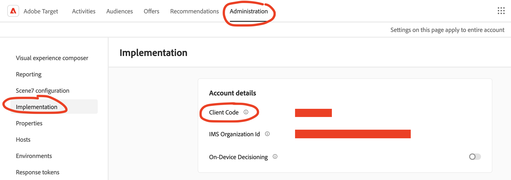

# Adobe Target

## 🏃‍♀️ Getting Started

1. Click **Add Service**.
2. Select **Adobe Target** from the menu.
3. Open the Target app in another window. Navigate to **Administration** > **Implementation** and copy your Client Code to clipboard.
4. Return to Census and paste it under **Client ID**.

<figure><figcaption>
Get your Client ID from the Adobe Target app.
</figcaption></figure>

## 🔀 Supported Objects and Behaviors

| **Object Name** | **Supported?** | **Identifiers**  | **Behaviors**       |
| --------------: | :------------: | ---------------- | ------------------- |
| Profile | ✅ | Target ID, Third Party ID | Update or Create |

[Contact us](mailto:support@getcensus.com) if you want Census to support more Adobe Target objects and/or behaviors.

## 🚑 Need help connecting to Adobe Target?

[Contact us](mailto:support@getcensus.com) via support@getcensus.com or start a conversation with us via the [in-app](https://app.getcensus.com) chat.
