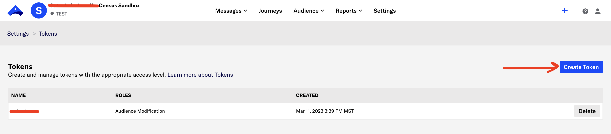

# Airship

## Getting Started

1. Navigate to the **Destinations** page in Census and click **New Destination**.
2. Select **Airship** from the menu.
3. Open the Airship app in another tab, select a project, and navigate to **Settings** > **Tokens**. Click **Create Token** to generate a new token. You can set the role to **Audience Modification**. Create the token and copy it to clipboard.
4. Return to Census, enter your **API Token** and select your **Region**, then click **Connect**.

<figure><figcaption>
Generate an API key from the Airship app.
</figcaption></figure>

## Supported Objects and Sync Behaviors 

| **Object Name** | **Supported?** | **Sync Keys**       | **Behaviors**    |
| --------------: | :------------: | ------------------- | ---------------- |
|     Static List |        ✅       | Channel-specific ID | Replace          |
|           Event |        ✅       | Census Tracking ID  | Send             |
|   Email Channel |        ✅       | Email Address       | Update or Create |


Learn more about all of our sync behaviors in our [Syncs](../syncs/overview.md) documentation.


[Contact us](mailto:support@getcensus.com) if you want Census to support more Airship objects and/or behaviors.

## Need help connecting to Airship?

[Contact us](mailto:support@getcensus.com) via support@getcensus.com or start a conversation with us via the [in-app](https://app.getcensus.com) chat.
