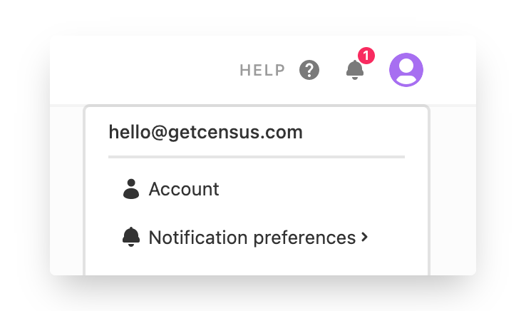
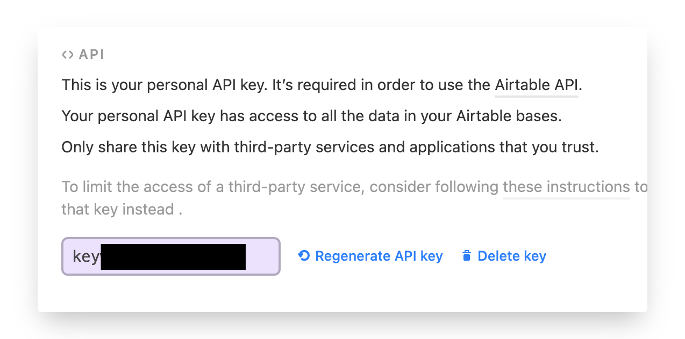
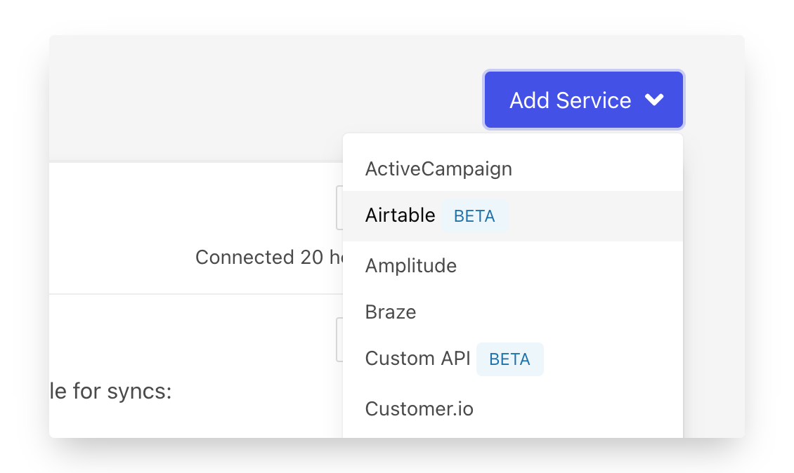
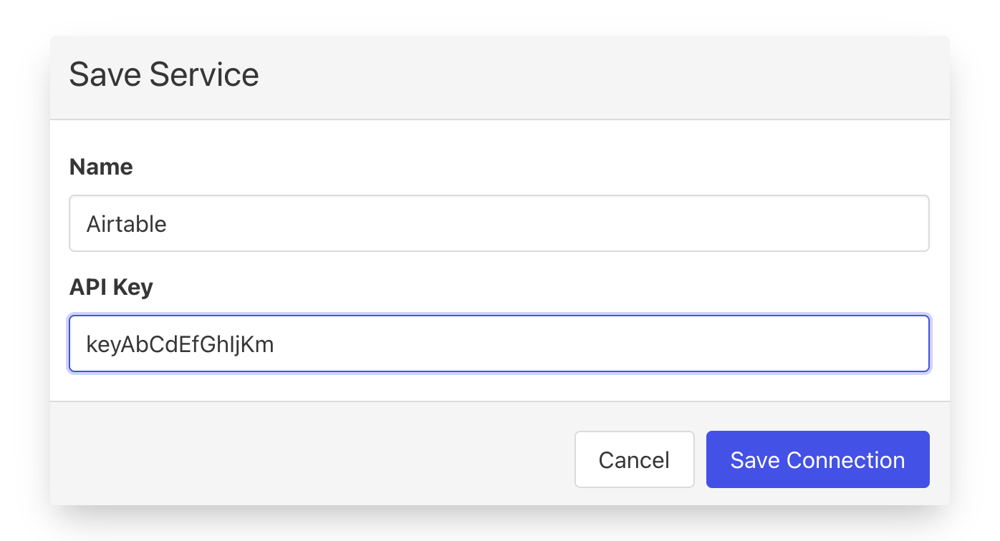

# Airtable

## 🏃‍♀️ Getting Started

In this guide, we will show you how to connect Airtable to Census and create your first sync.



### Prerequisites 

To get started, you'll need three things:

1. A Census account​. If you need one, [create a Free Trial Census account](https://app.getcensus.com/)​ now.
2. An Airtable account with write access to your target Airtable base. 
3. Credential to access your data warehouse. 

### 1. Create or get the Airtable API key

1. From within Airtable, click the profile icon in the top right and select **Account**. Or click [_here_](https://airtable.com/account)_._   
2. Scroll to the **API** section. If this is your first time using the API, you'll need to create an API key. Once created, click the box and copy the API key. You'll need that in a minute.    

Note: Census's permissions will be the same as this Airtable user. If you think this Airtable user's permissions may change or the account is removed, you may want to create a special Airtable account just for Census to use.

### 2. Add an Airtable Connection

1. Now back to Census! Navigate to the [Connections page](https://app.getcensus.com/connections).
2. Click the **Add Service** button.
3. Select **Airtable** from the list.  
4. Add your API key to the modal and give your connection a memorable name. Save once you've got both!  

### 3. Connect your data warehouse

If you don't already have a data warehouse connected, follow one of our short guides depending on your data warehouse service:

* [Redshift](https://help.getcensus.com/article/10-configuring-redshift-postgresql-access)
* [Postgres](https://help.getcensus.com/article/10-configuring-redshift-postgresql-access)
* [BigQuery](https://help.getcensus.com/article/21-configuring-bigquery-access)
* [Snowflake](https://help.getcensus.com/article/8-configuring-snowflake-access)
* [Databricks](../sources/databricks.md)

You should now have a connection to Airtable and to your data warehouse! Let's start syncing data. 

### 4. Create your first Model 

Now navigate to the [Model section of our Dashboard](https://app.getcensus.com/models).​‌

Here you will have to write SQL queries to select the data you want to see in Airtable. Here are some ideas of data you should select‌.

* Orders that to fulfill
* Expenses to review
* Customer feature requests to prioritize

Once you have created your model, click **Save**.‌

### 5. Create your first Sync 

Now head to the [Sync page](https://app.getcensus.com/syncs) and click the **Add Sync** button‌.

In the " **What data do you want to sync?"** section‌

* For the **Connection**, select the data warehouse you connected in step 3
* For the **Source,** select the model you created in step 4

Next up is the **"Where do you want to sync data to?"** section‌

* Pick the name of Airtable from step 2 as **the Connection**
* For Object, pick the table you want to sync data to

For the " **How should changes to the source be synced?"** section‌

* Select your preferred behavior. **Update only** is a great place to start if you have data in Airtable! **Update or Create** is great for sending data from the warehouse into Airtable.
* Pick the right mapping key, Airtable only allows a text type from their tables. We recommend you use your own unique id from the database if possible.

Finally, select the fields you want to update in the Mapper in the **"Which Fields should be updated?"** section‌.

* Here simply map the field from your Airtable instance to the column from your model.

The end result should look something like this​:

Click the **Next** button to see the final preview which will have a recap of what will happen when you start the sync‌.

### 6. Confirm the data is in Airtable 

Now go back to your Airtable and go view the table object that should have been updated. If everything went well, you should see your data in the table​

That's it! In 6 steps, you've connected Airtable and started syncing orders data from your warehouse 🎉

## 🗄 Supported Objects

Airtable support is pretty straight forward!

| **Object Name** | **Supported?** |
| ---: | :---: |
| Table | ✅ |


Airtable needs a primary key that is a short text field for Census to be able to join from a source table. On the SQL side, it can be a numeric type, but this is a quirk of this integration that's worth calling out.


**Column types**

<table>
  <thead>
    <tr>
      <th style="text-align:center">Airtable Field Types</th>
      <th style="text-align:left">Source SQL Types</th>
    </tr>
  </thead>
  <tbody>
    <tr>
      <td style="text-align:center">Short Text</td>
      <td style="text-align:left">
        
String

        
Numeric

      </td>
    </tr>
    <tr>
      <td style="text-align:center">Single Select</td>
      <td style="text-align:left">
        
String

        
Numeric

      </td>
    </tr>
    <tr>
      <td style="text-align:center">Checkbox</td>
      <td style="text-align:left">
        
Boolean

        
Numeric (nonzero = checked, 0 = unchecked)

      </td>
    </tr>
    <tr>
      <td style="text-align:center">The Rest</td>
      <td style="text-align:left">
        
Census will give an informative error

        
message if rejected by Airtable &#x1F600;

      </td>
    </tr>
  </tbody>
</table>

[Contact us](mailto:support@getcensus.com) if you want Census to support more objects for Airtable.

## 🔄 Supported Sync Behaviors


Learn more about all of our sync behaviors on our [Core Concepts page](../basics/core-concept.md#the-different-sync-behaviors).


| **Behaviors** | **Supported?** | **Objects?** |
| ---: | :---: | :---: |
| **Update or Create** | ✅ | All |
| **Update Only** | ✅ | All |
| **Mirror** | 🔜 | All |

[Contact us](mailto:support@getcensus.com) if you want Census to support more Sync behaviors for Airtable.

## 🚑 Need help connecting to Airtable?

[Contact us](mailto:support@getcensus.com) via support@getcensus.com or start a conversation with us via the [in-app](https://app.getcensus.com) chat.

