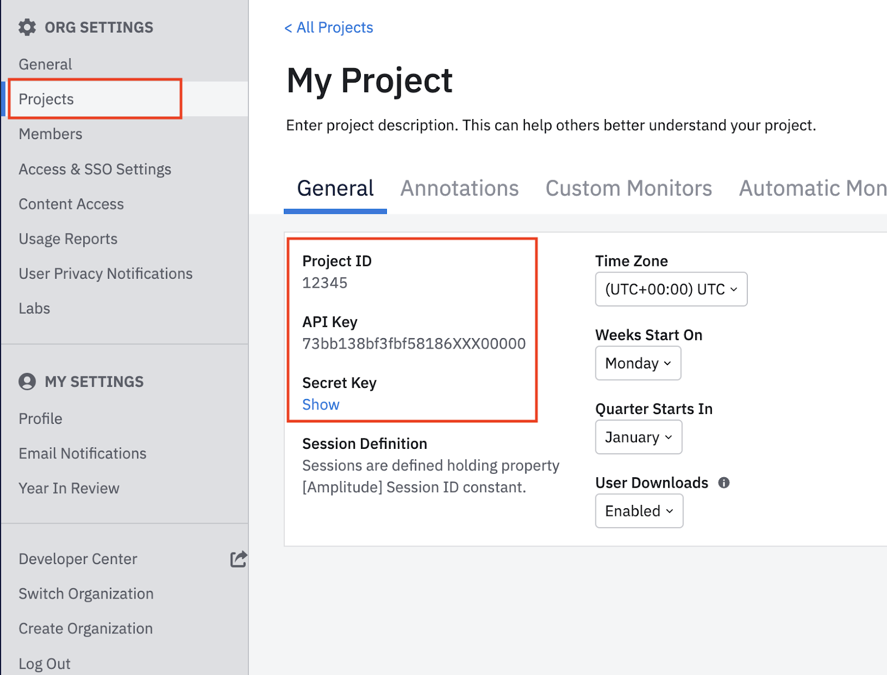

# Amplitude

## Getting Started

‌In this guide, we will show you how to connect Amplitude to Census and create your first sync.

### Prerequisites

* Have your Census account ready. If you need one, [create a Free Trial Census account](https://app.getcensus.com/) now.
* Have your Amplitude account ready.
* Have the proper credentials to access to your data source. See our docs for each supported data source for further information:
  * [Azure Synapse](../sources/available-sources/azure-synapse.md)
  * [Databricks](https://docs.getcensus.com/sources/databricks)
  * [Elasticsearch](https://docs.getcensus.com/sources/elasticsearch)
  * [Google BigQuery](https://docs.getcensus.com/sources/google-bigquery)
  * [Google Sheets](https://docs.getcensus.com/sources/google-sheets)
  * [MySQL](https://docs.getcensus.com/sources/mysql)
  * [Postgres](https://docs.getcensus.com/sources/postgres)
  * [Redshift](https://docs.getcensus.com/sources/redshift)
  * [Snowflake](https://docs.getcensus.com/sources/snowflake)
  * [SQL Server](https://docs.getcensus.com/sources/sql-server)

### **1. Get API key from Amplitude**

Census needs only one piece of information to connect to your Amplitude project

* The API Key for an HTTP API data source for your Amplitude project

To find your Amplitude project's unique API key, follow these steps.

1. In the Amplitude Analytics web app, click [**Settings**](http://analytics.amplitude.com/amp-dev-docs/settings/projects) in the lower left navigation.
2. Click **Projects**, then find your target project.
3. On the **General** tab, copy your API key and secret key.

<figure><figcaption></figcaption></figure>

### 2. **Create the Census Connection**

Now that we have the API Key from Amplitude, we can now set up Amplitude as a Destination in Census.

1. In the **Destinations** section of Census, create a new Amplitude connection by clicking the New Destination button and searching for "Amplitude" in the search bar.

<figure><figcaption></figcaption></figure>

2. You can provide whatever name you like.
3. Provide the copied API Key from Amplitude.
4. Choose the appropriate region
5. Click Connect

<figure><figcaption></figcaption></figure>

### 3. Create your first Model

Now navigate to the [Model section of our Dashboard](https://app.getcensus.com/models)

Here you will have to write SQL queries to select the data you want to see in Amplitude. Here are some ideas of data you should select

* The Lifetime Value of a customer
* The end date of a user's trial
* The date a user became active in your product
* The number of key activities a user did in your app in the last 7/30 days

Once you have created your model, click save.

### 4. Create your first Sync

Now head to the [Sync page](https://app.getcensus.com/syncs) and click the Add Sync button

In the "What data do you want to sync?" section.

* For the Connection, select the data warehouse you've already connected (See Prerequisites).
* For the Source, select the model you created in step 4.

Next up is the "Where do you want to sync data to?" section.

* Pick the Amplitude connection you created in step 3.
* For Object, Select Device or User. If Devices can be associated with Users, then select Device. If no Device information is collected, select User.

For the "How should changes to the source be synced?" section.

* Select Update Or Create
* Pick the right mapping key; Amplitude only supports Distinct ID.

Finally, select the fields you want to update in the Mapper in the "Which Fields should be updated?" section. Here simply map the field from your Amplitude instance to the column from your model.

Click the Next button to see the final preview, which will have a recap of what will happen when you start the sync.

## ️ Supported Objects and Sync Behaviors 

| **Object Name** | **Supported?** | **Sync Keys** | **Behaviors**    |
| --------------: | :------------: | ------------- | ---------------- |
|         Devices |        ✅       | Device ID     | Update or Create |
|           Users |        ✅       | User ID       | Update or Create |
|          Groups |        ✅       | Group Value   | Update or Create |
|          Events |        ✅       | Insert ID     | Send             |

Both User and Device objects will resolve to a single User Profile in Amplitude. If Devices can be associated with Users, then select Device and map the User field to an appropriate value in your model. If no Device information is collected, select User.


Learn more about all of our sync behaviors in our [Syncs](../syncs/overview.md) documentation.


[Contact us](mailto:support@getcensus.com) if you want Census to support more Amplitude objects and/or behaviors.

### Working with Amplitude's Data Model

Amplitude has very well optimized data model for analyzing time series event, but this model presents some quirks and challenges for historic data updating.

Each Event record in Amplitude has a snapshot of any user and group properties that applied to it at the moment that event was ingested into Amplitude. Amplitude's analyzes this event stream so this makes querying events really efficient.

But these events are immutable, meaning once they're written, they're never updated again, including that snapshot of user and group properties. This introduces some quirks:

* If user properties are updated by Census, those user properties will only apply to any _**future**_ _**ingested**_ events at the time of their ingestion. So if User A's properties are updated by Census today, but they never again generate an event, the Amplitude UI will never show the updated user properties because none of the previous events' snapshots can be changed to reflect the updated properties.
* This also means that historical event imports are limited. Historical events can be imported with updated user and group properties, but again, those properties _**will only be reflected on events ingested after the historical sync**_ in real world time\*\*,\*\* not just in the future according to the timestamp of the events. This is because all events already ingested are immutable.

This is Amplitude's intended design: fast, but with some inflexibility. You can read more about it in [Amplitude's documentation](https://help.amplitude.com/hc/en-us/articles/115002380567-User-properties-and-event-properties#h_856d23e3-10ea-4398-a50d-4982a42d1f3f).

#### Working Around Missing User Properties

As a result of this behavior, we often get asked "Why can't I see my user properties?" and we explain that it's likely because the user hasn't had a subsequent event. Some users choose to work around this by creating a sort of `Updated By Census` synthetic Event instead of using the User Identify destination object. If you chose to go this route, you'll likely want to tell Amplitude to consider this an inactive event so that the user doesn't appear as active when this happens. See [Amplitude's documentation](https://help.amplitude.com/hc/en-us/articles/360047138392-Manage-events-and-properties) on the steps to define that and make sure you do this **before running the sync** to avoid accidentally marking your users as active.

‌ 🔋 [Contact us](mailto:support@getcensus.com) if you want Census to support more Sync Behaviors for this destination.

‌

## Need help connecting to Amplitude?

[Contact us](mailto:support@getcensus.com) via support@getcensus.com or start a conversation with us via the [in-app](https://app.getcensus.com) chat.
