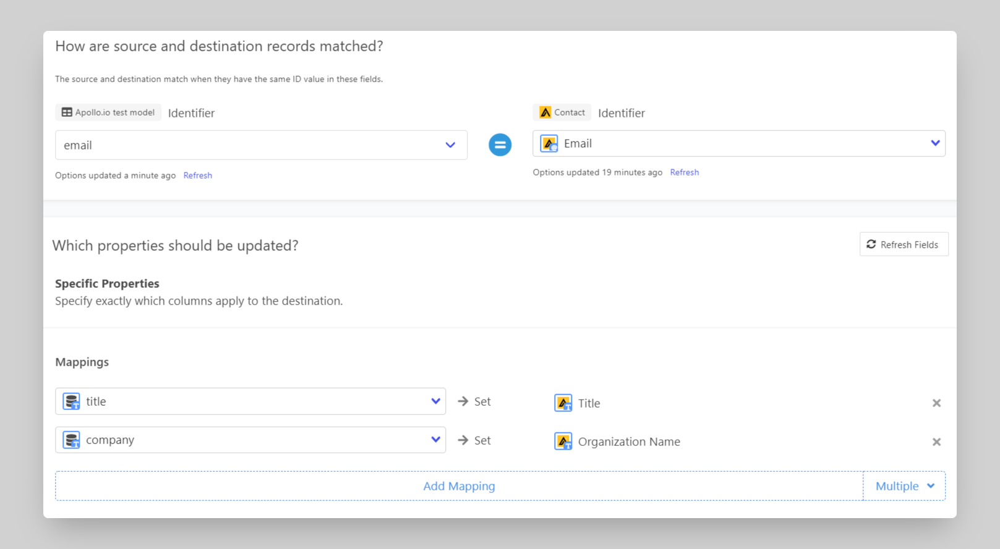

# Apollo

## 🏃‍♀️ Getting Started

In this guide, we will show you how to connect Apollo to Census and create your first sync.

### Prerequisites

* Have your Census account ready. If you need one, [create a Free Trial Census account](https://app.getcensus.com/) now.
* Have the proper credentials to access your data source. See our docs for each supported data source for further information:
  * [Azure Synapse](../sources/azure-synapse.md)
  * [Databricks](https://docs.getcensus.com/sources/databricks)
  * [Elasticsearch](https://docs.getcensus.com/sources/elasticsearch)
  * [Google BigQuery](https://docs.getcensus.com/sources/google-bigquery)
  * [Google Sheets](https://docs.getcensus.com/sources/google-sheets)
  * [MySQL](https://docs.getcensus.com/sources/mysql)
  * [Postgres](https://docs.getcensus.com/sources/postgres)
  * [Redshift](https://docs.getcensus.com/sources/redshift)
  * [Rockset](https://docs.getcensus.com/sources/rockset)
  * [Snowflake](https://docs.getcensus.com/sources/snowflake)
  * [SQL Server](https://docs.getcensus.com/sources/sql-server)

### 1. Create an Apollo API key

Apollo lets you create a number of API keys, each with their own set of permissions. You'll almost certainly want to create a new API key for Census rather than reusing an existing one.

In Apollo's top navigation bar, click **Enrich > API Enrichment**.

Then, inside **API Management**, click **API Keys**.

Next, click **Create New Key**.

.png>)

Provide a name you'll recognize ("Census" is a good choice) and select the **Set as Master Key**.

Click **Create API Key**.

Finally, copy the code you see under **API Key**. We'll use that in a minute.

### 2. Connect Census to Apollo

Great! Now let's pull it all together.

1. In the [**Destinations**](https://app.getcensus.com/destinations) page, click on **New Destination**, and select "Apollo"
2. You can provide whatever name you like for the connection
3. Paste your Apollo API Key
4. Click **Connect**

.png>)

Census will test your API key and show a green checkmark :white\_check\_mark: when successful.

### 3. Connect to your Data Warehouse

Please follow one of our short guides depending on your data warehouse technology

* [Redshift](https://help.getcensus.com/article/10-configuring-redshift-postgresql-access)
* [Postgres](https://help.getcensus.com/article/10-configuring-redshift-postgresql-access)
* [BigQuery](https://help.getcensus.com/article/21-configuring-bigquery-access)
* [Snowflake](https://help.getcensus.com/article/8-configuring-snowflake-access)

### 4. Create your first Model

Now navigate to the [Model page in Census](https://app.getcensus.com/models)

Here you will have to write SQL queries to select the data you want to see in Apollo. Here are some ideas of data you should select:

* Customer attributes like name, organization, title, email, etc.
* Account attributes like name, domain, phone number, address

Once you have created your model, click **Save Model**.

### 5. Create your first Sync

Now head to the [Sync page](https://app.getcensus.com/syncs) and click the **Create a Sync** button

In the "**What data do you want to sync?"** section

* For the **Connection**, select the data warehouse you connected in step 3
* For the **Source,** select the model you created in step 4

Next up is the **"Where do you want to sync data to?"** section

* Pick Apollo as **the Connection**
* For Object, pick the one you want to sync data to: **Account** or **Contact**

For the " **How do you want to update the destination?"** section

* Select **Update or Create** or **Update Only**
* Pick the right mapping key.
  * If you select Update or Create, it will be:
    * Email for Contacts, or
    * Name for Accounts
  * If you select Update Only, it will be:
    * ID or Email for Contacts, or
    * ID or Name for Accounts

Finally, select the properties you want to update in the Mapper in the **"Which properties should be updated?"** section

* Here simply map the fields from Apollo to the column from your model.

The end result should look something like this

Click the **Next** button to see the final preview which will have a recap of what will happen when you start the sync

### 6. Confirm the data is in Apollo

Now go back to your Apollo account and go view a record type (Contact or Account) that should have been updated. If everything went well, you should see your data in Apollo.

That's it! In 6 steps, you connected Census to Apollo and started syncing customer & account data from your warehouse to Apollo🎉

## 🗄 Supported Objects

Census currently supports syncing to the following Apollo objects.

| **Object Name** | **Supported?** | Identifiers |
| --------------: | :------------: | ----------- |
|         Account |        ✅       | Name        |
|         Contact |        ✅       | Email       |

[Contact us](mailto:support@getcensus.com) if you want Census to support more objects for Apollo.

## 🔄 Supported Sync Behaviors


Learn more about all of our sync behaviors in our [Syncs](broken-reference) documentation.


|        **Behaviors** |                       **Supported?**                      |    **Objects**   |
| -------------------: | :-------------------------------------------------------: | :--------------: |
| **Update or Create** | [✅](https://docs.getcensus.com/basics/alerts#sync-alerts) | Account, Contact |
|      **Update Only** |                             ✅                             | Account, Contact |

[Contact us](mailto:support@getcensus.com) if you want Census to support more sync behaviors for Apollo.

## 🚑 Need help connecting to Apollo?

[Contact us](mailto:support@getcensus.com) via support@getcensus.com or start a conversation with us via the [in-app](https://app.getcensus.com) chat.
