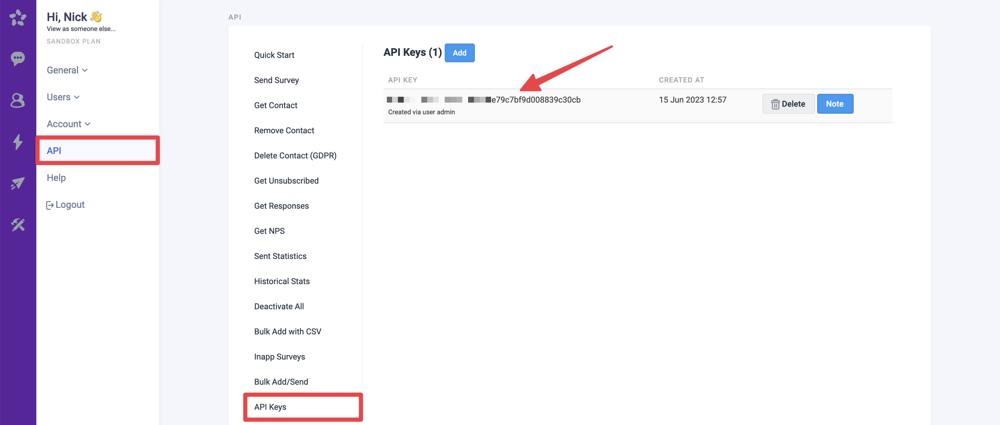

# AskNicely

## 🏃‍♀️ Getting Started

1. Click **Add Service**.
2. Select **AskNicely** from the menu.
3. Enter your **API Key** and **Domain**. The former can be found in the AskNicely app under **Settings** > **API** > **API Keys**. The latter comes from the URL when you are logged into the app (e.g. `yourcompany.asknice.ly`).

<figure><figcaption>
Get your API key from the AskNicely app.
</figcaption></figure>

## 🔀 Supported Objects and Behaviors

| **Object Name** | **Supported?** | **Identifiers**  | **Behaviors** |
| --------------: | :------------: | ---------------- | --------------|
| Contact | ✅ | Email | Update or Create |

[Contact us](mailto:support@getcensus.com) if you want Census to support more AskNicely objects and/or behaviors.

## 🚑 Need help connecting to AskNicely?

[Contact us](mailto:support@getcensus.com) via support@getcensus.com or start a conversation with us via the [in-app](https://app.getcensus.com) chat.
