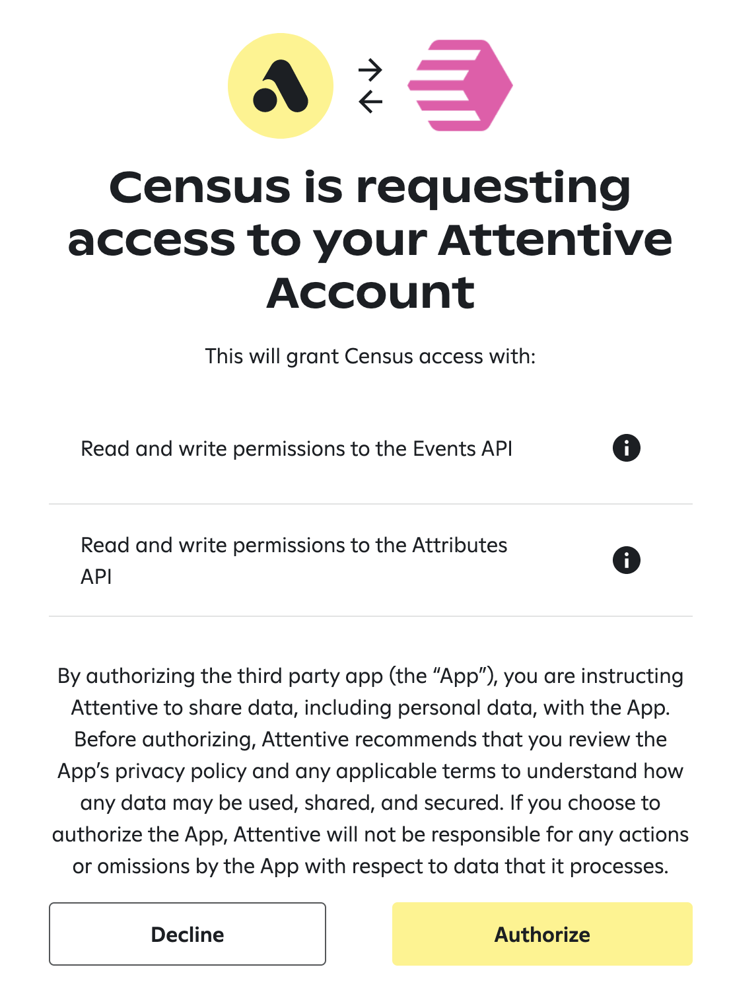

# Attentive

## 🏃‍♀️ Getting Started

1. Navigate to the **Destinations** tab in Census and click **Add Destination**.
2. Select **Attentive** from the menu.
3. Follow the prompts to grant Census access to your account.

<figure><figcaption>
Connect Attentive via the OAuth flow.
</figcaption></figure>

## 🔀 Supported Objects and Behaviors

| **Object Name** | **Supported?** | **Sync Keys**  | **Behaviors** |
| --------------: | :------------: | ---------------- | --------------|
| User | ✅ | Email, Phone Number | Update Only |
| User Event | ✅ | Any unique identifier | Append |

[Contact us](mailto:support@getcensus.com) if you want Census to support more Attentive objects and/or behaviors.

## 🚑 Need help connecting to Attentive?

[Contact us](mailto:support@getcensus.com) via support@getcensus.com or start a conversation with us via the [in-app](https://app.getcensus.com) chat.
