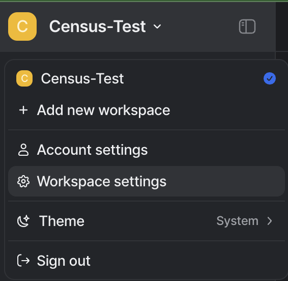
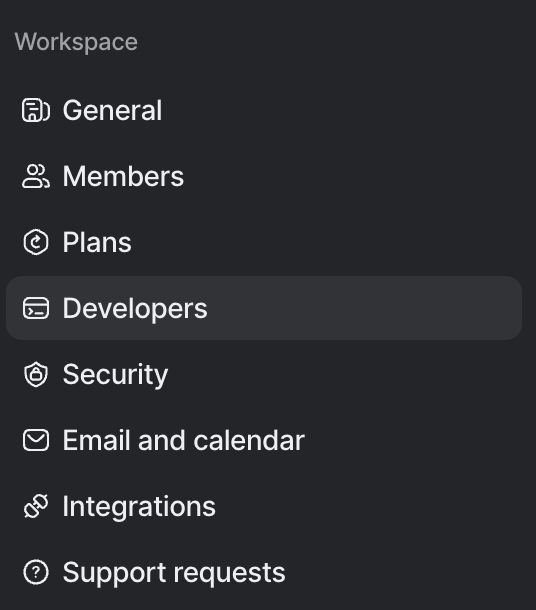
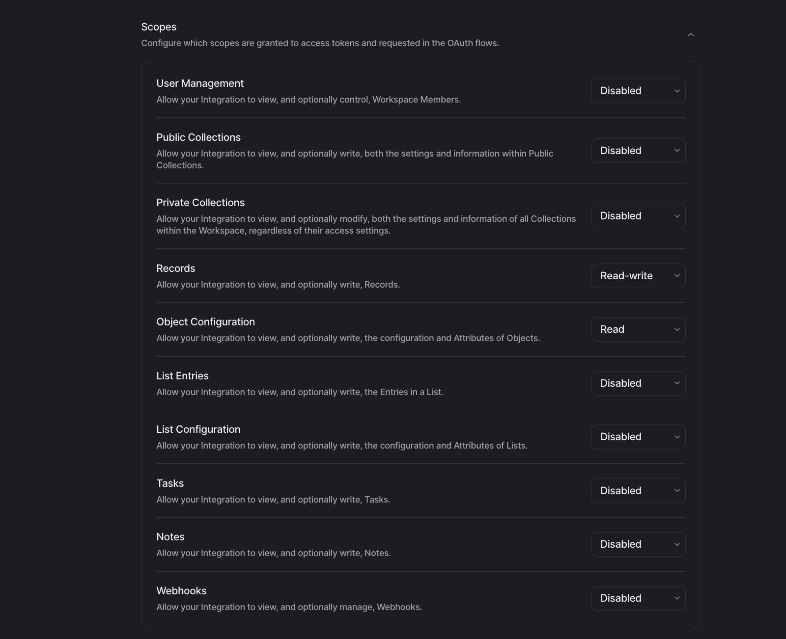

# Attio

## 🏃‍♀️ Getting Started

1. Click **Add Service**.
2. Select **Attio** from the menu.
3. Open the Attio app in another browser tab. Navigate to **Workspace Settings** <figure><figcaption></figcaption></figure>
   1. Select **Developers** from the left hand menu and click the `Create a new integration` button. 
        <figure><figcaption></figcaption></figure>
   2. Once the integration is created, a new access token will be available within your new integration. Copy this value.
        <figure><figcaption></figcaption></figure>
   3. Ensure your access token has `Read/Write` access for `Record` as well as `Read` access for `Object Configuration` under the `Scopes` section
        <figure><figcaption></figcaption></figure>
4. Return to Census and paste the access token under **API Token**.


## 🔀 Supported Objects and Behaviors

| **Object Name** | **Supported?** | **Identifiers**      | **Behaviors** |
|----------------:| :------------: |----------------------|---------------|
|         Company | ✅ | Any unique attribute | Upsert Only   |
|          People | ✅ | Any unique attribute | Upsert Only   |
|  Custom Objects | ✅ | Any unique attribute | Upsert Only   |

### Record References

Fields of type `Record Reference` are taken in as an array of objects. Below is an example of the expected format
```
[
    {
        "target_object": "companies",
        "target_record_id": "<company uuid>"
    },
                    {
        "target_object": "people",
        "target_record_id": "<person uuid>"
    }
],
```


[Contact us](mailto:support@getcensus.com) if you want Census to support more Attio objects and/or behaviors.

## 🚑 Need help connecting to Attio?

[Contact us](mailto:support@getcensus.com) via support@getcensus.com or start a conversation with us via the [in-app](https://app.getcensus.com) chat.
