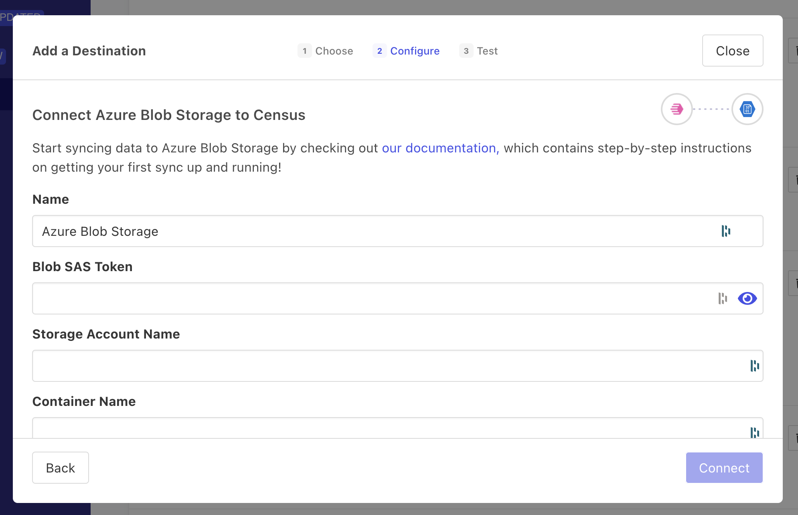

# Azure Blob Storage

## 🏃‍♀️ Getting Started

1. Click **Add Service**.
2. Select **Azure Blob Storage** from the menu.
3. Enter the requested credentials.

<figure><figcaption>
Enter your Azure Blob Storage credentials in Census.
</figcaption></figure>

## 🗄️ File Path Variables

When defining the file path for an Azure Blob Storage sync, you can use variables that will be set when the sync runs. This allows you to create and sync to new CSV files in the S3 bucket that reflect the date and time of the sync.

| **Variable** | **Description**              | **Example Values** |
| ------------ | ---------------------------- | ------------------ |
| `%Y`         | 4-digit year                 | 1997               |
| `%y`         | 2-digit year                 | 97                 |
| `%m`         | month with zero padding      | 07, 12             |
| `%-m`        | month without zero padding   | 7, 12              |
| `%d`         | day with zero padding        | 03, 23             |
| `%-d`        | day without zero padding     | 3, 23              |
| `%H`         | 24 hour with zero padding    | 08, 18             |
| `%k`         | 24 hour without zero padding | 8, 18              |
| `%I`         | 12 hour with zero padding    | 08, 12             |
| `%l`         | 12 hour without zero padding | 8, 12              |
| `%M`         | minute with zero padding     | 04, 56             |
| `%S`         | second with zero padding     | 06, 54             |

## 🔀 Supported Sync Behaviors

| **Behavior** | **Supported?** | **Objects**  |
| -----------: | :------------: | ------------ |
| Mirror | ✅ | All |

[Contact us](mailto:support@getcensus.com) if you want Census to support more sync behaviors for Azure Blob Storage.

## 🚑 Need help connecting to Azure Blob Storage?

[Contact us](mailto:support@getcensus.com) via support@getcensus.com or start a conversation with us via the [in-app](https://app.getcensus.com) chat.
