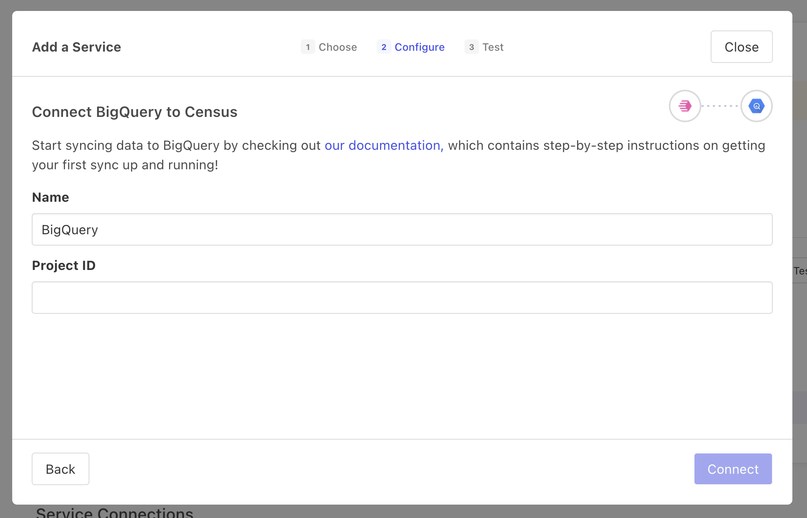
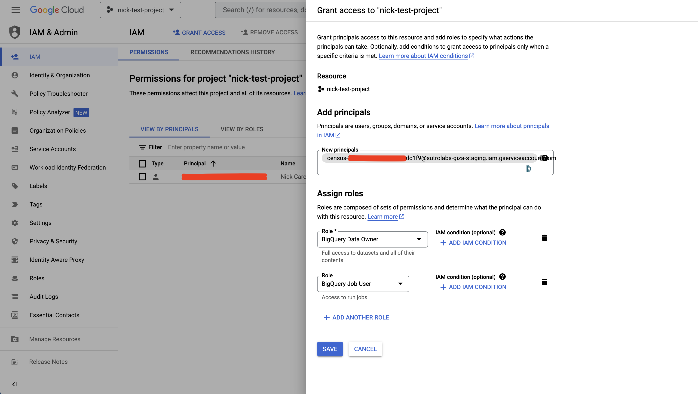

# BigQuery

## 🏃‍♀️ Getting Started

1. Navigate to the **Destinations** page in Census and click **New Destination**.
2. Select **BigQuery** from the menu.
3. Enter your BigQuery **Project ID** and hit **Connect**.
4. On the next screen, copy the provided Service Account address.
5. Open BigQuery, navigate to the **IAM & Admin** section, and select **Grant Access**. Paste the provided Service Account address under **New principals**, then assign the requested roles as shown in the screenshot below.

<figure><figcaption>
Enter your BigQuery Project ID.
</figcaption></figure>
<figure><figcaption>
Grant the required roles to the Service Account.
</figcaption></figure>

## 🔀 Supported Objects and Behaviors

| **Object Name** | **Supported?** | **Sync Keys** | **Behaviors** |
| --------------: | :------------: | --------------- | -------------- |
| Table | ✅ | Primary keys or columns with uniqueness constraints | Update or Create, Update Only, Append |

[Contact us](mailto:support@getcensus.com) if you want Census to support more BigQuery objects and/or behaviors.

## 🚑 Need help connecting to BigQuery?

[Contact us](mailto:support@getcensus.com) via support@getcensus.com or start a conversation with us via the [in-app](https://app.getcensus.com) chat.
