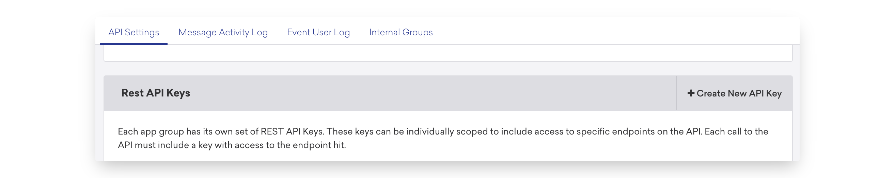
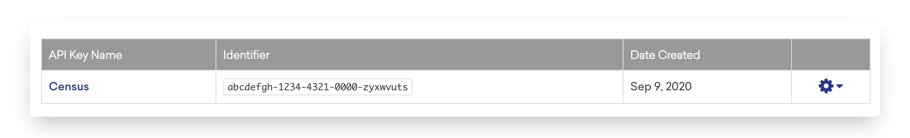

# Braze

### Note on Braze API Costs


Braze prices its API on a per data point update basis. Census ensures that only fields that need to be updated are sent (rather than a copy of the entire record). Please be aware that large datasets, which change often can increase your Braze API usage. [Read More](braze.md#supported-objects-1).


## 🏃‍♀️ Getting Started

In this guide, we will show you how to connect Braze to Census and create your first sync.



### Prerequisites

* Have your Census account ready. If you need one, [create a Free Trial Census account](https://app.getcensus.com/) now.
* Have your Braze account ready, with create access for Braze API keys.
* Have the proper credentials to access to your data source. See our docs for each supported data source for further information:
  * [Azure Synapse](../sources/azure-synapse.md)
  * [Databricks](https://docs.getcensus.com/sources/databricks)
  * [Elasticsearch](https://docs.getcensus.com/sources/elasticsearch)
  * [Google BigQuery](https://docs.getcensus.com/sources/google-bigquery)
  * [Google Sheets](https://docs.getcensus.com/sources/google-sheets)
  * [MySQL](https://docs.getcensus.com/sources/mysql)
  * [Postgres](https://docs.getcensus.com/sources/postgres)
  * [Redshift](https://docs.getcensus.com/sources/redshift)
  * [Rockset](https://docs.getcensus.com/sources/rockset)
  * [Snowflake](https://docs.getcensus.com/sources/snowflake)
  * [SQL Server](https://docs.getcensus.com/sources/sql-server)

### 1. Create a Braze API key

Braze lets you create a number of API keys, each with their own set of permissions. You'll almost certainly want to create a new API key for Census rather than reusing an existing one.

Within Braze's left navigation bar, scroll down to the very bottom. Under **App Settings** and click **Developer Console**.

Then, inside the **API Settings** tab, under **Rest API Keys**, click **+ Create New API Key**.

Provide a name you'll recognize ("Census" is a good choice) and select the following permissions:

* All User Data permissions, except for `users.delete`&#x20;


You must include users.delete if you want to do the [remove option of Mirroring users](braze.md#mirror-mode-options)


* `segments.list`
* This permission set may change as we add support for more Braze objects so you may want to grant more permissions now or plan to update these permissions in the future.&#x20;

Scroll down and click **Save API Key**.

Finally, copy the long code you see under **Identifier**. We'll use that in a minute.

### 2. Select your Braze API Endpoint

Braze requires that we use a slightly different URL to access your account depending on where it's been set up. See the [full list of all Braze API Endpoints](https://www.braze.com/docs/api/basics/#endpoints). In general, you just need the number from the URL you see in your browser when you're signed into Braze.\
\
For example, if your Braze URL is https://dashboard-**03**.braze.com/, then your API Endpoint should be https://rest.iad-**03**.braze.com.

### 3. Create the Census Connection

Great! Now let's pull it all together.&#x20;

1. In the [**Connections**](https://app.getcensus.com/connections) **** page, click on Add Service, and select "Braze"
2. You can provide whatever name you like for the connection
3. Provide the appropriate Braze Endpoint URL
4. Copy and paste your new Braze API key

After the Connection Test is Green, you're all set and ready to get syncing! 🎉

## 🗄 Supported Objects

Census currently supports syncing to the following Braze objects.

|                **Object Name** | **Supported?** | Identifiers                                    |
| -----------------------------: | :------------: | ---------------------------------------------- |
|                           User |        ✅       | External User ID                               |
|                          Event |        ✅       | Event ID                                       |
| Subscription Group Memberships |        ✅       | [See Here](braze.md#braze-subscription-groups) |

Census supports custom fields on both Braze User and Event objects. Additionally, Census supports [sending structured data](../basics/defining-source-data/structured-data.md) to Braze:&#x20;

* [User Push Tokens](https://www.braze.com/docs/api/objects\_filters/user\_attributes\_object#push-token-import) - To send push tokens, your data should be structured as an array of objects with 2-3 values: `app_id`, `token`, and an optional `device_id`.
* &#x20;[Nested Custom Attributes](https://www.braze.com/docs/user\_guide/data\_and\_analytics/custom\_data/custom\_attributes/nested\_custom\_attribute\_support/#api-request-body) - Both objects and arrays are supported. As of April 2022, this feature is still in early access. You may need to contact your Braze account manager for access.

### ✉️ Braze Subscription Group Memberships

Census offers a way to manage your Braze Subscription Groups via your data hub. The current behavior is that you are to "Mirror" the subscribed users from your user base. It is required that you have, within the source:

* The Subscription Group Id in Braze
* Braze User External Id

This source model should be all of your Subscribed users for their Subscription groups. If a previously-synced **subscription group / user pair** no longer appears in your data source, Census will **unsubscribe** that user from that subscription group.


If you have a query that returns the external id, subscription group id, and status columns. Your source model should logically look like this:

`SELECT`&#x20;

`external_id, subscription_group_id`

`FROM`

`subscription_table`

`WHERE`

`status = 'subscribed'`&#x20;


Only the Braze User External Id and the Subscription Group Id should be mapped fields. This is a special unsubscribing mirror for user/group pairs that no longer appear in the data source.

[Contact us](mailto:support@getcensus.com) if you want Census to support more objects for Braze.

## 🔄 Supported Sync Behaviors


Learn more about all of our sync behaviors on our [Core Concepts page](../basics/core-concept/#the-different-sync-behaviors).


|        **Behaviors** |                       **Supported?**                      |                                     **Objects?**                                     |
| -------------------: | :-------------------------------------------------------: | :----------------------------------------------------------------------------------: |
| **Update or Create** | [✅](https://docs.getcensus.com/basics/alerts#sync-alerts) |                                         User                                         |
|           **Mirror** |                             ✅                             | User, [Subscription Group Membership](braze.md#braze-subscription-group-memberships) |
|           **Append** |                             ✅                             |                                         Event                                        |

### Mirror Mode Options

Braze's Mirror behavior optionally supports a choice of two actions when a record is removed from the source. This can be configured when setting up the sync initially:

* **Delete record** - This is the typical behavior for most mirror syncs. When a record is removed from the source, the corresponding record will be deleted from Braze.&#x20;
* **Null out fields** - This is a new behavior for mirror syncs in Braze. In this case, when a record is removed from the source, the currently mapped fields of the synced will be removed from the destination record (by setting them to Null).
* **Subscription Group Membership** - This will unsubscribe users from the corresponding subscription group, as described [above](braze.md#braze-subscription-groups).

[Contact us](mailto:support@getcensus.com) if you want Census to support more sync behaviors for Braze.

## Data Points

In order to minimize your API usage with Braze to ensure that your organization is only updating the [data points](https://www.braze.com/docs/user\_guide/onboarding\_with\_braze/data\_points/) that have actually changed, Census exports the mapped fields from Braze and scans the data in your data source (including on Full Syncs). If there is a difference, Census will send that data point over from the source. If there is not, Census will not send that data point write over.


Note that certain built-in fields in Braze, such as Country and Gender, have automatic standardization that happens in Braze. IE: "United States" from SQL becomes "US" from Braze's API.

So when using these type of values, we recommend either:

* Pre-standardize your fields to match Braze’s format (IE: "US")
* Use Custom Attributes to store them instead


## 🚑 Need help connecting to Braze?

[Contact us](mailto:support@getcensus.com) via support@getcensus.com or start a conversation with us via the [in-app](https://app.getcensus.com) chat.
