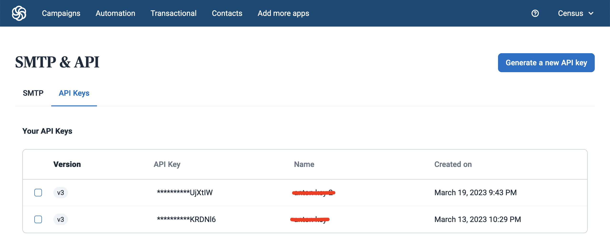

# Brevo (formerly Sendinblue)

## Getting Started

1. Navigate to the **Destinations** page in Census and click **New Destination**.
2. Select **Brevo** from the menu.
3. Open the Brevo app in another browser tab. Navigate to the **SMTP & API** page and generate a new API key. Copy it to your clipboard.
4. Return to Census and enter your **API Key** to connect.

<figure><figcaption>
Generate an API key from the Brevo app.
</figcaption></figure>

## Supported Objects and Behaviors

|   **Object Name** | **Supported?** | **Sync Keys** | **Behaviors**    |
| ----------------: | :------------: | ------------- | ---------------- |
|           Contact |        ✅       | Email         | Update or Create |
| Contact With List |        ✅       | Email         | Mirror           |

Contact our support team if you want Census to support more Brevo objects and/or behaviors.

## Need help connecting to Brevo?

Contact our support team or start a conversation with us via the [in-app](https://app.getcensus.com) chat.
