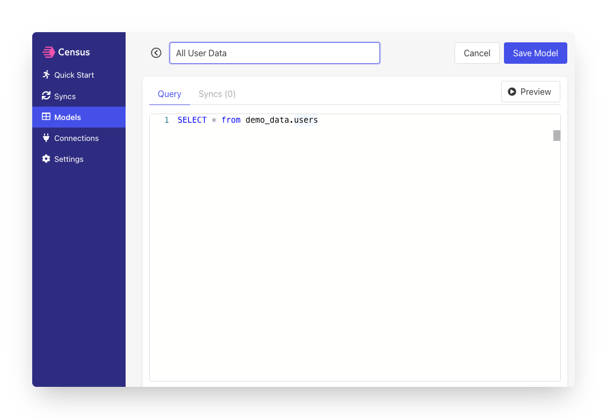

# Campaign Monitor

## 🏃‍♀️ Getting Started

‌In this guide, we will show you how to connect Campaign Monitor to Census and create your first sync.

### Prerequisites

* Have your Census account ready. If you need one, [create a Free Trial Census account](https://app.getcensus.com/) now.
* Have your Campaign Monitor account ready, including your List ID.
*   Have the proper credentials to access your data source. See our docs for each supported data source for further information:

    * [Azure Synapse](../sources/azure-synapse.md)
    * [Databricks](https://docs.getcensus.com/sources/databricks)
    * [Elasticsearch](https://docs.getcensus.com/sources/elasticsearch)
    * [Google BigQuery](https://docs.getcensus.com/sources/google-bigquery)
    * [Google Sheets](https://docs.getcensus.com/sources/google-sheets)
    * [MySQL](https://docs.getcensus.com/sources/mysql)
    * [Postgres](https://docs.getcensus.com/sources/postgres)
    * [Redshift](https://docs.getcensus.com/sources/redshift)
    * [Rockset](https://docs.getcensus.com/sources/rockset)
    * [Snowflake](https://docs.getcensus.com/sources/snowflake)
    * [SQL Server](https://docs.getcensus.com/sources/sql-server)

### 1. Get Campaign Monitor API Key

1. Within Campaign Monitor, visit **Settings** then the **Developer** page.
2. Copy the API key to provide to Census

### 2. Connect Campaign Monitor

* Once you are in Census, navigate to [Destinations](https://app.getcensus.com/destinations)
* Click the **New Destination** button
* Select Campaign Monitor in the dropdown list

* When prompted for your API Credentials, enter your Campaign Monitor API Key

Once complete, you'll see your new connection in the **Destinations** list. :point\_down:

### 3.  Connect to your Data Warehouse

Please follow one of our short guides depending on your data warehouse technology

* [Redshift](https://help.getcensus.com/article/10-configuring-redshift-postgresql-access)
* [Postgres](https://help.getcensus.com/article/10-configuring-redshift-postgresql-access) &#x20;
* [BigQuery](https://help.getcensus.com/article/21-configuring-bigquery-access)
* [Snowflake](https://help.getcensus.com/article/8-configuring-snowflake-access)

### 4. Create your first model

Now navigate to the **Model section of our Dashboard**

When defining models, you'll write SQL queries to select the data you want to see in CampaignMonitor. This can be as simple as selecting everything in a specific database table or as complex as creating new calculated values.

1. From inside your Census account, navigate to the **Models** page.
2. Enter a name for your model. You'll use this to select the model later.
3. Enter your SQL query. This is a good spot to include your List ID, as it'll be needed later during the creation of your sync. If you want to test the query, use the **Preview** button.
4. Click **Save Model**.

### 5. Create your first Sync

The sync will move data from your warehouse to Campaign Monitor. In this step, you'll define how that will work.

1. From inside your Census account, navigate to the [Syncs](https://app.getcensus.com/syncs) page.
2. Under **What data do you want to sync?**, choose your data warehouse as the **Connection** and your model as the **Source**.
3. Under **Where do you want to sync data to?**, choose CampaignMonitor as the **Connection** and the **Subscribe Object** in CampaignMonitor. (See Supported Objects.)
4. Under **How should changes to the source be synced?**, choose **Update or Create**. (See Supported Sync Behaviors.)
5. &#x20;Under **How are source and destination records matched?**, select a mapping key. (See Supported Objects for details.)&#x20;
6. &#x20;Under **Which Properties should be updated?**, select the fields you want to update by mapping a field in CampaignMonitor to a column in your model. Your Campaign Monitor List ID will be needed here to map to the List field(see screenshot below).&#x20;
7. Click **Next**. This will open the **Confirm Details** page where you can see a recap of your setup.
8. If you want to start a sync immediately, select the **Run a sync now?** checkbox.
9. Click **Create Sync**.

When configuring your sync, the page should look something like this: 👇

### Step 6: Confirm the synced data in Campaign Monitor&#x20;

Once your sync is complete, it's time to check your data. Open Campaign Monitor and check that the records are updated correctly.&#x20;

If everything went well, that's it! You've started syncing data from your warehouse to Campaign Monitor!&#x20;

And if anything went wrong, [contact the Census support team](mailto:support@getcensus.com) to get some help.

## 🗄 Supported Objects

Census currently supports syncing to the following CampaignMonitor objects.

|                 |                |                 |
| :-------------: | :------------: | :-------------: |
| **Object Name** | **Supported?** | **Sync Keys** |
|    Subscriber   |        ✅       |  Email Address  |

[Contact us](mailto:support@getcensus.com) if you want Census to support more objects for Campaign Monitor.

## 🔄 Supported Sync Behaviors


Learn more about all of our sync behaviors on our [Core Concepts page](../basics/core-concept/#the-different-sync-behaviors).


|                      |                      |             |
| :------------------: | :------------------: | :---------: |
|     **Behaviors**    |    **Supported?**    | **Objects** |
| **Update or Create** | :white\_check\_mark: |  Subscriber |
|      **Mirror**      |           ✅          |  Subscriber |

[Contact us](mailto:support@getcensus.com) if you want Census to support more Sync Behaviors for Campaign Monitor.

## 🚑 Need help connecting to Campaign Monitor?

[Contact us](mailto:support@getcensus.com) via support@getcensus.com or start a conversation with us via the [in-app](https://app.getcensus.com) chat.
