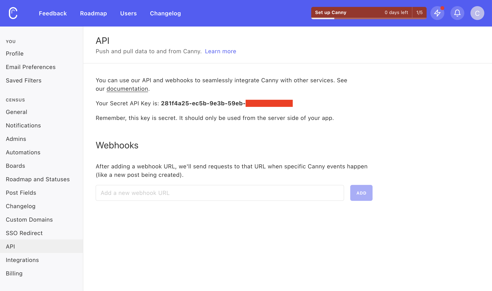

# Canny

Canny is a customer feedback management tool that helps you collect and organize feedback from your customers. Census can sync your customer data to Canny to help you better understand your customers' needs and prioritize your product roadmap.

## 🏃‍♀️ Getting Started

1. Navigate to the **Destinations** page in Census and click **New Destination**.
2. Select **Canny** from the menu.
3. Enter your **API Key**, which can be found in the Canny app at **Settings** > **API**.

<figure><figcaption>
Get your API key from the Canny app.
</figcaption></figure>

## 🔀 Supported Objects and Behaviors

| **Object Name** | **Supported?** | **Sync Keys**  | **Behaviors**       |
| --------------: | :------------: | ---------------- | ------------------- |
| User | ✅ | User ID | Update or Create |

[Contact us](mailto:support@getcensus.com) if you want Census to support more Canny objects and/or behaviors.

## 🚑 Need help connecting to Canny?

[Contact us](mailto:support@getcensus.com) via support@getcensus.com or start a conversation with us via the [in-app](https://app.getcensus.com) chat.
