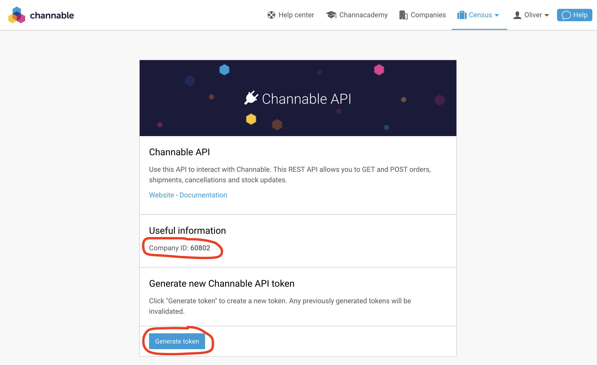

# Channable

## 🏃‍♀️ Getting Started

1. Navigate to the **Destinations** page in Census and click **New Destination**.
2. Select **Channable** from the menu.
3. Enter your **API Token**, **Company ID**, and **Project ID**. The API Token and Company ID can be found on the Channable API page in the Channable app. The Project ID can be found on your project settings page.

<figure><figcaption>
Get your API Token and Company ID from the Channable app.
</figcaption></figure>

## 🔀 Supported Objects and Behaviors

| **Object Name** | **Supported?** | **Sync Keys**  | **Behaviors**       |
| --------------: | :------------: | ---------------- | ------------------- |
| Order Cancellation | ✅ | Order ID | Update Only |
| Return | ✅ | Return ID | Update Only |
| Shipment | ✅ | Order ID | Update Only |

[Contact us](mailto:support@getcensus.com) if you want Census to support more Channable objects and/or behaviors.

## 🚑 Need help connecting to Channable?

[Contact us](mailto:support@getcensus.com) via support@getcensus.com or start a conversation with us via the [in-app](https://app.getcensus.com) chat.
