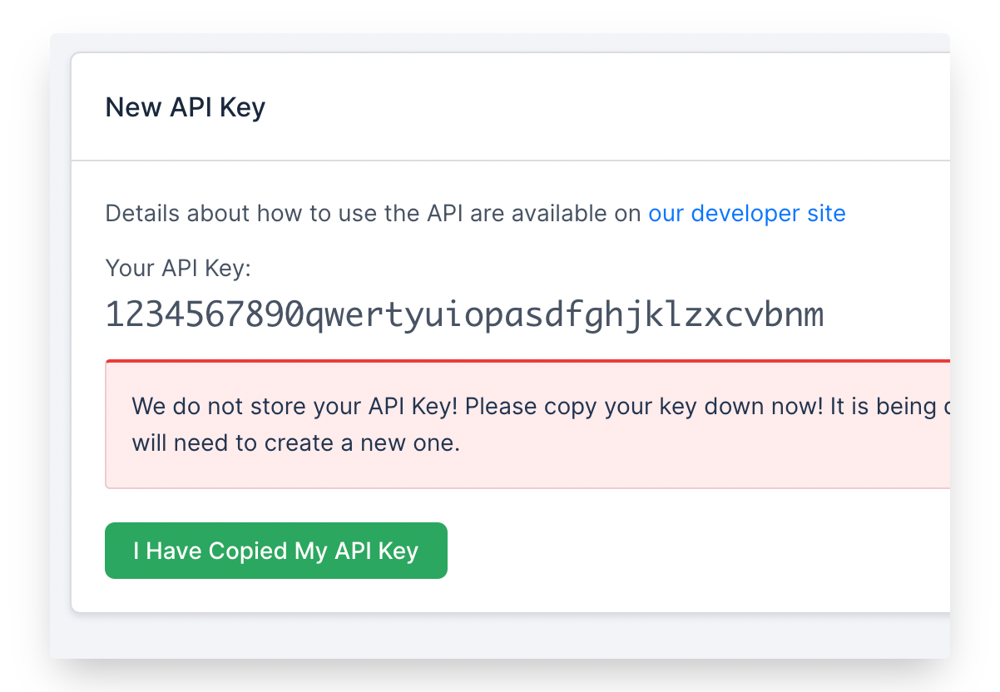
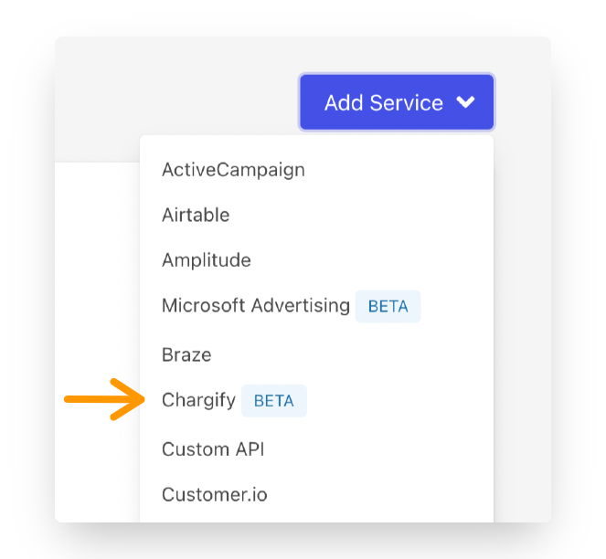
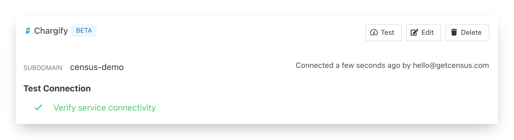
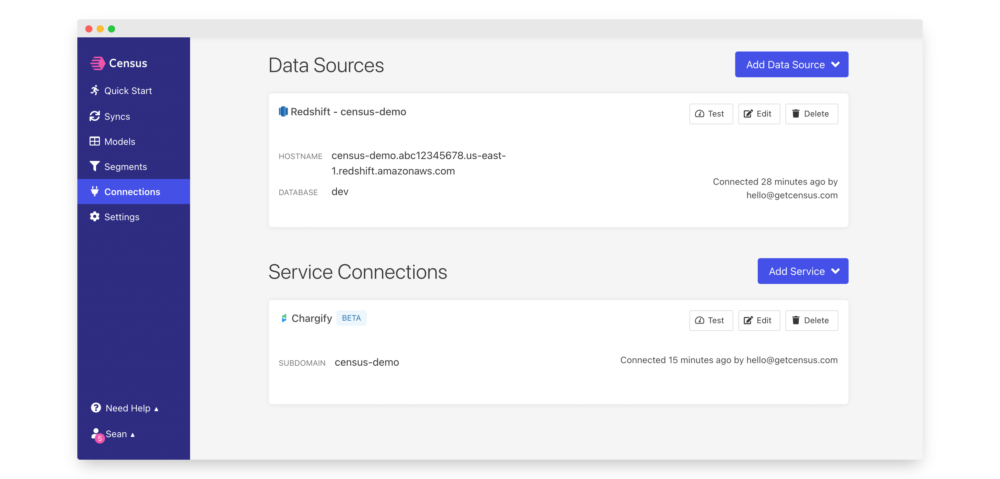
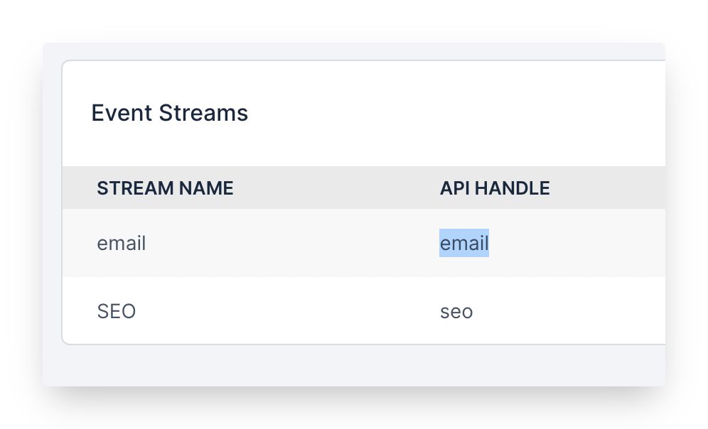

# Chargify

## 🏃‍♀️ Getting Started

In this guide, we will show you how to connect Chargify to Census and create your first sync.

### Prerequisites

* Have your Census account ready. If you need one, [create a Free Trial Census account](https://app.getcensus.com) now.
* Have your Chargify account ready.
* Have the proper credentials to access to your data source. See our docs for each supported data source for further information:
  * [Databricks](https://docs.getcensus.com/sources/databricks)
  * [Google BigQuery](https://docs.getcensus.com/sources/google-bigquery)
  * [Google Sheets](https://docs.getcensus.com/sources/google-sheets)
  * [Postgres](https://docs.getcensus.com/sources/postgres)
  * [Redshift](https://docs.getcensus.com/sources/redshift)
  * [Rockset](https://docs.getcensus.com/sources/rockset)
  * [Snowflake](https://docs.getcensus.com/sources/snowflake)

### 1. Collect your Chargify settings

1. Navigate to your target Chargify site. The URL should be `http://[SUBDOMAIN].chargify.com/dashboard`. Make note of the subdomain, you'll need that in a minute.
2. Click on **Config** in the left navigation, then select **Integrations**. By default, **API Keys** should already be selected. Press the **New API Key** button and copy and paste the resulting API Key. You won't be able to retrieve it again. Once it's created, feel free to edit it and give it a name like Census Integration so you'll remember.&#x20;

### 2. Connect Chargify

* Head back to Census and navigate to [Connections](https://app.getcensus.com/connections).
* Click the Add Service button.
* Select Chargify in the dropdown list

* Paste your Chargify site's **API Key** and **Subdomain**. Save your connection and if everything is set up correctly, you should see a successful connection which should look something like this 👇

### 2. Connect your Data Warehouse

Please follow one of our short guides depending on your data warehouse technology.

* [Redshift](https://help.getcensus.com/article/10-configuring-redshift-postgresql-access)
* [Postgres](https://help.getcensus.com/article/10-configuring-redshift-postgresql-access)
* [BigQuery](https://help.getcensus.com/article/21-configuring-bigquery-access)
* [Snowflake](https://help.getcensus.com/article/8-configuring-snowflake-access)

After setting up your warehouse, your Census Connections Page should look like this.

### 3. Create your first model

Next we'll define the data you'll send to Chargify. Navigate to the [Models](https://app.getcensus.com/models) page.

Here you have the ability to write SQL queries to select the data you want to see in Chargify. (If you already have you data available in a table or view, you can skip this step and connect your sync directly to that).

For your model, let's select some events you want to tie to billing in Chargify. These might be.

* Adding new users to a team
* Turning on new features for the first time
* The number of new document creations.

Once you have created your model, click **Save**.&#x20;

### 4. Create your first Sync

For our sample sync, we're going to be syncing to Chargify's Billable Events. In this case, we'll also need one more piece of information, the target Billable Event Stream's API Name. To get that, visit Chargify, click **Events** in the left navigation, and then **Streams**. You'll have to first create a stream if you don't have one. Once you've created it, copy and paste the stream API name.&#x20;

Now head to the [Sync page](https://app.getcensus.com/syncs) and click the Add Sync button

In the " What data do you want to sync?" section

* For the Connection, select the data warehouse you connected in step 2
* For the Source, select the model you created in step 3

Next up is the "Where do you want to sync data to?" section.

* Pick Chargify as the Connection
* For Object, we will be using Billable Event

For the " How should changes to the source be synced?" section.&#x20;

* Select Append
* Pick a unique identifier for the billable events.&#x20;

Now we'll start mapping fields. By default, Chargify needs the stream API name we captured earlier as well as a timestamp for the event.&#x20;

Af

Click the Next button to see the final preview, which will have a recap of what will happen when you start the sync.

### 5. Confirm the data is in Mixpanel

Now go back to your Mixpanel Instance and view a Contact that should have been updated. If everything well well, you should see your data in Mixpanel.

That's it! In 5 steps, you connect Census to Mixpanel and started syncing customer & product data from your warehouse to Mixpanel 🎉

## 🗄 Supported Objects

Census currently supports syncing to the following Chargify objects.

| **Object Name** | **Supported?** | Identifiers |
| --------------: | :------------: | ----------- |
|   Billing Event |        ✅       | Insert ID   |

[Contact us](mailto:support@getcensus.com) if you want Census to support more objects for Chargify.

## 🔄 Supported Sync Behaviors


Learn more about all of our sync behaviors on our [Core Concepts page](../basics/core-concept.md#the-different-sync-behaviors).


| **Behaviors** | **Supported?** | **Objects?** |
| ------------: | :------------: | :----------: |
|    **Append** |        ✅       |     Event    |

[Contact us](mailto:support@getcensus.com) if you want Census to support more Sync behaviors for Chargify.

## 🚑 Need help connecting to Chargify?

[Contact us](mailto:support@getcensus.com) via support@getcensus.com or start a conversation with us via the [in-app](https://app.getcensus.com) chat.
