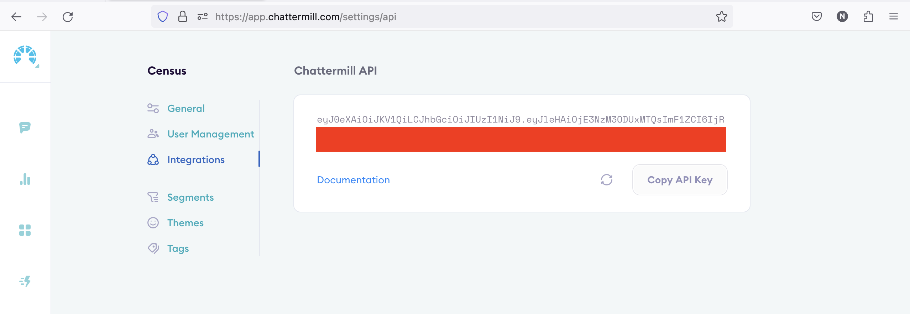

# Chattermill

## Getting Started

1. Navigate to the **Destinations** page in Census and click **New Destination**.
2. Select **Chattermill** from the menu.
3. Enter your **API Token** and **Project Name**. The former can be found in the Chattermill app under **Settings** > **Integrations**.

<figure><figcaption>
Generate an API key from the Chattermill app.
</figcaption></figure>

## Supported Objects and Sync Behaviors 

| **Object Name** | **Supported?** | **Sync Keys**         | **Behaviors** |
| --------------: | :------------: | --------------------- | ------------- |
|        Response |        ✅       | Any unique identifier | Send          |


Learn more about all of our sync behaviors in our [Syncs](../syncs/overview.md) documentation..


Contact our support team if you want Census to support more Chattermill objects and/or behaviors.

## Need help connecting to Chattermill?

Contact our support team or start a conversation with us via the [in-app](https://app.getcensus.com) chat.
