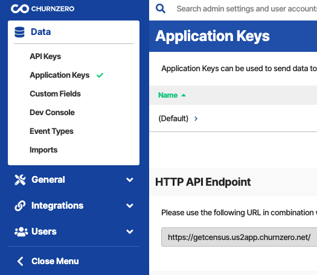
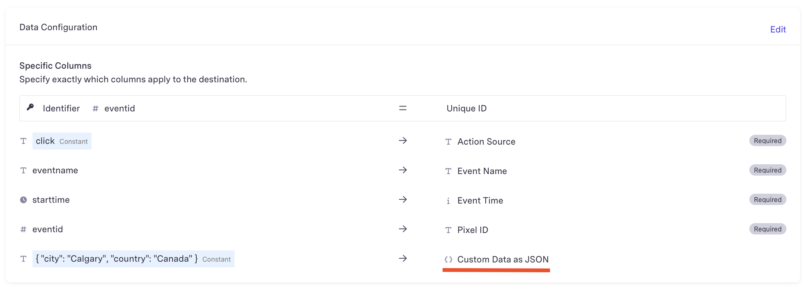

# ChurnZero

## 🏃‍♀️ Getting Started

1. Navigate to the **Destinations** page in Census and click **New Destination**.
2. Select **ChurnZero** from the menu.
3. Enter your **domain**, and **App Key**. You can find all of these in the ChurnZero app under the **Admin > Application Keys > New App Key**.

<figure><figcaption>
Switch to Admin view
</figcaption></figure>

<figure><figcaption>
Select Application Keys
</figcaption></figure>

## Custom Fields in ChurnZero

Custom fields defined in ChurnZero can be added to the sync mapping by manually entering the CZ API Name in the destination field mapping

<figure><figcaption>
ChurnZero Custom Field
</figcaption></figure>

<figure><figcaption>
Sync Mapping
</figcaption></figure>

## 🔀 Supported Objects and Behaviors

| **Object Name** | **Supported?** | **Sync Keys**         | **Behaviors** |
| --------------: | :------------: | --------------------- | ------------- |
|         Account |        ✅       | AccountExternalId     | Upsert        |
|         Contact |        ✅       | ContactExternalId     | Upsert        |
|           Event |        ✅       | Any unique identifier | Append        |

[Contact us](mailto:support@getcensus.com) if you want Census to support more ChurnZero objects and/or behaviors.

## 🚑 Need help connecting to ChurnZero?

[Contact us](mailto:support@getcensus.com) via support@getcensus.com or start a conversation with us via the [in-app](https://app.getcensus.com) chat.
