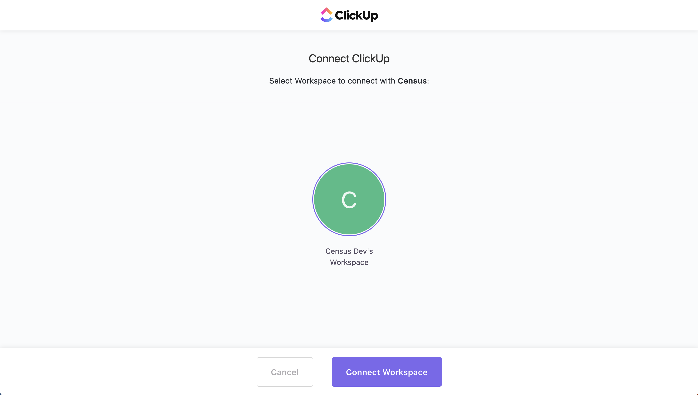

# ClickUp

## 🏃‍♀️ Getting Started

1. Navigate to the **Destinations** page in Census and click **New Destination**.
2. Select **ClickUp** from the menu.
3. Complete the OAuth flow to grant Census access to your ClickUp workspace. Note that you'll have to create a separate Census connection for each workspace you wish to send data to.

<figure><figcaption>
Select the workspace you wish to use with Census.
</figcaption></figure>

## 🔀 Supported Objects and Sync Behaviors 

| **Object Name** | **Supported?** | **Sync Keys**  | **Behaviors**    |
| --------------: | :------------: | ---------------- |------------------|
| Task | ✅ | Any unique identifier Task ID | Add, Update Only |

[Contact us](mailto:support@getcensus.com) if you want Census to support more ClickUp objects and/or behaviors.

## 🚑 Need help connecting to ClickUp?

[Contact us](mailto:support@getcensus.com) via support@getcensus.com or start a conversation with us via the [in-app](https://app.getcensus.com) chat.
