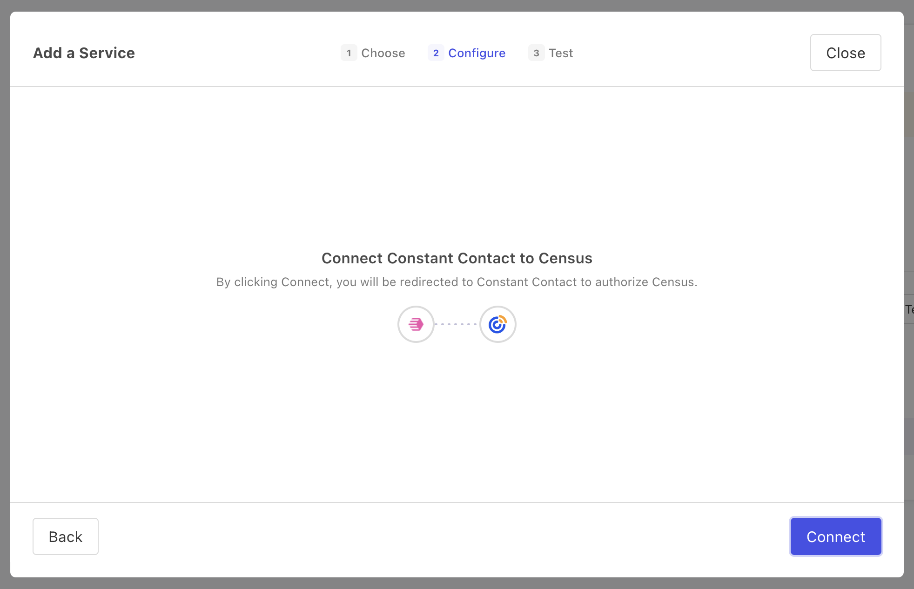

# Constant Contact

## Getting Started

1. Navigate to the **Destinations** page in Census and click **New Destination**.
2. Select **Constant Contact** from the menu.
3. When prompted, log into your Constant Contact account to authorize Census.

<figure><figcaption>
Log into your Constant Contact account when prompted to do so.
</figcaption></figure>

## Supported Objects and Behaviors

| **Object Name** | **Supported?** | **Sync Keys** | **Behaviors** |
| --------------: | :------------: | --------------- | ------------- |
| Contact | ✅ | Email | Update or Create |

**Note**: when syncing contacts from Census, **List Ids** is a required field. This needs to be an array of strings, each of which is the ID (not name) of an *existing* contact list in Constant Contact.

[Contact us](mailto:support@getcensus.com) if you want Census to support more Constant Contact objects and/or behaviors.

## Need help connecting to Constant Contact?

[Contact us](mailto:support@getcensus.com) via support@getcensus.com or start a conversation with us via the [in-app](https://app.getcensus.com) chat.
