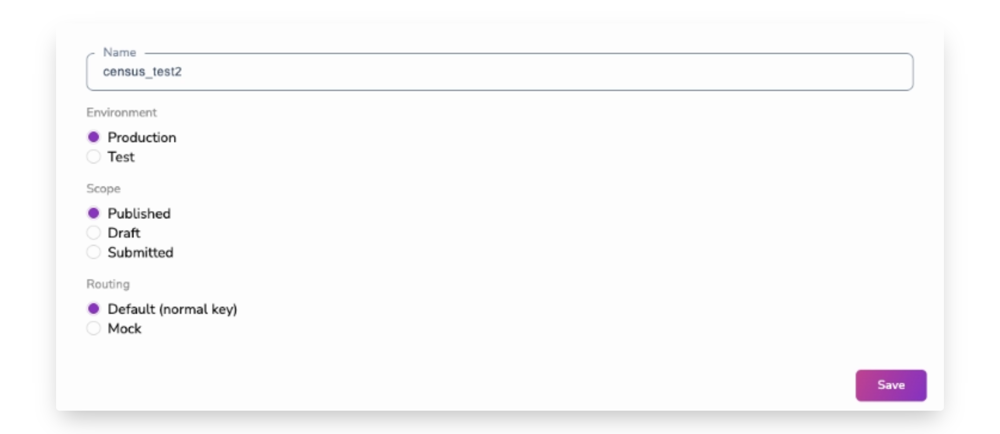
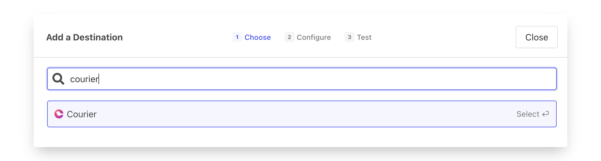

# Courier

## Getting Started

‌In this guide, we will show you how to connect Courier to Census and create your first sync.

### Prerequisites

* Have your Courier account ready.
* Have your Census account ready. If you need one, [create a Free Trial Census account](https://app.getcensus.com/) now.
* Have the proper credentials to access to your data source. See our [Data Sources Overview](../sources/overview.md) for more information.

### **1. Get API key from Courier**

Census only needs an API key for Courier to get started.

To access your API keys, visit the **Settings** by clicking the **⚙ icon** in the top right and choosing **API Keys** from the menu. Depending on your Courier plan, you can generate a new key or reuse the existing keys provided to you. If generating new keys, you can optionally choose which Courier environment or routing you want to use for your key if you'd like to test the integrations first before sending notifications. See [Courier's API Key documentation](https://help.courier.com/en/articles/4677510-using-environments-api-keys-and-migrating-assets#api-keys-and-environments) to understand the ins-and-outs for your API configuration.

<figure><figcaption></figcaption></figure>

### 2. **Create the Courier connection in Census**

Now that we have your API Key from Courier, we can set up Courier as a Destination Connection.

1.  Inside Census, click on **Destinations** in the left navigation, click **New Destination** and then find Courier in the menu.

    <figure><figcaption></figcaption></figure>
2. You can provide whatever name you like. This is helpful if you're using a test environment to start and want to label your connection to indicate that.
3. Copy in your API Key from Courier
4. Save

And that's it! If this is your very first sync with Census, jump back to our guide on [Creating Syncs](../syncs/core-concept/#creating-syncs). Otherwise, read on to learn more about how to get the most out of syncing data from your warehouse to Courier!

## Use Cases

Courier is a service that lets you design, send, and manage notifications to your users across many different channels including email, SMS, push, in-app, chat, and more.

Using Census, you can sync your user data and give Courier super powers. For example:

* Sync user profile attributes to the Courier profile to personalize notifications based on your users' up-to-the-minute activities.
* Add Courier to the set of destination services for your Census Segments. Sync them to new [Courier Lists](https://www.courier.com/blog/introducing-the-lists-api/) for targeting notifications.

With live data and programmatic notifications, the possibilities are endless. Let us know what you come up using Census and Courier together!

## ️ Supported Objects

| Object Name       | Supported? | Identifiers  |
| ----------------- | :--------: | ------------ |
| Profiles          |      ✅     | Recipient ID |
| Profile with List |      ✅     | Recipient ID |

Like Courier, we use the `recipient_id` as the primary identifier for Profiles. A `recipient_id` is a unique identifier for a recipient. This can be any string of your choosing. Be sure to choose a value that does not change. This prevents duplicate entries in the event that a recipient changes their email or some other identifying value. Typically, user ID values from your system make for good recipient\_id's.

Looking for another Courier feature? [Contact us](mailto:support@getcensus.com) and let us know!

## Supported Sync Behaviors


Learn more about all of our sync behaviors in our [Syncs](../syncs/overview.md) documentation.


|        **Behaviors** | **Supported?** |    **Objects**    |
| -------------------: | :------------: | :---------------: |
| **Update or Create** |        ✅       |        All        |
|           **Mirror** |        ✅       | Profile with List |

‌Not seeing what you're looking for? [Contact us](mailto:support@getcensus.com) about supporting alternative sync behaviors for this destination.

## Need help connecting to Courier?

[Contact us](mailto:support@getcensus.com) via support@getcensus.com or start a conversation with us via the [in-app](https://app.getcensus.com) chat.
