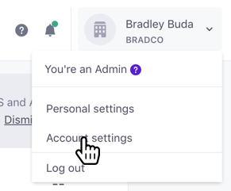
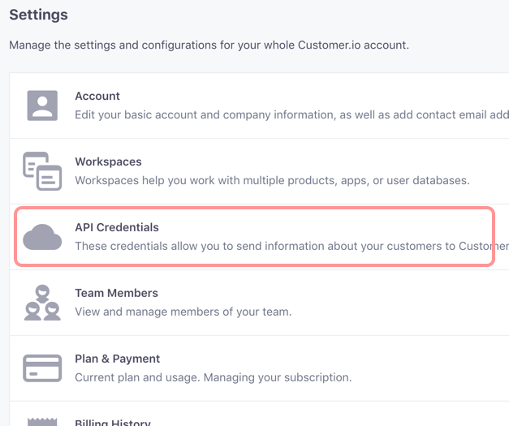
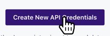
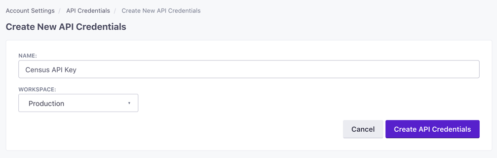
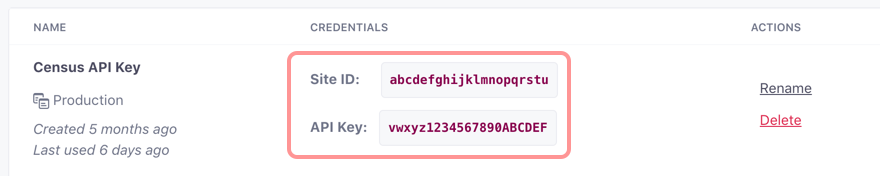
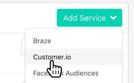
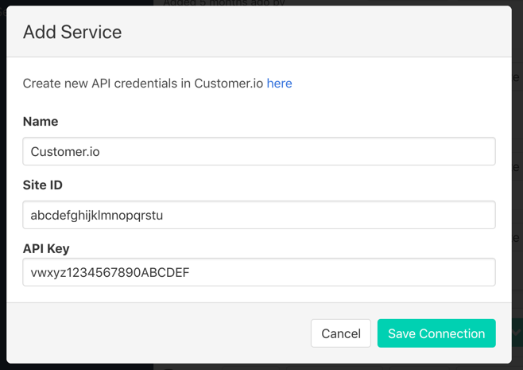

# Customer.io

## 🏃‍♀️ Getting Started

In this guide, we will show you how to connect Customer.io to Census and create your first sync.



### 1. Collecting Customer.io API Credentials

To connect Census to your Customer.io, you'll need to provide Census with a few credentials so that we can talk to it directly. 

### **2. Go to your API Credentials page**

In the top right, click on your name, and select **Account Settings**

Then select **API Credentials**

### **3. Create a new set of Tracking API credentials for Census**

Click the **Create New API Credentials** button in the top right.

Then give the new credentials a name. It can be whatever you like, but give it something memorable so you know this key is used by Census. If you're using Customer.io's workspaces feature, you'll want to specify which workspace to use. If you want to connect Census to multiple workspaces, you'll need to create credentials for each one.

When you hit save, you'll return to the list of credentials. Make a note of the **Site ID** and **API Key**. You'll need to provide them to Census.

### **4. Create a new Customer.io connection in Census**

* Visit the **Connections** tab in Census
* Then select **Customer.io** from the **Add Service** menu

Finally, provide the Site ID and API Key you just created on Customer.io. You can name the connection something memorable. This is particularly useful if you're going to create multiple connections, one for each Customer.io workspace. In that case, include the Customer.io workspace name here.

Customer.io will now appear as a new destination for Census syncs.  🎉

## 🏎 Sync Speed

Customer.io is a destination with a fast API that can burst all the way to 600 api calls per second but usually we set a conservative **150 calls per second.**

| **Service** | Public API rate limit | **Records sync / Minute** |
| :--- | :--- | :--- |
| Customer.io | 150 / sec | 7,000 |

## 🗄️ Supported Objects

We currently support all objects of [Customer.io's core API. ](https://customer.io/docs/api/#section/Overview)

| **Object Name** | **Supported?** | Create Fields? |
| ---: | :---: | :---: |
| Person | ✅ | ✅ |
| Device | ✅ | ✅ |
| Event | ✅ | ✅ |

## 🔄 Supported Sync Behaviors


Learn more about all of our sync behaviors on our [Core Concept page](../basics/core-concept.md#the-different-sync-behaviors).


| **Behaviors** | **Supported?** | **Objects?** |
| ---: | :---: | :---: |
| **Update or Create** | ✅ | All |
| **Update Only** | 🔜 | All |
| **Append** | ✅ | Event Only |

🔋[Contact us](mailto:support@getcensus.com) if you want Census to support more Sync Behaviors for this destination

## 💡  Things to know about the Customer.io connector

There are a few unique features available when syncing to a Customer.io instance.

* **People** are very standard Census syncs. Customer.io only allows the ID field to be used as the identifier for a Person record and recommends using your internal ID when possible, though email may be used to refer to prospective users if needed. ⚠️ This is a configuration done at the Project level of your instance. You can read more about [Customer.io's identifier guidelines here](https://customer.io/docs/data-mapping-guide#describing-users-with-customer-attributes).
* **Events** are unique \(literally!\). Census will only send new database rows to Customer.io and so Events only support the **Append Only** behavior for syncs. In order to make sure an event is only ever published once, each row in your events source needs a globally unique ID.

Both objects support arbitrary custom fields. You can directly map to a new custom field by clicking the **+ Add Custom Field** button when creating or editing a mapping.

## 🚑 Need help connecting to Customer.io?

[Contact us](mailto:support@getcensus.com) via support@getcensus.com or start a conversation with us via the [in-app](https://app.getcensus.com) chat.

