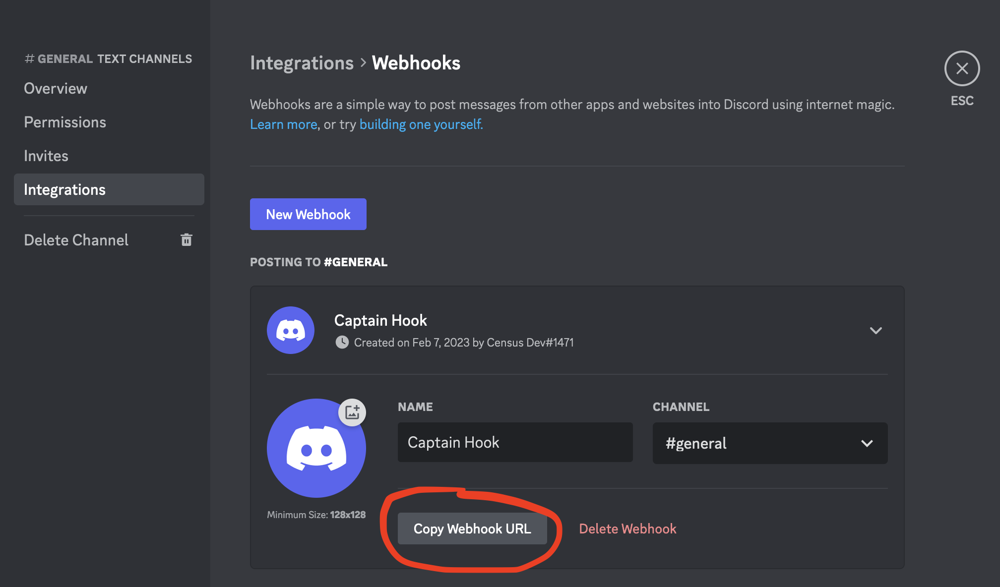

# Discord

## 🏃‍♀️ Getting Started

1. Navigate to the **Destinations** page in Census and click **New Destination**.
2. Select **Discord** from the menu.
3. Open the Discord app in another tab and go to the settings for the channel you'd like to post to. Create a new webhook or view an existing one. Copy the Webhook URL.
4. Return to Census and paste your **Webhook URL**.

<figure><figcaption>
Get your webhook URL from the Discord app.
</figcaption></figure>

## 🔀 Supported Objects and Behaviors

| **Object Name** | **Supported?** | **Sync Keys**  | **Behaviors**       |
| --------------: | :------------: | ---------------- | ------------------- |
| Webhook | ✅ | N/A | Append |

[Contact us](mailto:support@getcensus.com) if you want Census to support more Discord objects and/or behaviors.

## 🚑 Need help connecting to Discord?

[Contact us](mailto:support@getcensus.com) via support@getcensus.com or start a conversation with us via the [in-app](https://app.getcensus.com) chat.
