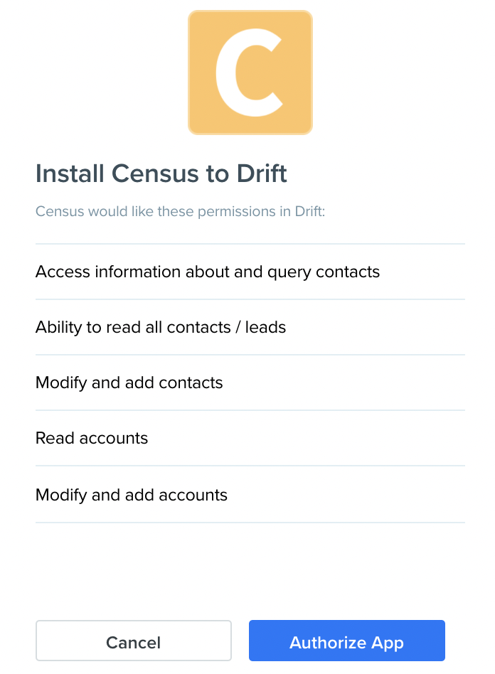

# Drift

## 🏃‍♀️ Getting Started

In this guide, we will show you how to connect Drift to Census and create your first sync.

### 1. Connect Census to Drift

In the **Connections** page in Census, click the **Add Service** button under the **Service Connections** section, and select Drift.

You will be redirected to a page to log in to Drift to authorize your account to Census. You will be prompted to enter your email and then your password. Once you click the **Sign In** button, you'll see a page like the image below, confirming you want to authorize Census.

Once you've authorized Census, you'll be redirected back to the **Connections** page in Census and you should see your Drift connection there. 

If you want to see your integrations in Drift in the future, simply navigate to the **Settings** page, and click on **Integrations** in the left side navigation \(close to the bottom, right above **Help**\).

## 🗄 Supported Objects

| **Object Name** | **Supported?** | Identifiers |
| ---: | :---: | :--- |
| Contact | ✅ | Object ID, any Text/Number  |

[Contact us](mailto:support@getcensus.com) if you want Census to support more supported objects for Drift.

## 🔄 Supported Sync Behaviors


Learn more about what all of our sync behaviors on our [Core Concept page](../basics/core-concept.md#the-different-sync-behaviors).


| **Behaviors** | **Supported?** | **Objects?** |
| ---: | :---: | :---: |
| **Update or Create** | ✅ | All |

[Contact us](mailto:support@getcensus.com) if you want Census to support more Sync Behaviors for Drift.

## 🚑 Need help connecting to Drift?

[Contact us](mailto:support@getcensus.com) via support@getcensus.com or start a conversation with us via the [in-app](https://app.getcensus.com) chat.

