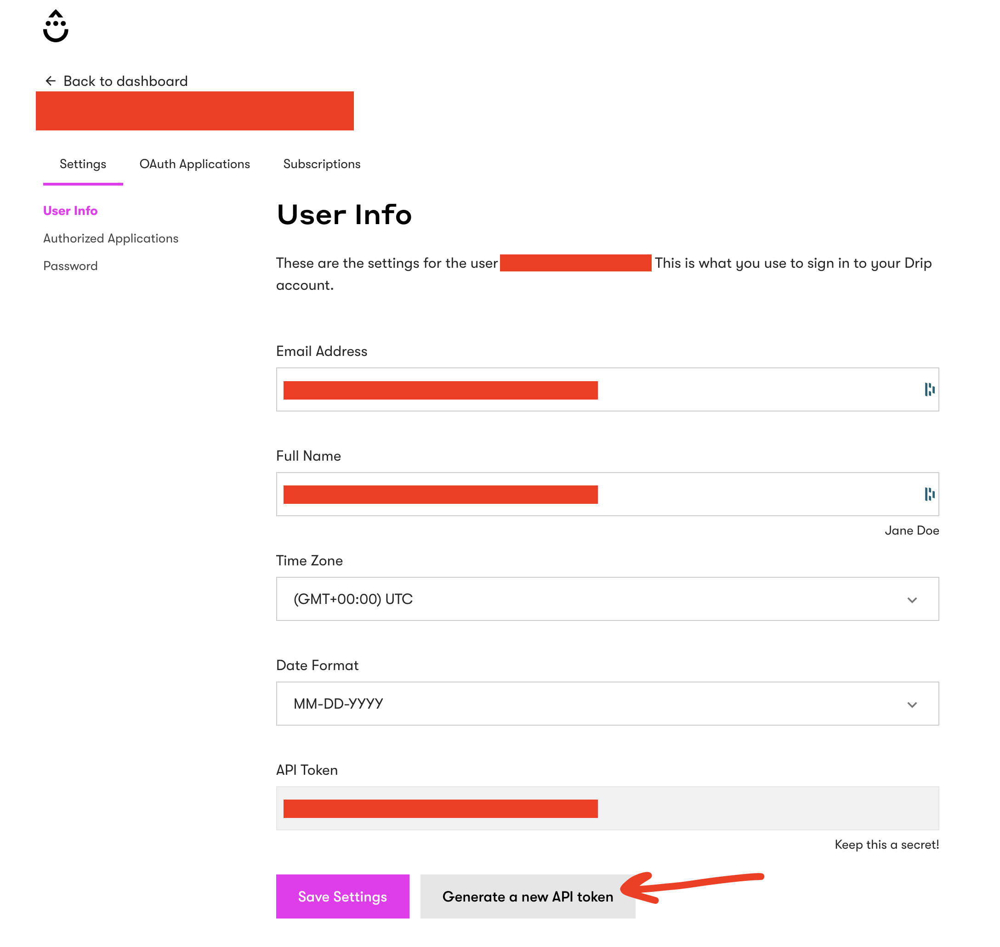

# Drip

## Getting Started

1. Navigate to the **Destinations** page in Census and click **New Destination**.
2. Select **Drip** from the menu.
3. Enter your **API Token** and **Account ID**. The former can be found in the Drip app under **User settings**. The latter comes from the URL when you are logged into the app (e.g. https://www.getdrip.com/**1234123**/dashboard).

<figure><figcaption>
Generate an API Token from the Drip app.
</figcaption></figure>

## Supported Objects and Sync Behaviors 

| **Object Name** | **Supported?** | **Sync Keys**           | **Behaviors**    |
| --------------: | :------------: | ----------------------- | ---------------- |
|           Event |        ✅       | Any unique identifier   | Send             |
|          Person |        ✅       | ID, Visitor UUID, Email | Update or Create |


Learn more about all of our sync behaviors in our [Syncs](../syncs/core-concept/#sync-behaviors) documentation.


[Contact us](mailto:support@getcensus.com) if you want Census to support more Drip objects and/or behaviors.

## Need help connecting to Drip?

[Contact us](mailto:support@getcensus.com) via support@getcensus.com or start a conversation with us via the [in-app](https://app.getcensus.com) chat.
