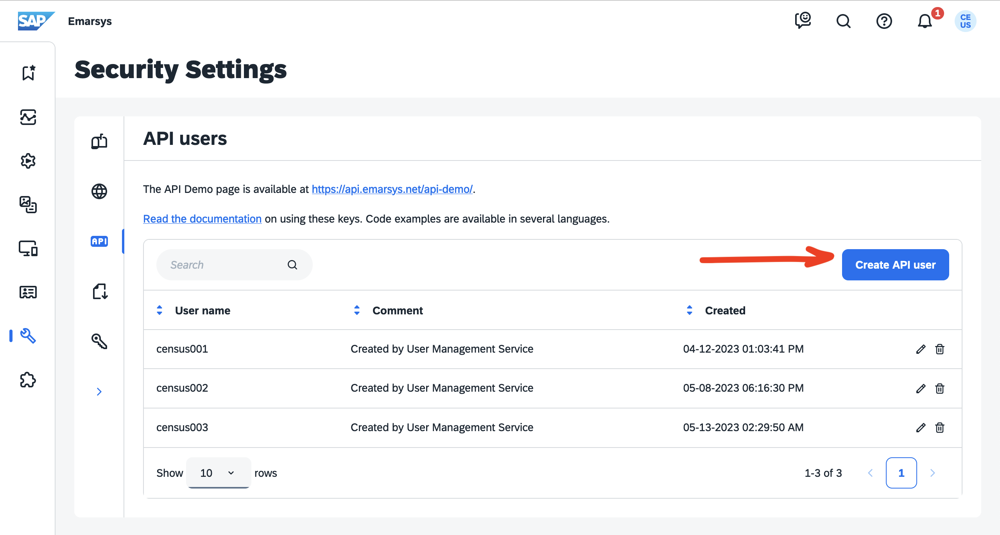

# Emarsys

## 🏃‍♀️ Getting Started

1. Navigate to the **Destinations** page in Census and click **New Destination**.
2. Select **Emarsys** from the menu.
3. Open the Emarsys app in another browser tab and navigate to **Management** > **Security Settings** > **API Users**. Select **Create API user** and take note of the **User name** and **Secret** provided (these will only be displayed once).
4. Once you've created the API user, click the pencil icon next to the new user to edit the permissions assigned to it. Enable all `contact` and `field` scopes, then save your changes.
5. Return to Census and input your **User name** and **Secret**.

**Note**: if your connection test fails in Census, your API user permissions may not have saved properly. Revisit step 4.

<figure><figcaption>
Create an API user in the Emarsys app.
</figcaption></figure>

## 🔀 Supported Objects and Behaviors

| **Object Name** | **Supported?** | **Sync Keys**  | **Behaviors** |
| --------------: | :------------: | ---------------- | --------------|
| Contact | ✅ | Email | Update or Create, Update Only |

[Contact us](mailto:support@getcensus.com) if you want Census to support more Emarsys objects and/or behaviors.

## 🚑 Need help connecting to Emarsys?

[Contact us](mailto:support@getcensus.com) via support@getcensus.com or start a conversation with us via the [in-app](https://app.getcensus.com) chat.
