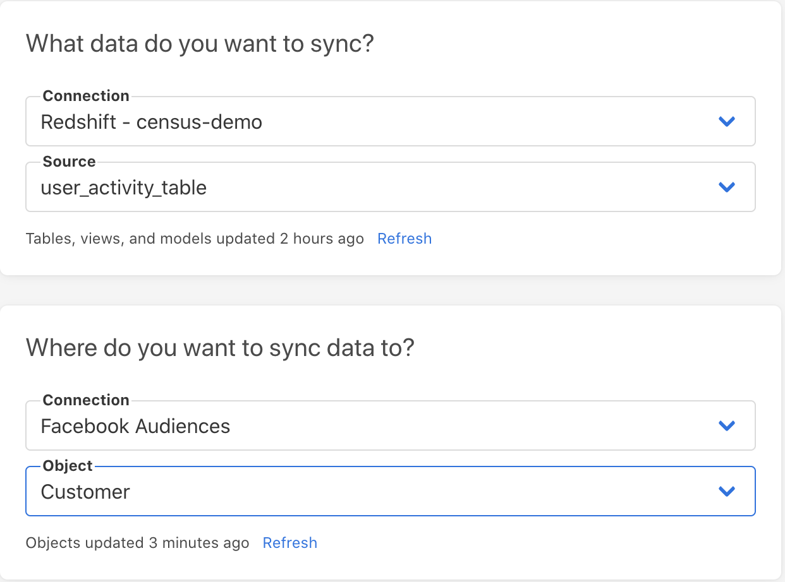
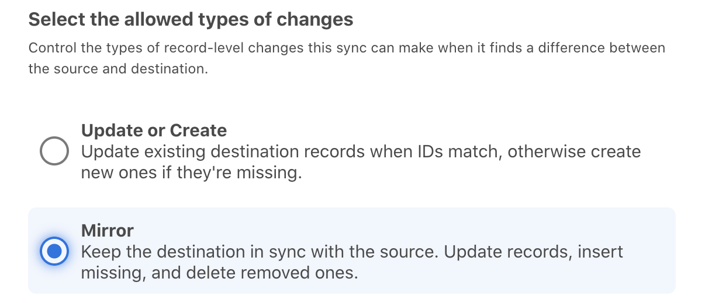
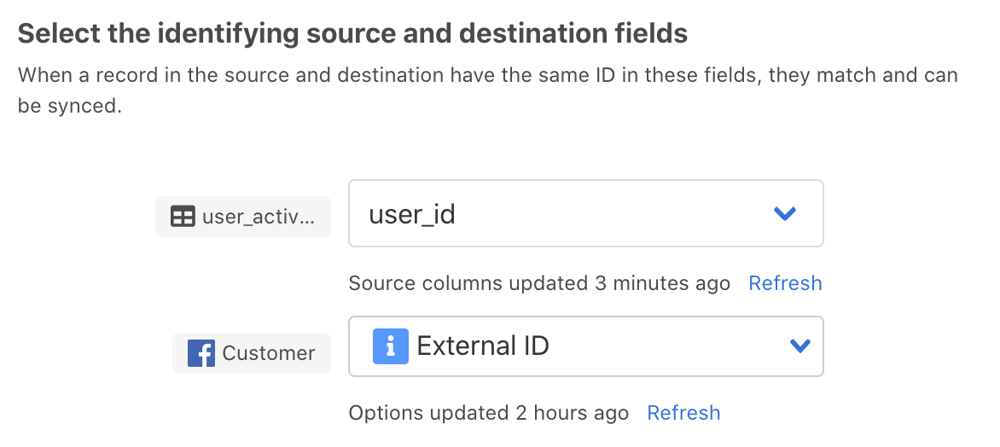
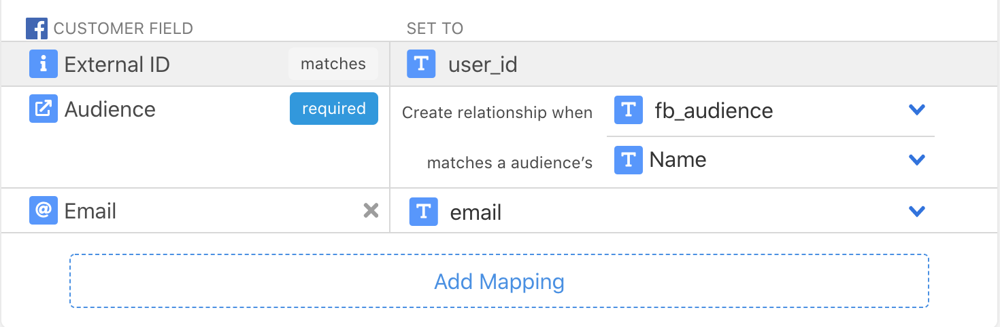

# Facebook Ads Audiences

## 🏃‍♂️ Getting Started



### 1. Collect the Facebook Audience ID

The first step is finding the audience you'd like to sync data into. You can do that by visiting the [Audiences section of Facebook's Ads Manager](https://business.facebook.com/adsmanager/audiences). Make a note of the ID \(name will work too\) of the audience you want to sync to from Census. 

If you'd like to use a new Facebook Audience with Census, go ahead and create it now. Facebook Audiences makes it a bit confusing to create a new empty audience for Census. You'll need to create a new Customer List Custom Audience and then upload a CSV with the columns that you'll be using.

### 2. Create a SQL Model from your source data

The results of the View, Table, or Census Model should contain a row per user. Each row will have three or more columns:

1. A unique identifier for the user, Facebook calls this the External ID. This is usually a unique ID from your application database, but could be email as well if that also uniquely identifies each row. 
2. A column indicating what Facebook Audience the user should be synced to \(can be the audience name or audience ID\).
3. Any other identifying fields that Facebook can use to match your audience. Facebook requires these fields to be formatted in a certain way. For example, email must be lower-case. You can read more about each of the formatting requirements in the[ Facebook Documentation](https://developers.facebook.com/docs/marketing-api/audiences/guides/custom-audiences/#hash).

Example Facebook Audience Model:

```sql
SELECT
    user_id, 
    LOWER(email_address) AS email, 
    'active users audience' AS fb_audience
FROM user_activity_table;
```

### 3. Create a sync

Now that your data is prepared and in the correct format, we're ready to start syncing users to Facebook. 

#### **A. Select your model from above as a data source and Facebook Audiences as a destination.**



#### **B. Choose the appropriate sync behavior**

Update or Create will add or update users to the audience, but will never remove users. Mirror will also remove users that have disappeared from the source. Note: If you're reusing an existing Facebook Audience, Census will not remove any users already added to that audience through other means. Census only removes users that it created initially.



#### **C. Select an external identifier to match rows uniquely in Facebook**

This should be the user id or other external ID you selected when you created the model.



#### **D. Associate users with the Audience**

Let Census know which column should be used to assign users to their audience. Select the Audience's ID or Name to correspond to the type of identifier you're providing with your model.



#### **E. Map the remaining identifying fields**

You can then map any user identifying fields that are present in your source data \(e.g. phone number, email, first name, last name, etc\).

## 🗄 Supported Objects

| **Object Name** | **Supported?** | Identifiers |
| ---: | :---: | :--- |
| Customer | ✅ | [External ID](https://developers.facebook.com/docs/marketing-api/conversions-api/parameters/external-id/) |
| Offline Conversions | 🔜 |  |
| Product Catalog | 🔜 |  |

Please [contact us](mailto:support@getcensus.com) if there are additional Facebook Ads objects you'd like us to support.

#### Data Normalization

Facebook Audiences are a bit unique from other services. We do not upload the data you provide directly. Instead, it's "matched" to Facebook's audience. To do this, both sides "hash" their data so users can be compared without revealing the actual personally identifiable information. 

Census automatically takes care of this hashing step for you. 

**However, all values provided to Census must be lowercase**. You can use this standard SQL function `LOWER()`that works across all data warehouses.

## 🔄 Supported Sync Behaviors

| **Behaviors** | **Supported?** | **Objects?** |
| ---: | :---: | :---: |
| **Update or Create** | ✅ | All |
| **Mirror** | ✅ | All |

Update or Create will add or update users to the audience, but will never remove users. Mirror will also remove users that have been removed from the source.   
  
Note: If you're reusing an existing Facebook Audience, Census will not remove any users already added to that audience through other means. Census only removes users that it created initially.


Learn more about our sync behaviors on our [Core Concept page](../basics/core-concept.md#the-different-sync-behaviors).


## 🚑 Need help connecting to Facebook?

Contact us via support@getcensus.com or start a conversion via the [in-app](https://app.getcensus.com) chat.

