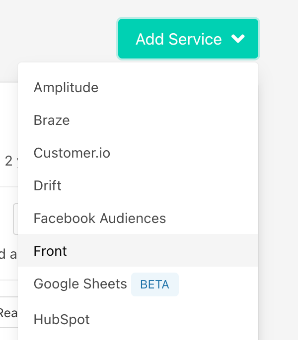
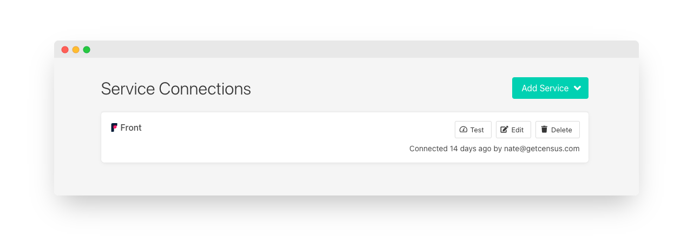
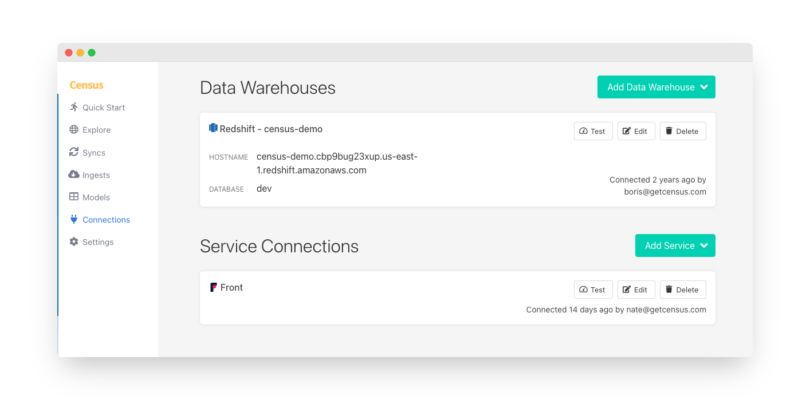
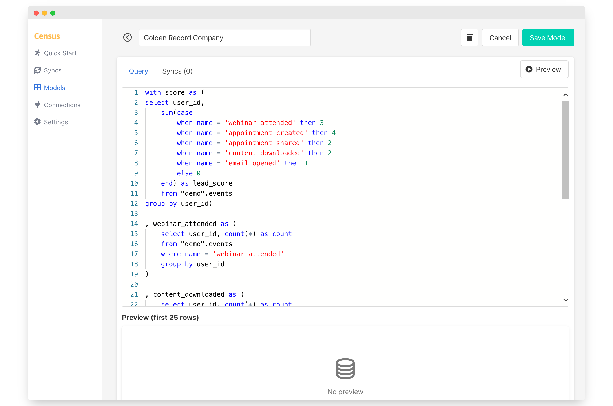
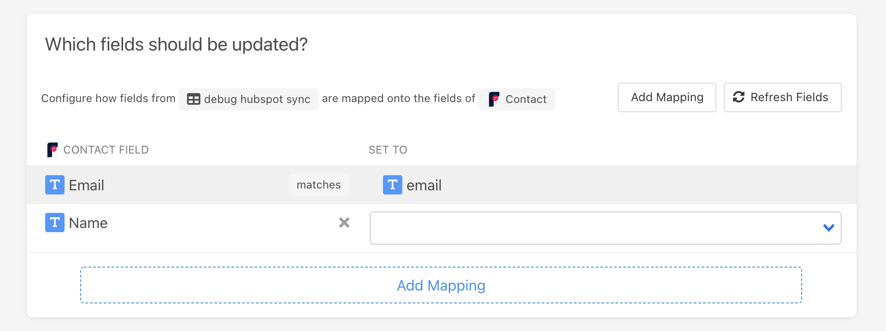
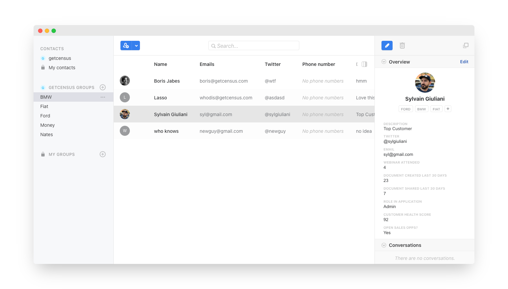

# Front

## 🏃‍♂️ Getting Started



In this guide, we will show you how to connect your Front instance to [Census](https://www.getcensus.com/) and create your first sync.

### 0. Prerequisites

* [Create a Free Trial Census Account](https://app.getcensus.com/)
* Have your Front account ready as we will be connecting Census to Front via OAuth
* Have the credential to access your warehouse. You can find our guides for each data warehouse here: [Redshift](https://help.getcensus.com/article/10-configuring-redshift-postgresql-access), [Postgres](https://help.getcensus.com/article/10-configuring-redshift-postgresql-access), [BigQuery](https://help.getcensus.com/article/21-configuring-bigquery-access), [Snowflake](https://help.getcensus.com/article/8-configuring-snowflake-access).

### 1. Connect Front

* In Census, navigate to [Connections](https://app.getcensus.com/connections)
* Click the Add Service button
* Select Front in the dropdown list

Follow the OAuth flow to connect Front. Your end state should look something like this 👇

### 2. Connect your Data Warehouse

Please follow one of our short guides depending on your data warehouse technology

* [Redshift](https://help.getcensus.com/article/10-configuring-redshift-postgresql-access)
* [Postgres](https://help.getcensus.com/article/10-configuring-redshift-postgresql-access)
* [BigQuery](https://help.getcensus.com/article/21-configuring-bigquery-access)
* [Snowflake](https://help.getcensus.com/article/8-configuring-snowflake-access)

After setting up your warehouse, your Census Connections page should look like this:

### 3. Create your first Model

Navigate to the [Models](https://app.getcensus.com/models)

Here you can write SQL queries or select dbt models that contain the data you want to see in Front. Here are some ideas of data you should select:

* The Lifetime Value of a customer and add it to a contact
* The end of their trial
* The date they became active in your product
* The number of key activities a user did in your app in the last 7/30 days

Once you have created your model, click save. 

### 4. Create your first Sync

Now head to the [Syncs page](https://app.getcensus.com/syncs) and click the Add Sync button, which will take you to a step-by-step wizard for building a data mapping.

In the "What data do you want to sync?" section

* For the Connection, select the data warehouse you connected in step 2
* For the Source, select the model you created in step 3

Next up is the "Where do you want to sync data to?" section

* Pick Front as the Connection
* Pick Contact as the Object

For the "How should changes to the source be synced?" section 

* Select **Update Or Create**
* Pick the appropriate mapping key, it could be email or a custom unique ID

Finally, select the fields you want to update in the mapper in the "Which Fields should be updated?" section

* For each field in your Front instance, you can choose a column from your model.

Click the Next button to see a preview of what will happen when you start the sync. You can check the "Run Sync Now" checkbox to kick off an initial sync and pick a schedule afterwards.

### 5. Confirm the data is in Front

Now go back to Front and go view a Contact that should have been updated. If everything went well, you should see your data in Front.

That's it, in 5 steps, you connected Census to Front and started syncing customer & product data from your warehouse to Front 🎉

If you have any questions or if you have any issues getting started, please contact us via the in-app live chat in the bottom right corner or send us an email at support@getcensus.com

## 🏎 Sync Speed

The Front API is pretty slow with a [default rate limit of 10 calls / minute](https://dev.frontapp.com/docs/core-api-getting-started#limitations). If you are on the Enterprise plan, this can be boosted to 200 calls / minute. 

Rest assured that Census will manage that API rate limit for you and ensure that all your syncs are successful. 

| **Service** | Public API rate limit | **Records sync / Minute** |
| :--- | :--- | :--- |
| This Service \(Front\) | 100 calls / minute | ~40 |
| Front Enterprise | 200 calls / minute | ~80 |
| Salesforce \(as a reference\) | 20,000 \(default\) | 10,000 |


Please note that you can contact your Front Customer Success Manager to increase your API rate limit temporarly which will increase the number of records we can sync per minute.


## 🗄️ Supported Objects

Front has [many objects available via their API](https://dev.frontapp.com/reference/introduction), from Contacts, Conversations to Tags.  These are the objects we currently support in Census.

| **Object Name** | **Supported?** |
| ---: | :---: |
| Contact | ✅ |
| Conversations | 🔜 |
| Tags | 🔜 |
| Teams | 🔜 |

[Contact us](mailto:support@getcensus.com) if you want Census to support more objects for Front

## 🔄 Supported Sync Behaviors


Learn more about all of our sync behaviors on our [Core Concepts page](../basics/core-concept.md#the-different-sync-behaviors).


| **Behaviors** | **Supported?** | **Objects?** |
| ---: | :---: | :---: |
| **Update or Create** | ✅ | Contact Only |
| **Update Only** | 🔜 |  |

[Contact us](mailto:support@getcensus.com) if you want Census to support more Sync behaviors for Front

## 💡  Things to know about our Front connector

* You can use email as the matching key for a Contact or any "user handle" that Front supports out of the box such as Twitter, Facebook, Phone, Smooch ID, etc. [See Front's doc here](https://dev.frontapp.com/reference/contacts)
* We support syncing to multiple phone numbers

## 🚑 Need help connecting to Front?

Contact us via support@getcensus.com or start a conversion via the [in-app](https://app.getcensus.com) chat.

